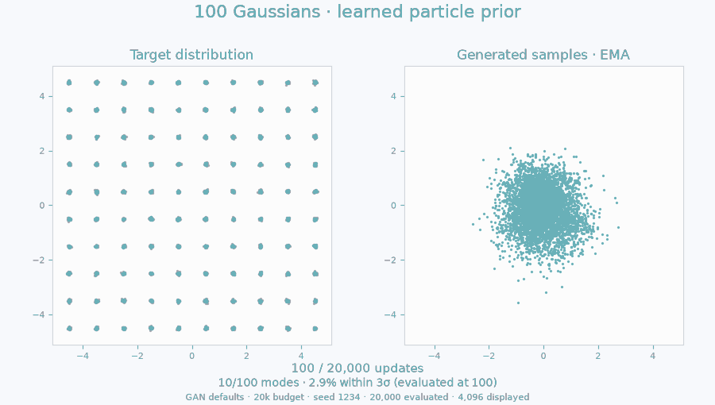
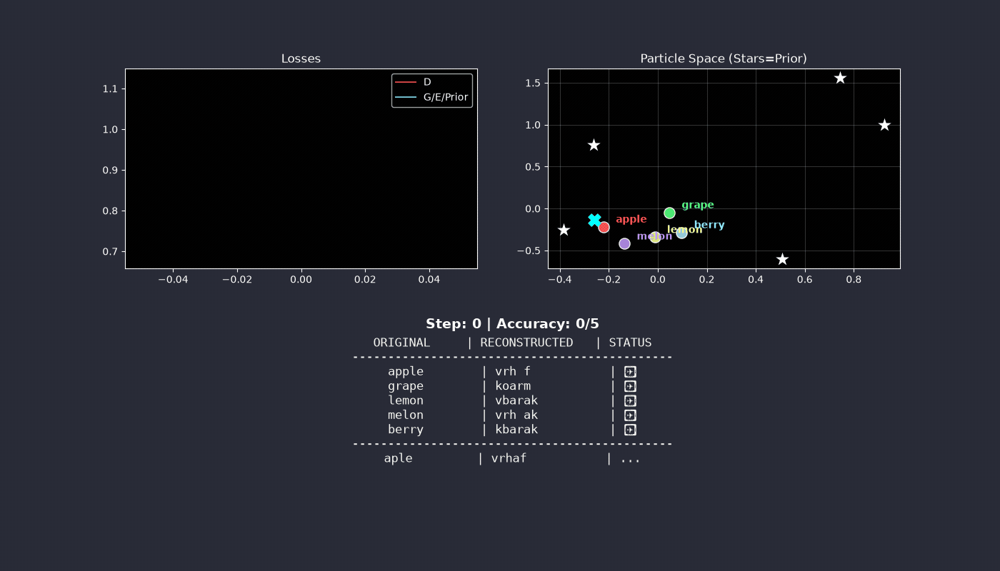

# ParticleGAN

**Learnable latent particles for studying GAN mode coverage and stability.**



## The Problem

GANs can suffer from **mode collapse**: the generator produces only a subset of the data distribution. This project explores whether optimizing a finite latent particle cloud alongside the generator improves coverage on small, highly multimodal benchmarks.

## The Insight

**What if the prior could move too?**

We introduce learnable "particles" in latent space. Both the generator and these latent vectors are optimized during training. The experiments examine how that extra flexibility interacts with discriminator regularization, optimizer dynamics, and sample quality. The results are empirical observations on these benchmarks, not a guarantee against collapse.

### Historical Gaussian example


*Historical visualization from the older Gaussian example. Its architecture and training recipe differ from the particle example above, so these GIFs are not a matched prior comparison.*

## Evidence and controls

The historical [regularizer study](FINDINGS.md) compares discriminator penalties within the particle model. It does not establish that a fixed Gaussian prior necessarily collapses. The current examples share one training loop and matched defaults; the only training change for the Gaussian controls is removing the learned prior and its regularizer.

For a reproducible three-way comparison, run:

```bash
python experiments/compare_priors.py --study-dir runs/prior_comparison --run --device cuda:0
```

This runs learned particles, a frozen Gaussian table, and fresh Gaussian noise on paired seeds 23001–23003. It records configs, source revision, final samples, coverage, transport distances, and per-mode radial and covariance shape diagnostics. See [prior controls and interpretation](docs/prior-controls.md) and [reproducing the project](docs/reproducing.md).

## How It Works

1. **Particle Prior**: Instead of sampling z ~ N(0, I), we maintain a set of learnable latent vectors (particles). During training, we sample from this discrete set.

2. **Joint Optimization**: Particles are optimized alongside G and D. Their positions can adapt to the data modes.

3. **VICReg Regularization**: We apply variance-covariance regularization to prevent particles from collapsing to a single point, while allowing arbitrary topology (clusters, gaps, etc.).

## Examples

### Five Modes (Text Generation)

A minimal example demonstrating the core idea. Five words ("apple", "grape", "lemon", "melon", "berry") are encoded into a 2D latent space. Each word gets one particle.



```bash
python examples/five_modes.py
```

The visualization shows:
- **Left**: Loss curves for D and G/E/Prior
- **Center**: 2D latent space with particle positions (white stars) and encoded words (colored dots)
- **Right**: Reconstruction quality over training

### 100 Gaussians (2D Distribution)

The main benchmark. 100 Gaussian modes arranged on a 10×10 grid. This is a stress test for mode coverage.

```bash
python examples/100gaussians.py
```

The historical particle study reports runs with 100/100 modes and approximately 99% of samples within 3σ of a center after 7k steps. Coverage alone does not establish that the within-mode distribution is correct; the trainer also records shape and transport metrics.

The default recipe is RpGAN (relativistic, logistic) + a one-sided cap gradient penalty on D (`relu(‖∇ₓD‖ − 1)²` on reals and fakes, coeff 1.0), Fourier-feature D, EMA evaluation, Adam β1=0, base LR 6e-4 with a delayed cosine anneal. The cap won a 420-run bake-off against the zero-centered R1/R2 penalty, which is still available with `--reg_arm a_r1r2 --reg_coeff 0.02`. See [FINDINGS.md](FINDINGS.md) for the study and [docs/convergence-tips.md](docs/convergence-tips.md) for the transferable reasoning behind each ingredient.

**Without particle prior** (baseline):
```bash
python examples/100gaussians_no_particle_prior.py
```

This entrypoint uses the same architecture, losses, learning rates, schedule, and EMA as the particle example, with fresh Gaussian noise. Use `--prior frozen_gaussian` for a finite frozen-table control. The outcome depends on the recipe and seed; the baseline does not assume collapse.

## Installation

```bash
git clone https://github.com/255BITS/ParticleGAN.git
cd ParticleGAN
python -m pip install -e '.[dev]'
```

## Project Structure

```
ParticleGAN/
├── lib/
│   ├── particle_prior.py   # Learnable particle cloud (nn.Module)
│   ├── gan_loss.py         # Flexible GAN losses (hinge, logistic, Wasserstein, LSGAN)
│   ├── grad_regularizers.py # D gradient penalties (cap, R1/R2, eikonal, ...)
│   └── vicreg_loss.py      # Variance-covariance regularization
├── examples/
│   ├── five_modes.py                    # Text generation toy problem
│   ├── 100gaussians.py                  # 100-mode benchmark (with particles)
│   └── 100gaussians_no_particle_prior.py # Baseline (without particles)
└── README.md
```

The grid-search infrastructure behind the study — config generation, the per-arm trainer, grid runner, and the analysis/leaderboard scripts — lives in `experiments/`, with the generated per-run configs in `configs/`.

## Key Components

### ParticlePrior (`lib/particle_prior.py`)

A simple nn.Module holding M learnable latent vectors of dimension D:

```python
from lib.particle_prior import ParticlePrior

prior = ParticlePrior(num_particles=1000, z_dim=2)
z, indices = prior.sample(batch_size=64)  # Sample 64 particles
```

### GANLoss (`lib/gan_loss.py`)

Supports multiple loss types and relativistic variants:

```python
from lib.gan_loss import GANLoss

loss_fn = GANLoss(loss_type='hinge', mode='vanilla')
d_loss = loss_fn.d_loss(d_real, d_fake)
g_loss = loss_fn.g_loss(d_fake)
```

### VICRegLikeLoss (`lib/vicreg_loss.py`)

Penalizes low marginal variance and cross-dimension covariance while allowing flexible topology:

```python
from lib.vicreg_loss import VICRegLikeLoss

reg = VICRegLikeLoss()
loss = reg(particle_positions)  # Encourages spread + decorrelation
```

## Notes

- The text experiments (`five_modes.py`) use the same recipe (RpGAN + one-sided cap penalty on the joint critic ∇₍ₓ,𝓏₎D, EMA, β1=0, cosine anneal)
- The 100-Gaussian experiments use the one-sided cap penalty (`--reg_arm`, default `b_cap`); a gradient penalty is what lets the sharp Fourier discriminator keep full mode coverage
- Particles use a higher learning rate (10×) than G/D for faster adaptation

## Changelog

Versions track the default recipe of `examples/100gaussians.py`.

### 0.1.2 — 2026-08-22

- Default gradient penalty switched to the one-sided cap (`b_cap`, `relu(‖∇ₓD‖ − 1)²`, coeff 1.0) via `lib/grad_regularizers.py`; base LR 3e-4 → 6e-4; run length 5k → 7k steps.
- Chosen by a 420-run controlled study ([FINDINGS.md](FINDINGS.md)): same game-damping as R1/R2, sharper modes (hq 0.986 vs a ~0.94 ceiling), honest per-mode core width (0.87), zero collapses. R1/R2 stays available via `--reg_arm a_r1r2`.
- Adds the `experiments/` study infrastructure and the deterministic video renderer.

### 0.1.1

- R3GAN-style defaults (previously undocumented; commit `b5529cb`): RpGAN logistic objective + zero-centered R1+R2 (γ=0.02) + Fourier-2 features on D + EMA(0.995) on G and prior + Adam β1=0 + delayed cosine LR anneal + z_dim 4.
- Full coverage with ≥90% hq in ~3.5k steps.

### 0.1.0

- Original example: vanilla/hinge GAN, no gradient regularizer, plain MLP D, z_dim 2, Adam β1=0.5, no EMA, no LR anneal.
- Never converged on the 100-Gaussians benchmark: ~86–92/100 modes, ~30% hq at 12k steps (baseline row in [docs/convergence-tips.md](docs/convergence-tips.md)).

## Citation

```bibtex
@software{particlegan2025,
  author = {Martyn Garcia},
  title = {ParticleGAN: Learnable Priors for Stable GANs},
  year = {2025},
  url = {https://github.com/255BITS/ParticleGAN}
}
```

## License

MIT
