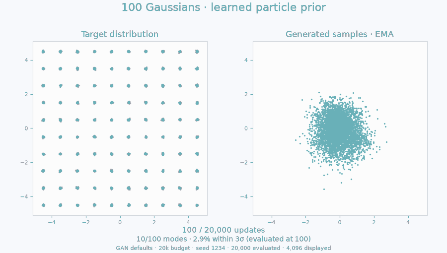

# ParticleGAN

**GANs with a learnable particle prior, for PyTorch.**

[](https://github.com/255BITS/ParticleGAN/actions/workflows/tests.yml)

A GAN usually draws its latent code from a fixed Gaussian and leaves all of
the work of covering the data to the generator; when it cannot, modes go
missing. ParticleGAN replaces that noise with a table of learnable latent
vectors (*particles*) that are optimized together with the generator, so the
prior itself can move toward the data's modes. The package ships one training
configuration: a relativistic-pairing (RpGAN) logistic loss, a critic gradient
penalty that starts as R1 and then blends in capped gradients plus an EMA-critic
anchor gated by the critic's own Adam statistics, and the optimizer settings and
schedules that go with them ([how it works](docs/ka2.md)). You write an ordinary PyTorch GAN
loop; the recipe builds the pieces.



Recorded with the 0.8.0 recipe and its original random initialization, live weights, seed 1234:
**100/100 modes, 98.9% within 3σ after 7,000 updates**, with all 100 modes first covered
at update 1,430. [Reproduce this animation](reports/readme-100gaussians/README.md#readme-hero-gif).

**Without a learning-rate schedule.** The [E22 configuration](docs/e22.md) has no schedule or training
horizon, and no statistic of the raw data in its training control. It covers all 100 modes on three layouts,
ending at 98.3–98.6% of samples within 3σ after 7,000 updates:


[How this animation was made](reports/e22-animation/README.md).

## Install

Requires Python 3.10+, PyTorch, and NumPy (installed as dependencies).

```bash
python -m pip install particlegan           # the library (0.8.0)
```

For the examples, experiments and tests, install from source:

```bash
git clone https://github.com/255BITS/ParticleGAN.git
cd ParticleGAN
python -m pip install -e '.[experiments,dev]'  # plus examples, experiments and tests
```

## Train a GAN

Everything comes from role-named factories on a recipe; the loop is yours.

```python
import copy
import torch
from torch import nn
from particlegan import get_recipe, init, scale_learning_rates

def real_batch(n):  # replace with your DataLoader: 8 Gaussians on a ring
    angle = torch.randint(8, (n, 1)) * torch.pi / 4
    return torch.cat([angle.cos(), angle.sin()], 1) + 0.05 * torch.randn(n, 2)

recipe = get_recipe(total_steps=2000)
G = nn.Sequential(nn.Linear(recipe.z_dim, 128), nn.LeakyReLU(0.2), nn.Linear(128, 2))
D = nn.Sequential(nn.Linear(2, 128), nn.LeakyReLU(0.2), nn.Linear(128, 1))
init.deterministic_orthogonal_(G, seed=0)        # optional: repeatable weights
init.deterministic_orthogonal_(D, seed=1)
prior = init.deterministic_orthogonal_(recipe.make_prior())  # the learnable particle table
opt_g, opt_d = recipe.make_optimizers(G, D, prior, ema_critic=copy.deepcopy(D))
penalty, gan = recipe.make_critic_penalty(opt_d), recipe.make_loss()
base_lrs = [[group["lr"] for group in opt.param_groups] for opt in (opt_g, opt_d)]

for step in range(recipe.total_steps):
    scale_learning_rates(step, recipe, (opt_g, opt_d), base_lrs, prior)
    real = real_batch(recipe.batch_size)
    z, _ = prior.sample(recipe.batch_size)
    fake = G(z)

    d_loss = gan.d_loss(D(real), D(fake.detach())) + penalty(D, real, fake.detach())
    opt_d.zero_grad(); d_loss.backward(); opt_d.step()

    g_loss = gan.g_loss(D(fake), D(real))
    opt_g.zero_grad(); g_loss.backward(); opt_g.step()
```

`opt_g` and `opt_d` are Adam optimizers whose `step()` also does the
formulation's step-time work, and their `state_dict()` holds all of its state,
so checkpoint them as usual. [`examples/pytorch_loop.py`](examples/pytorch_loop.py)
adds the remaining pieces of the default update (critic input noise, generator
output noise, EMA weights).

Or let `GANTrainer` run exactly that default update:

```python
from particlegan import GANTrainer

recipe = get_recipe()
prior = init.deterministic_orthogonal_(recipe.make_prior())
trainer = GANTrainer(recipe, G, D, prior=prior)
for _ in range(trainer.recipe.total_steps):
    trainer.step(real_batch(trainer.recipe.batch_size))
samples = trainer.sample(1024)
```

Without `prior=`, the trainer builds a plain randomly drawn particle table.

## Repeatable initialization

The recipe never touches your weights: networks train from whatever they are
built with. `particlegan.init` is optional tooling in the spirit of
`torch.nn.init`, and the examples use it:

```python
from particlegan import init

init.deterministic_orthogonal_(G, seed=0)   # G, D and an encoder get different seeds
init.deterministic_orthogonal_(D, seed=1)
prior = init.deterministic_orthogonal_(recipe.make_prior())
```

It writes orthogonal matrices at PyTorch's default scale, patterned biases and
an evenly spread particle table, derived from `seed` alone: the same seed and
architecture give the same weights, and no random state is used. Call it on
fresh networks, before loading weights or building optimizers. A custom layer
it does not know raises an error until you declare it with `init.register`.
Values depend on each parameter's position in the module you pass, so
initialize whole networks: a submodule initialized on its own gets different
values. Projects with custom layers can guard this with a one-line test that
`init.declarations(net)` has no `None` entries
([example](docs/api.md#declarationsmodule)).
See the [API reference](docs/api.md#initialization) and the
[math and architecture guide](docs/initialization.md).

## Model families

`get_recipe(name)` selects a model family or an E22 policy preset.

| Name | Model |
| --- | --- |
| `gan` (default) | GAN with a learnable particle prior |
| `e22` | Scalar particle GAN with stationarity control, row evidence, birth/death, learned noise and served averages |
| `e22_routed` | Conditional dense-bank adaptation with paired row evidence and guarded birth/death |
| `mog` | GAN with a mixture-of-Gaussians particle prior |
| `ddgan` | Denoising-diffusion GAN with a UCD (class-conditional) critic |
| `ddgan_mog` | `ddgan` with a mixture-of-Gaussians prior |
| `ae_gan` | Autoencoder GAN: an encoder routes data to particles |
| `vae_gan` | Variational variant of `ae_gan` |
| `ae_ddgan` | Autoencoder denoising-diffusion GAN |

Any field can be overridden: `get_recipe("mog", total_steps=20_000)`.
For E22, set the task's dimensions and output noise explicitly:
`get_recipe("e22", num_particles=20_000, z_dim=2, batch_size=2048, output_noise_std=.029)`.
[`E22Policy`](docs/e22.md) exposes the same controls used by `GANTrainer` for
caller-owned backward passes and optimizer steps, with checkpointing and served snapshots.
For conditional softmax blends, use `get_recipe("e22_routed", ...)` with the
explicit [`RoutedRows` contract](docs/e22_routed.md). This adaptation measures
the whole conditional forward and validates row moves on separate guard
contexts. Frozen BF16 modules can accompany FP32 trainable parameters and tables.
Multiple token routing sites can share one bank and controller through the
[full-model routing contract](docs/e22_routed_sites.md). Candidate checks rerun
the complete model, including downstream sites and the final paired output.
`RoutedRows(probe_interval=20)` schedules expensive row probes separately from
per-update gradient evidence and saves its clock in checkpoints. Enable
`output_error_guard=True` to also protect clean paired-output MSE on guard
contexts. Split rows transport their parent's Adam history at half mass.

## Learn more

- [How the training formulation works](docs/ka2.md), including several critics and conditional critics
- [E22](docs/e22.md): a schedule-free configuration for the native 100-Gaussian problems with no data-space statistics
- [Routed paired E22](docs/e22_routed.md): conditional row evidence, guarded moves and clean serving
- [Shared-bank routing sites](docs/e22_routed_sites.md): sequential token routing and a matched spatial comparison
- [Whole-model checkpoint replay](docs/e22_routed_sites.md#activation-checkpointed-whole-model-replay): per-site DV12 without repeated training draws or diagnostics
- [API reference](docs/api.md) and a [minimal DDGAN + UCD loop](docs/api.md#a-minimal-ddgan--ucd-loop)
- Examples: [`quickstart_gan.py`](examples/quickstart_gan.py) (GANTrainer with checkpoints),
  [`e22_external_loop.py`](examples/e22_external_loop.py) (E22 in a caller-owned loop),
  [`e22_routed_paired.py`](examples/e22_routed_paired.py) (source/time-conditioned paired-error training),
  [`e22_routed_sites.py`](examples/e22_routed_sites.py) (sequential shared-bank routing and spatial ablations),
  [`pytorch_loop.py`](examples/pytorch_loop.py) (the full update in your own loop),
  [`100gaussians.py`](examples/100gaussians.py) (the benchmark above),
  [`particle_autoencoder.py`](examples/particle_autoencoder.py) (AE/VAE-GAN),
  [`fast_lander.py`](examples/fast_lander.py) (world model and controllers for Lunar Lander)
- [Changelog](CHANGELOG.md) · [Releasing](docs/releasing.md)

## Citation

```bibtex
@software{particlegan2025,
  author = {Martyn Garcia},
  title = {ParticleGAN: Learnable Priors for Stable GANs},
  year = {2025},
  url = {https://github.com/255BITS/ParticleGAN}
}
```

## License

MIT
