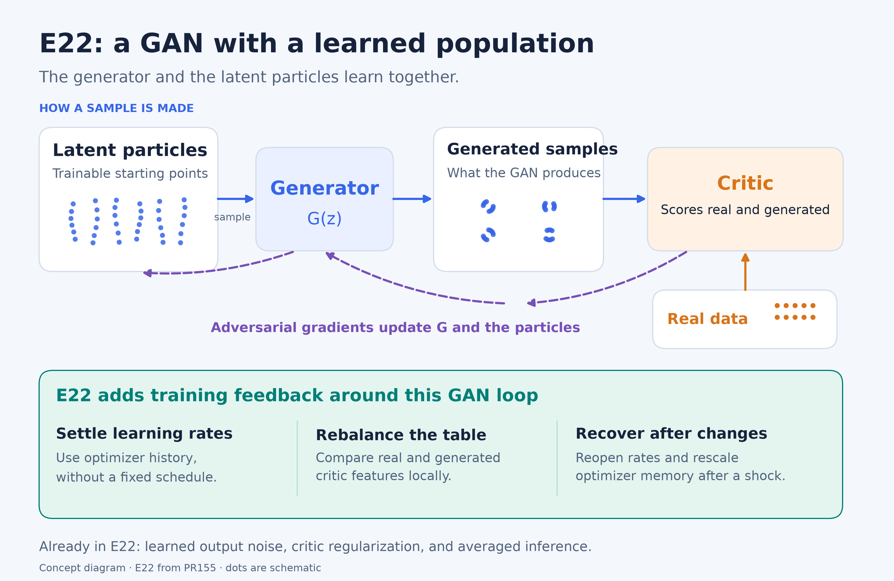
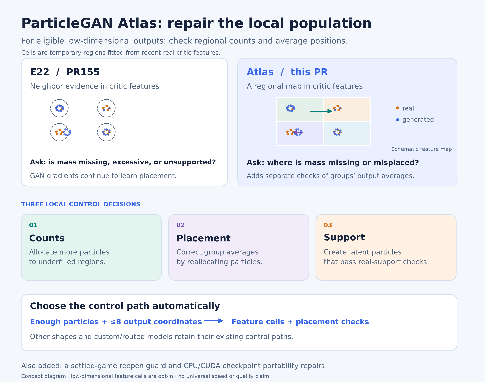
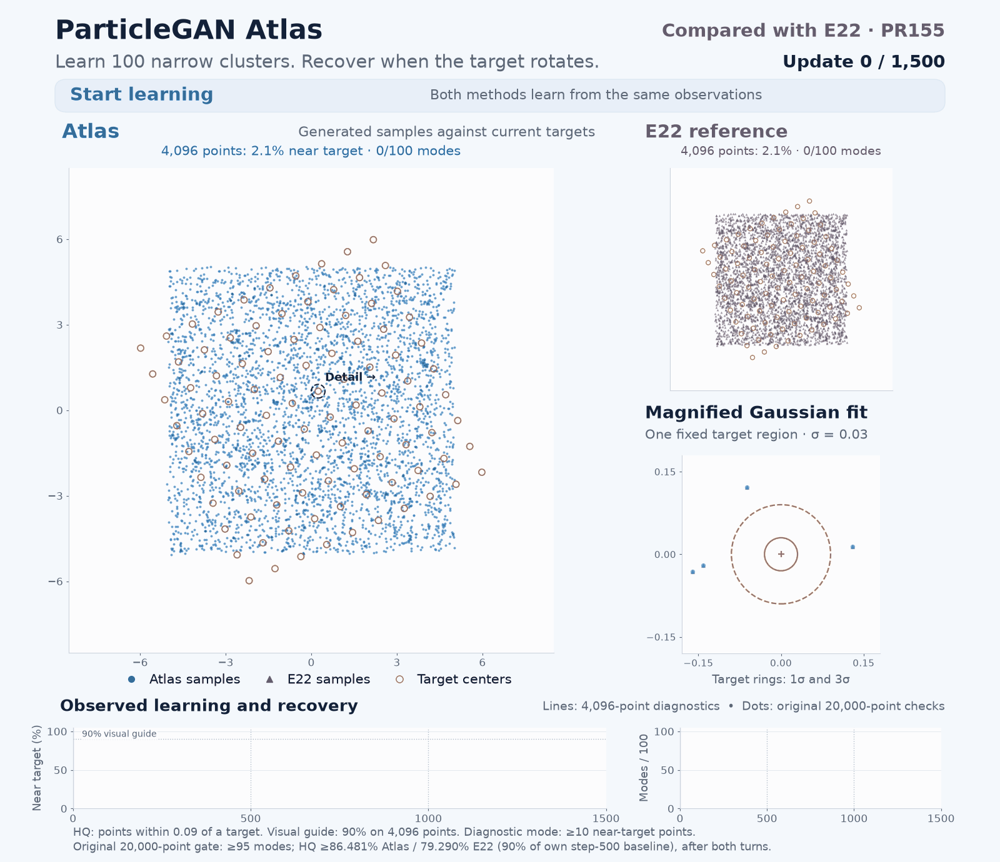

# ParticleGAN Atlas

**E22’s adaptive GAN training, with local population corrections.**

Atlas keeps the generator, critic, adversarial objective, and caller-owned
training interfaces from [PR155’s E22](e22.md). It adds an optional population
control path that checks regional sample counts and average output positions,
plus a guard on reopening a game after it has begun to settle.

The installed package exposes the same controls as a named preset:

```python
from particlegan import get_recipe

recipe = get_recipe("atlas", num_particles=20_000, z_dim=2, batch_size=2048)
# recipe.total_steps is None; use GANTrainer(..., max_steps=...) for a budget.
```

Forge integration and task applicability are described in
[the develop integration notes](../reports/forge/DEVELOP_INTEGRATION.md).

## Start with E22

An ordinary GAN learns a generator that maps latent inputs to samples.
ParticleGAN also learns a table of latent starting points: the **particles**.
Sampling picks a table row and passes it through the generator. Adversarial
gradients train both the generator and these latent codes.

E22 puts feedback around this loop. It settles learning rates using optimizer
history, balances population mass using the critic’s learned features, checks
real support, and reopens training after an optimizer shock. Learned output
noise, critic regularization, averaged inference, and checkpointing are already
part of E22.



[Open the vector diagram](../reports/atlas-explanation/e22-explained.svg).

## What Atlas changes

A region can have too few generated samples. It can also have enough samples
whose average position is wrong. Atlas gives these errors separate population
checks in its feature-cell path.

**Cells** are temporary regions fitted from recent real examples in the
critic’s internal representation. Count controls rebalance latent rows between
regions. Placement controls correct a group’s output mean through checked
row reallocation/cloning within that group. These are population actions after the
ordinary GAN update. Support controls create latent codes checked through the
generator against real-feature anchors.



[Open the vector diagram](../reports/atlas-explanation/atlas-changes.svg).

The feature-cell path requires enough particles to resolve its evidence budget,
at most eight raw output coordinates, and the standard representation path.
Other shapes and custom/routed models retain their existing controls. MNIST
uses kNN; it benefits from the reopening guard rather than raw-output cells.

## Advantages over current PR155 E22

| Aspect | E22 in PR155 | Atlas | Why it helps |
| --- | --- | --- | --- |
| Population evidence | Neighbor-based mass/support checks in critic features | Regional count checks, conditional output-mean checks, and real-anchor support proposals | Gives coverage and placement their own measured population actions |
| Reopening | Optimizer-shock detector | Also requires a network-contraction witness and rebases known critic-objective transitions | Avoids the observed early false reopen on the static MNIST task |
| Choosing controls | Existing neighbor/representation policy | Selects eligible feature cells from population size, output shape, and model ownership | One configuration retains the established paths for other cases |
| Execution and restore | Existing trainer/policy APIs and checkpoints | CPU-only optimizer checks, explicit CPU planning, alias-preserving transfer, and atomic shape validation | Fixes the diagnosed CPU/CUDA and checkpoint failures |

### Direct measured comparison

These rows compare **current PR155 E22 at `cabe2084`**, including its optimizer
reopening, with Atlas on the original Toy/MNIST fixtures, models, initialization,
streams, seed, scorer, and 2,000-update budget.

| Metric | PR155 E22 | Atlas |
| --- | ---: | ---: |
| Toy sample precision ↑ | 71.55% | **96.53%** |
| Toy mode coverage | 25/25 | 25/25 |
| Toy mass TV ↓ | 0.28455 | **0.05211** |
| Toy original quality gate | FAIL | **PASS** |
| MNIST active embedding distance ↓ | 1.88097 | **0.54449** |
| MNIST embedding precision ↑ | 76.76% | **86.91%** |
| MNIST embedding recall ↑ | 71.92% | **84.72%** |
| MNIST confident class coverage | 10/10 | 10/10 |
| Static MNIST reopen events | 1, recorded after 202 completed updates | **0** |

MNIST has no separately invented numerical pass threshold. Both methods cover
all ten confident classes. Current E22 is freshly executed; Atlas’s original
fresh learned runs retain their source labels, with checked equivalence and
actual latest-source CUDA replay. See the
[direct comparison and provenance](../reports/toy100/lrfree-search/feature-cells-cb64-ra/generalization-20260930/mnist/pr155-e22-current/REPORT.md).

### Moving distribution



[Full-resolution MP4](../reports/toy100/lrfree-search/feature-cells-cb64-ra/generalization-20260930/visualization-pr223-convergence/render/final-media-1/atlas-vs-e22-convergence.mp4)
· [Poster](../reports/toy100/lrfree-search/feature-cells-cb64-ra/generalization-20260930/visualization-pr223-convergence/render/final-media-1/poster.png)

The animation shows 153 actual observations per method, with an overview,
local Gaussian zoom, and synchronized recovery curves. Target jumps hold
the model fixed; sample clouds are not interpolated.

Fresh `rotated100` runs of both current packages start from the same particles
and models. This 100-Gaussian target turns 30° after updates 500 and 1,000. The original
20,000-point acceptance draws give:

| Update | PR155 E22 quality / modes | Atlas quality / modes |
| --- | --- | --- |
| 500, initial fit | 88.10% / 100 | **96.09% / 100** |
| 1,000, after first shift | 83.99% / 100 | **96.09% / 100** |
| 1,500, after second shift | **94.73% / 100** | 92.59% / 98 |

Both methods pass both original shift gates. Atlas has better initial and
first-shift endpoints; E22 has better final quality and mode coverage.
Quality is the fraction of noisy generated points within 0.09 of a target
center (three Gaussian standard deviations).

The dense animation also records separate 4,096-point diagnostics every ten
updates. Under a shared illustrative 90% quality target, Atlas first crosses
90% at update 220 during initial learning and 290 updates after the first
shift; E22 does not cross 90% within either 500-update period. Both cross it
330 updates after the second shift. This diagnostic target is separate from
the original acceptance rule, which uses each method’s step-500 baseline.

## Use Atlas

[`atlas.json`](../configs/100gaussians/atlas.json) is the preferred name for the
validated shared configuration. `ra13-settled.json` remains a byte-identical
historical alias.

```python
import json
from pathlib import Path
from particlegan import GANTrainer, Recipe

fields = json.loads(Path("configs/100gaussians/atlas.json").read_text())
fields.update(num_particles=N, z_dim=Z, batch_size=B)
recipe = Recipe(**fields)
# Supply your initialized G, D, prior, and data stream.
trainer = GANTrainer(recipe, G, D, prior=prior, serial_backward=True)
trainer.step(real_batch)
samples = trainer.sample(10_000, output_noise=True)
```

The same settings work through the existing caller-owned `E22Policy` lifecycle.
Choose output-noise scale for your data; .029 belongs to the recorded Gaussian
tasks. Ordinary package defaults are unchanged. See the
[implementation and checkpoint guide](feature-cells.md).

## Tradeoffs and scope

- E22’s control law uses critic features without raw-output statistics. Atlas’s
  feature-cell branch adds a raw-coordinate assumption through conditional
  output moments and is limited to at most eight coordinates.
- Automatic feature cells use one-quarter generator/noise base rates while
  retaining the configured table/critic base rates. This is empirical
  calibration, and the measured comparison includes it.
- Extra population checks cost computation. Recorded Toy training took longer
  with Atlas, while MNIST took less time; separate-run timings do not establish
  a general speed advantage.
- PR155 reports 13/13 portability and 3/3 static native passes; Atlas’s
  qualification also passes all of these gates. The pass count is preserved.
  Fixed-seed results do not establish universal quality gains, scaling laws,
  or performance on larger image architectures.

The infographic dots are schematic. Benchmark animations and score tables use
recorded samples and original evaluators.
