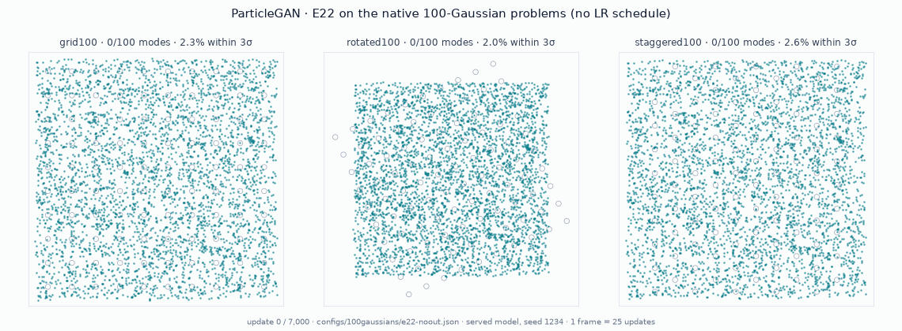

# E22: a reusable policy without data-space statistics

`get_recipe("e22", ...)` ships the E22 controls in the installed package.
[`configs/100gaussians/e22-noout.json`](../configs/100gaussians/e22-noout.json)
is the original research override set for grid100, rotated100 and staggered100;
applications can use the named preset directly. It has no learning-rate schedule or horizon, and
nothing in its training control path computes a distance, density, moment or
scale on raw data or raw generator outputs: real samples reach the controller
only through the critic's own learned features. The loss and critic penalty are
the package's ([KA2](ka2.md), `reg_coeff` 3).



One frame per 25 updates of the served model ([how it was made](../reports/e22-animation/README.md)).

## Using it

```python
from particlegan import GANTrainer, get_recipe, init

recipe = get_recipe("e22", num_particles=20_000, z_dim=2,
                    batch_size=2048, output_noise_std=0.029)
init.deterministic_orthogonal_(D, seed=1)          # fresh critic: the start the results used
trainer = GANTrainer(recipe, G, D, prior=prior)
for real in batches:                                # no total_steps: train as long as you like
    trainer.step(real)
samples = trainer.sample(10_000, output_noise=True)  # E22's current served choice
```

Choose `num_particles`, `z_dim`, `batch_size`, generator/critic architecture and
`output_noise_std` for the task. The .029 noise level belongs to the recorded
100-Gaussian problem; it is not an estimate the policy learns from raw data.
`get_recipe()` still selects the ordinary KA2 recipe. `get_recipe("e22")`
selects the same KA2 loss/optimizers plus the E22 controls below, with
`total_steps=None`. A caller can stop after any number of complete updates.

The recorded runs used the frozen native host: identity `nn.Linear(2, 2)`
generator, particle table drawn uniform in [-5, 5], a 128×3 MLP critic with
Fourier features (xavier, then `deterministic_orthogonal_(D, seed=1)`), and were
scored with output noise.

## What it turns on

| Field | Value | What it does |
| --- | --- | --- |
| `continuous_policy`, `lr_control` | `dv12`, `stationarity` | no schedule: each optimizer group's rate is halved when a settling test in its own update statistics says it is stationary |
| `table_release_rule` | `anchor` | the table's rate may rise again only on evidence at twice the scale of the last "settled" verdict |
| `row_evidence_gate`, `row_evidence_null` | True, `scaled` | each table row tests its own gradient history (Benjamini-Hochberg at q=.05); flagged rows keep full speed and do not vote in the settling test |
| `particle_birth_death`, `birth_death_space` | True, `critic` | mass balancing moves rows using fakes-vs-reals evidence in the critic's feature space |
| `birth_death_feature_scale` | `std` | each critic feature standardized on the real reservoir (invariant to rescaling a hidden unit) |
| `birth_death_isolation` | True | a split-conformal support test in critic feature space re-draws rows with no real support (strays); off when the reservoir is mostly duplicates |
| `serve_average` | 4 | once the table has settled, the model of record (what `sample` and checkpoints serve) is the generator/table average over the last ~4 settling-test blocks; the fast iterate keeps training |
| `reopen_signal`, `reopen_anchor` | `optimizer`, `release` | [R1](r1-rotation.md): an abrupt rise of the gradient relative to Adam's own memory re-opens the rate ladders, rescales the shocked second moments and lets KA2's EMA-critic anchor release; never fires on a static target in the native gates. `none`, `hold` is E22 before R1 |
| `amsgrad`, `reg_coeff` | True, 3 | AMSGrad everywhere; KA2 penalty strength |
| `output_noise_mode`, `output_noise_std` | `learnable`, .029 | output noise is a trained scale starting at .029, floored at .029 until the generator and table rates have settled |
| `input_noise_std`, `total_steps` | 0, None | no critic input noise; no horizon |

Declared dataset inputs: `output_noise_std` (.029, the data's noise level; learned
freely it collapses toward 0), the host critic's Fourier frequencies, the table
size and `z_dim`.

## Caller-owned updates

`E22Policy` is the implementation used by `GANTrainer`; it does not call
`backward()` or optimizer `step()`. The caller supplies modules, optimizer
ownership and loss composition. The complete runnable
[`examples/e22_external_loop.py`](../examples/e22_external_loop.py) uses only
the installed package and PyTorch:

```bash
python -u examples/e22_external_loop.py --steps 5 --checkpoint /tmp/e22.pt
python -u examples/e22_external_loop.py --steps 5 --resume /tmp/e22.pt
```

Bind the policy to the optimizers whose steps the application will execute:

```python
from copy import deepcopy
from particlegan import E22Policy

opt_g, opt_d = recipe.make_optimizers(G, D, prior, ema_critic=deepcopy(D))
penalty = recipe.make_critic_penalty(opt_d)
policy = E22Policy(
    recipe, G, D, prior=prior,
    generator_optimizer=opt_g, critic_optimizer=opt_d,
    roles=[["generator", "table"], ["critic"]], penalty=penalty, seed=0,
)
```

`roles` matches optimizer parameter groups. Supported roles are `generator`,
`encoder`, `router`, `critic`, `table` and `noise`. Each group has one role;
every trainable parameter has one optimizer owner, and the table occupies its
own group. The learned output-noise parameter and its `noise` group are added
by the policy after validating the supplied groups. Roles can be inferred
from the supplied modules, or declared explicitly as above. Supply `encoder=`
or `router=` to declare those modules and their groups. Build separate
generator/encoder/router groups with `recipe.make_generator_optimizer(...)`;
the convenience `make_optimizers(..., encoder=E)` combines G and E into one
group and therefore needs splitting before it can declare these policy roles.
A separate
`table_optimizer=` is supported; the roles list then contains generator,
critic and table optimizer rows in that order. Step every generator-side
optimizer before `after_generator_step()`.

Use `table=nn.Parameter(...)` instead of `prior=` when the application owns
its own table sampler. Sampling must follow the independent-row law described
below. `generation(model, latent)` replaces the clean generator forward;
`critic_features(samples)` supplies the learned features used by birth/death
and its support test. Both callbacks must preserve sample order. The default
feature adapter, `ScalarHeadFeatures(D)`, captures the inputs to the critic's
learned scalar score heads. It rejects a critic whose available score heads
read only raw samples. Feature callbacks should be deterministic, use eval
mode and consume no training RNG.

One complete update has this order:

| Stage | Caller work and policy hook |
| --- | --- |
| Begin | `noise = policy.begin_step(real, game_record=opt_d.record)` reads the previous critic record, observes the real reservoir and chooses this update's learning rates, row gate and noise. Reuse `noise.output_sigma` for both halves; it retains the learned-noise graph. |
| Critic forward | Set G to eval and D to train. Under `no_grad`, sample with `policy.latent_generator`, call `policy.observe_support(latent)` and `policy.generate(latent, sigma=noise.output_sigma)`. Call `policy.observe_critic_pair(real, fake)` before building the critic loss plus penalty. Use `InputNoise(D, generator=policy.noise_generator)` with `noise.input_sigma`. |
| Critic update | `opt_d.zero_grad()`, optional `policy.before_critic_backward()`, `loss_d.backward()`, `opt_d.step()`, then `policy.after_critic_step()`. The recipe optimizer performs KA2's guard, Adam update and critic-anchor update; the policy observes the resulting displacement. |
| Generator forward | Set G to train and D to eval; freeze D's parameters while allowing gradients through its input. Sample a fresh latent batch with the same latent stream and generate with the same output sigma. Compute generator and any application losses. |
| Generator backward | `opt_g.zero_grad()`, optional `policy.before_generator_backward()`, `loss_g.backward()`, then `policy.after_generator_backward(loss_gan=loss_gan.detach(), loss_critic=(loss_d - penalty).detach())`. This observes generator gradients and updates row evidence before any clipping or gradient edits. |
| Generator update | Step the generator/table optimizers, then `policy.after_generator_step()`. This applies hot-row correction and observes stationarity after the optimizer's A2/direct-particle work. Restore D's original `requires_grad` flags. |
| Finish | `policy.finish_step()` updates averages, performs birth/death, rebases moved-row stationarity and resets their evidence, then advances the update counter and determines the served choice. |

Call each required hook once in order. The policy rejects lifecycle ordering
errors and mid-update checkpoints. It supports one critic update followed by
one generator/table update per cycle. The application owns module modes,
freezing, loss scaling, backward execution and its data cursor. For exact CUDA
recovery with higher-order penalties, wrap the whole cycle in
`torch.autograd.set_multithreading_enabled(False)`; the native equivalent is
`GANTrainer(..., serial_backward=True)`.

## Particle-row contract and routing

Full E22 supports an unconditional, equal-mass, independently sampled table:
draw an index uniformly with replacement, read `z_i`, and generate one sample
`G(z_i)`. Clean centres, row evidence and support statistics refer to this
same law. Birth/death clones a certified parent's latent and averaged latent,
its full-shaped Adam/AMSGrad state rows and optional latent history into a
child site. It leaves scalar/global optimizer state in place. Moved rows start
a new lineage in stationarity and row evidence.

Conditional/UCD generation and densely soft-routed banks are unsupported by
the independent `get_recipe("e22")` row evidence and birth/death. A blend
`G(sum_i w_i(c) z_i, c)` does not
give each row an independently sampled output or fixed equal mass. The policy
raises for `row_semantics="conditional"` or `"dense_soft"` while either row
mechanism is enabled, and for conditional or encoder recipes with those
mechanisms enabled. Binding conditioning into a callback does not satisfy the
independent-row contract. Hard conditional selection is also outside this
restructuring contract.

For conditional dense banks, [`get_recipe("e22_routed")`](e22_routed.md)
provides the named `routed_paired` adaptation. Its explicit `RoutedRows`
contract observes conditioned paired residuals and guards coupled
table/router proposals on separate contexts, with row evidence and birth/death
enabled. Its statistical evidence differs from the original independent-row
law. The runnable paired-error example includes source/time conditioning,
dense table gradients, mixed frozen BF16/FP32 ownership, clean served inference
and quantitative validation on a third disjoint context set.

For applications that only need non-row controls, `UpdatePolicy` exposes them
with
`row_evidence_gate=False` and `particle_birth_death=False`; explicitly declare
the row semantics and generator/encoder/router/critic/table roles. This is an
application-specific adaptation, without the full E22 restructuring policy.
`ParticleRows` also exposes the independent-row binding for direct
`ParticleBirthDeath` use with an explicit table, optimizer, average,
generation and feature callbacks.

## Recovery and serving

`policy.state_dict()` returns independent storage at a completed update
boundary. It includes fast module/table weights, averaged weights, optimizer
state including KA2 controllers, stationarity and anchored-release state,
row evidence, birth/death reservoir/evidence/private RNG, learned-noise
parameters, policy sampling/noise RNG streams, global PyTorch RNG and counters.
Reconstruct compatible modules, recipe and optimizer roles, then call
`policy.load_state_dict(saved)`. The application saves its data-loader cursor
and any external callback resources alongside this state. Callbacks with
checkpoint state should be restored consistently with those resources.
Birth/death feature callbacks can implement `state_dict()`, `check_state(state)`
and `load_state_dict(state)` to include their state in birth/death recovery;
the default adapter includes the selected score-head names. Generation
callbacks should depend only on the supplied model or explicitly owned
modules; arbitrary mutable closure state belongs to the application.

```python
torch.save({"policy": policy.state_dict(), "data_cursor": data_cursor}, path)
# Rebuild the same recipe/modules/optimizer layout first.
policy.load_state_dict(saved["policy"])
data_cursor = saved["data_cursor"]
```

`policy.served_snapshot()` returns an independent dictionary containing
`source` (`"fast"` or `"averaged"`), `models` state dictionaries, the selected
`table`, `output_sigma`, `completed_steps` and controller state. It chooses
averaged generator/table weights only while the table's last decisive verdict
is stationary; before settlement or after release, it chooses fast weights.
Critic weights remain the current critic. Load the snapshot into separate
inference modules to obtain the served parameters directly.

`policy.served_model()` returns frozen independent inference modules with
`.generator`, `.critic`, `.prior` (if supplied), `.table`, `.encoder` and
`.router`, plus the same `source` and noise metadata. Its `sample` and
`generate` methods preserve the DV12 latent perturbation, use a separate RNG,
and leave training weights and RNG streams untouched:

```python
served = policy.served_model()
eval_rng = torch.Generator(device=policy.device).manual_seed(42)
samples = served.sample(10_000, generator=eval_rng, output_noise=True)
```

When `generation(model, latent)` uses auxiliary modules outside G, bind it to
the frozen copies explicitly with `generation_factory`. For example, a
per-row encoder/router transform can be served as:

```python
served = policy.served_model(generation_factory=lambda models:
    lambda model, latent: model(models["router"](models["encoder"](latent))))
```

The default callback must use the supplied model, rather than close over live
training modules. For conditional or densely routed adaptations, `sample()`
rejects the independent-row sampling assumption; form the conditioned/routed
latents in the application and pass them to `served.generate(...)`.

Caller-owned training modules keep fast weights. `GANTrainer` preserves its
existing convention of exposing the served weights in its modules between
steps and restoring fast weights at the start of an update. Both interfaces
use the same policy and served-choice rule; a checkpoint records both models
and continues from the fast iterate. `trainer.sample` uses the selected served
model, DV12 latent perturbation and its separate evaluation RNG; it adds
output noise only when `output_noise=True`. Direct `G(z)` inference from a
snapshot evaluates clean centres; use `served_model().sample(...)` for the full
sampling law.

The conformance tests compare the caller-owned loop with `GANTrainer` exactly,
including losses, optimizer/controller state, row moves, learned noise and
served weights. They also retain a pre-extraction native receipt and resume
immediately across stationarity, birth/death and anchored-release events.
See the [short migration guide](e22_migration.md) for removed imports and
`reg_anchor_decay`.

## Results

Native gates, one deterministic seed, 7,000 updates, frozen CUDA host. Each cell
shows the worst live precision over the last five checks (limit ≥ .97) and the
worst centre error in σ (limit ≤ .20); the 100k-sample holdout is in brackets.

| | grid100 | rotated100 | staggered100 |
| --- | --- | --- | --- |
| E22 | PASS .9834 / .157 (.9851 / .129) | PASS .9851 / .152 (.9863 / .129) | PASS .9822 / .150 (.9835 / .117) |

- Learning rate ×0.75 and ×1.33: 6/6. 14k and 28k updates: 6/6 (rotated 28k .9888).
- 13-gate portability suite (vector, image, ring_shift, stationary): 13/13.
- The stress and suite runs are of E19a, which E22 reproduces on every live
  check (E22 adds only a duplicate-reservoir guard that does not fire on these tasks).

The run receipts record package sha256 `8d9ca80a…`; the research record (all
variants, attributions and reviews) is archived under
`reports/toy100/lrfree-search/noout-support-test/` at commit `da3b0470`.

## Ablation

`critic_r1_real: false` (E22 otherwise unchanged) fails rotated100: holdout
centre error .459σ against .129σ, live checks pass only from step 6,250 (E22:
1,500), and the critic learning rate ends 10× higher. Precision stays .984. The
R1 term on reals is needed.
