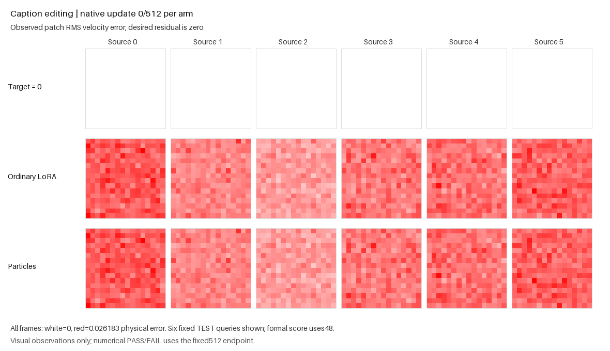

# Routed caption accuracy regression

This standalone Torch fixture compares ordinary LoRA and a shared routed
particle bank through public ParticleGAN APIs. Both use BF16 Down/Up matmuls
and six adapted projections; particles route at each site. They share a frozen
one-block backbone and six source-to-target caption edits. No pretrained
models, external data or local Supra helpers are required.

The sole completed run is **scientific FAIL** after 512 updates per arm.
Particles have 0.2623% higher aggregate RMSE than ordinary LoRA and exceed the
1e-6 source-harm tolerance on sources 0–4. Removing their codes raises RMSE
by 1.6593%, with a positive code benefit on every source. Bank/router gradients
were live for all 511 post-first updates; exact terminal public restore,
finite learned numerics and capture/state/RNG checks passed. Five proposal
events produced zero accepted population changes: three were rejected and
two were skipped.

| Terminal TEST48 | Physical RMSE ↓ |
| --- | ---: |
| Ordinary LoRA, BF16 | 0.006489918631 |
| Routed particles, BF16 | 0.006506938520 |
| Same particles, zero codes | 0.006614909085 |

The [compact readout](e22_routed_caption_accuracy_results.json) retains all
six source scores, failed bounds and receipt/source identities. Execution took
91.652 seconds externally, within the fixed 300-second allowance. This is a
reproducible API convergence challenge, not a diagnosis of the remaining gap
or an established optimizer remedy.

An [independent read-only review](e22_routed_caption_accuracy_independent_review.json)
agrees with the accuracy FAIL and integrity checks by reducing retained
tensors, traces and streams, with zero model forwards or native updates.



The [media receipt](e22_routed_caption_accuracy/media_receipt.json) binds the
actual saved observations and GIF. Rendering took 1.337 seconds on CPU with
zero model forwards/native updates; the numerical FAIL remains unchanged.

The new [fixed protocol](e22_routed_caption_accuracy_v1.json) runs 512 updates
per arm within one 300-second GPU budget. Its sole quality measurement is
terminal held-out physical RMSE, reduced in float64. PASS requires at least
0.1% aggregate improvement over ordinary LoRA, no source harmed by more than
1e-6, at least 0.1% aggregate benefit from particle codes with strictly positive
benefit for every source, live bank/router gradients on at least 90% of
updates 2–512, and nonzero C at every site. These scores never enter the native
GAN objective, feature-based structural decisions or a stopping rule.

From the repository root, with the project dependencies installed:

```sh
CUDA_VISIBLE_DEVICES=0 python -m examples.e22_routed_caption_accuracy --run --out runs/routed-caption-accuracy-v1
```

The command exits 0 on scientific PASS, 1 on completed scientific FAIL, and 2
on incomplete/error. Use a fresh output directory; JSON progress can be tailed.
The actual imported package path and hash are recorded and checked within the
run. Future API revisions are allowed and can pass the same numerical gate.
No historical failure reproduction is required.

Render the actual saved observations after either completed verdict:

```sh
python -m examples.render_e22_routed_caption_accuracy --run-directory runs/routed-caption-accuracy-v1
```

The optional renderer needs NumPy and Pillow>=10.1. It has a separate 60-second
CPU budget and performs no model forwards or updates. The GIF shows target
zero residual beside observed ordinary/particle patch error at updates
0, 64, 128, 256, 384 and 512, using one initial-only color scale. The six displayed
queries are fixed; all 48 held-out queries determine the score. Existing media
outputs and receipts are preserved on refusal.

The software suite runs independently:

```sh
python -m pytest tests/test_e22_routed_caption_accuracy.py -q
```

The preparation receipt records 20 passing cases and four tiny CPU native
updates, including exact 2+2 public restore/replay. This is software evidence;
the separately completed full-geometry run failed the numerical accuracy gate.

This is an explicit accuracy variant of the earlier generated caption geometry
question. Its older game-ranking FAIL stays unchanged. Synthetic TEST queries
have novel times and latents; the actual caption task shares its time grid
between FIT and TEST. Masked caption Gram/scalar statistics do not reproduce
pretrained token vectors or attention activations. Actual BF16 integration
also failed at its terminal 6400 updates: physical RMSE was 0.050601121474 for
BF16 particles versus 0.050397003120 for ordinary LoRA, under authoritative
report SHA256 `183158eeb9a07e86a63984d7dd40b4af23bf8a6384783c5e83a556b09019d7d3`.
That is a separate real-caption fixture with provisional historical controls,
not the generated TEST48 cohort. Precision is not an established remedy;
the original full-Supra top score remains unbeaten.

This new two-arm variant replaces the earlier three-arm learned-critic ranking
question with an offline terminal accuracy gate. It preserves the useful
six-site/paired-caption game geometry and records its different scope. Prior
sources, gates and failures are immutable. A future API can pass by improving
the fixed endpoint scores directly, without first reproducing a historical
failure.
