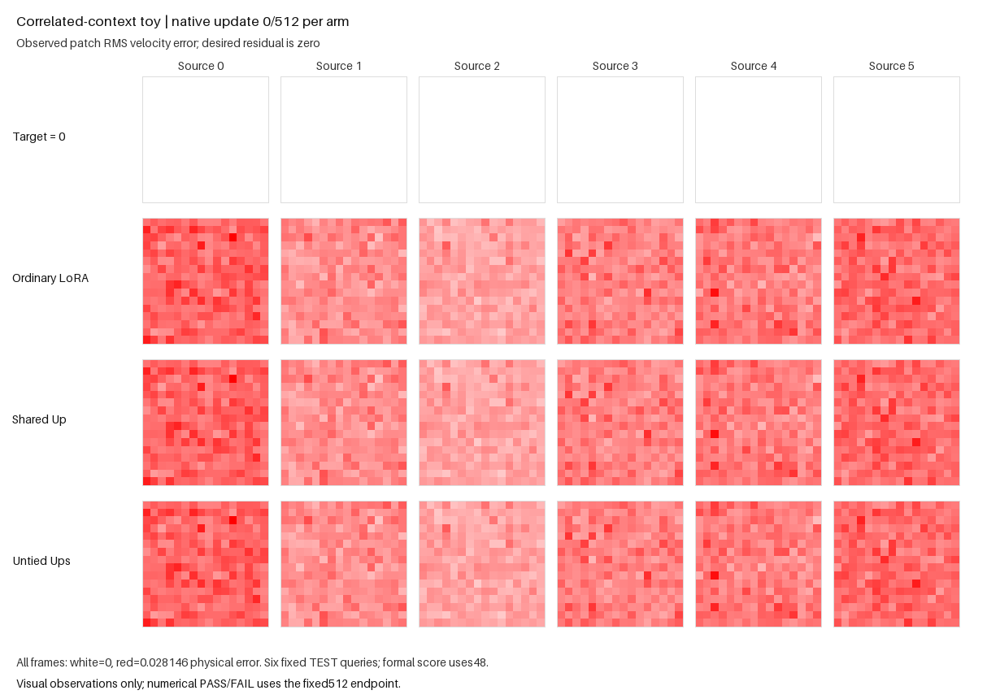

The correlated-input variant passed its fixed 512-update accuracy gate. Untied
particles beat ordinary LoRA by 2.558% and shared-Up particles by 2.486%, with
all six sources better than both controls. Cross-time correlation alone did not
reproduce the remaining actual-caption failure in this generated fixture.
The pretrained-caption and original full-Supra goals remain unresolved.

| TEST48 condition | Raw paired RMSE |
|---|---:|
| Ordinary BF16 LoRA | .006570665373 |
| Shared-Up BF16 particles | .006565844350 |
| Untied-Up BF16 particles | .006402591281 |
| Untied, codes zeroed | .007140628854 |

Zeroing codes increased aggregate RMSE by 11.527% and strictly harmed every
source. Bank/router gradients were live on all 511 post-first updates.
Each particle arm had five controller events, zero accepted proposals and zero
accepted row moves. No accepted structural change accounts for this result.

The new input law couples each source/occurrence across time using two Gaussian
anchors. FIT and TEST each retain 48 contexts but contain 12 independent
trajectories; GUARD contains 12 contexts and six trajectories. At the retained
`.25` FIT/TEST grid spacing the expected adjacent cosine is `.950350`, and
observed means were `.951021` and `.950791`. The defining `.992` expectation is
at a `.1` time gap. Marginal RMS was about one; the finite samples were not
renormalized or selected. Train and test anchors remain disjoint.

The normalization rule remains untrained FIT coordinate standard deviation
with a fixed `1e-8` nondegeneracy precondition. Its numerical values were
recomputed from the changed inputs. Initial normalized FIT RMS was `1.401402`,
versus `.365514` under the earlier `.04` floor. Token-mean power accounted for
78.94% of normalized initial power. At the endpoint it accounted for 3.896% of
untied error and 22.898% with codes zeroed. Centered power was slightly lower
with codes zeroed; the declared benefit concerns total/source accuracy.

The [independent CPU reduction](e22_routed_caption_flow_independent_review.json)
passed 77 checks in 1.102 seconds, with zero model/native calls, updates or
CUDA initialization. It exactly reconstructed all 108 context rows and 60
original-stream anchors, independently reduced all raw TEST48 scores, and
reconstructed all three 512-row data/Gaussian streams and matched owned penalty
streams. Saved terminal camera tensors exactly matched their selected endpoint
tensors. Source, protocol, preparation, package, launcher and raw-artifact
identities were unchanged. Learned-state finiteness, public restores and head
norms remain producer/source-bound witnesses. Adaptive sigma/LR trajectories
were not logged per update.

The sole GPU campaign took 162.183 seconds within its 300-second cap. Twelve
new CPU software cases preceded it, using four tiny native replay updates once.
The full-geometry prerequisite and terminal public replay passed in the
producer. The separate saved-state renderer took 1.408 CPU seconds and made no
model/native calls or updates.

The [actual goal GIF](e22_routed_caption_flow/goal.gif) uses the zero target and
three observed residual maps at updates 0/64/128/256/384/512, with a color range
fixed from initial frames. Its cameras illustrate convergence; full TEST48
determines the gate. The [final frame](e22_routed_caption_flow/goal-final.png)
and [media receipt](e22_routed_caption_flow/media-completion.json) are byte-exact
copies of the rendered campaign artifacts.

Reproduce the asset-free public-API test with the command in the
[protocol README](e22_routed_caption_flow.md). The
[compact result](e22_routed_caption_flow_results.json) records exact scores,
source counts, gates and provenance. This variant depends on
[PR241](https://github.com/255BITS/ParticleGAN/pull/241) and its inherited
PR240/239 helpers. Their executable files and evidence are unchanged. Real
latent amplitudes, pretrained host/teacher geometry and caption token directions
remain different; this result does not uniquely identify the transfer cause or
promote a full-Supra trial.
