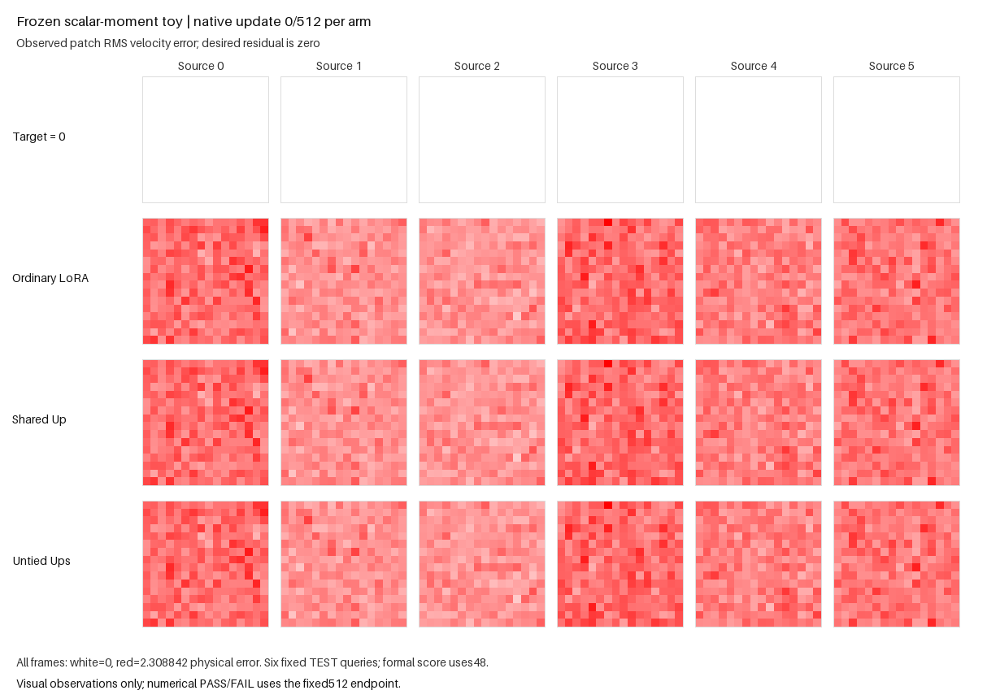

The scalar-calibrated frozen-host variant passed its fixed 512-update accuracy
gate. Untied particles improved raw RMSE by 4.930% against ordinary LoRA and
1.104% against shared-Up particles; every source improved against both.
Scalar moments alone did not reproduce the remaining actual-caption failure
in this generated fixture. The original full-Supra goal remains unresolved.

| TEST48 condition | Raw paired RMSE |
|---|---:|
| Ordinary BF16 LoRA | .775393729235 |
| Shared-Up BF16 particles | .745392136297 |
| Untied-Up BF16 particles | .737163908808 |
| Untied, codes zeroed | .831727071189 |

Zeroing codes increased aggregate RMSE by 12.828% and strictly harmed all six
sources. Bank/router gradients were live on all 511 post-first updates, and all
six C/particle-Up norm witnesses were positive. Each particle arm had five
controller events, zero accepted proposals and zero accepted row moves.
No accepted structural change accounts for the win.

The bundled profile contains 29 full-shape float64 mean/population-std records
from the immutable initial pure pretrained-base capsule. Linear weights and
biases retain Uniform sampling, position retains Normal sampling, and the
original full-name owned CPU streams are unchanged. Public initialization
applies call-local distributions before freezing. Learned tensor directions,
channel correlations, spectra and positional structure are not copied, and
finite sampled moments are not corrected to exact profile values.

Initial physical FIT RMS was `1.196320`; its token-mean power fraction was
56.217%. Normalized RMS was `1.226098`, with mean power 54.529%. The frozen FIT
scales ranged from `.790811` to `1.131507`; none used the old `.04` floor or
numerical epsilon. Calibration lowered the mean-power share from the parent
fixture's approximately 82%, but it does not match the actual host's output
magnitude, learned directions or approximately 42% mean share. Raw scores
across different frozen-host laws are separate task cohorts. No accuracy or
mean-share value was used to choose or adjust this fixed scalar profile.

At the endpoint, token-mean power accounted for 20.592% of untied error and
29.036% with codes zeroed. In this fixture, zeroing codes worsened both mean
and centered power as well as the declared total/source metric. Correlated
flow/caption inputs, paired target semantics, three-arm architecture/horizon,
native game/feature-only guards and offline accuracy/code/live gate were fixed.
The unchanged untrained FIT-std rule recomputed numerical game units naturally.

The [independent saved-CPU review](e22_routed_caption_frozen_stats_independent_review.json)
passed 110 checks in 1.384 seconds with zero models, native/API calls, updates
or CUDA. It exactly reproduced all 29 sampled FP32 frozen tensors using the
declared per-name draws, checked recorded realized moments, reconstructed flow
contexts/anchors and all three full update streams, and independently reduced
raw endpoint/source/code/live and saved camera scores. Terminal camera tensors
exactly matched their endpoint selections. Source/card/profile/preparation,
package, launcher and raw-artifact identities stayed unchanged.

Full-geometry initial owner/output equality, fresh public restoration and native
initial-loss tangent passed in the producer. Terminal public restoration and
clean-repeat capture, learned-state finiteness and trained head ownership remain
producer/source-bound witnesses. Per-update adaptive sigma/LR trajectories
were not logged. The sole GPU0 campaign took 160.625 seconds within its
300-second cap. Its 14-case CPU preparation spent four tiny replay updates once
and 3.296 seconds including imports, metadata and writes.

The [actual goal GIF](media/e22_routed_caption_frozen_stats/goal.gif) compares
the zero target and three observed residual maps at updates 0/64/128/256/384/512
on fixed source cameras, with an initial-only color scale. Full TEST48 determines
the gate. The [final frame](media/e22_routed_caption_frozen_stats/goal-final.png)
and [media receipt](media/e22_routed_caption_frozen_stats/media-completion.json)
are byte-exact copies; rendering took 1.356 CPU seconds without model/native
calls or updates.

The [protocol README](e22_routed_caption_frozen_stats.md) supplies the single
asset-free public-API science command. Exact metrics and provenance are in the
[compact result](e22_routed_caption_frozen_stats_results.json). This variant
depends on [PR242](https://github.com/255BITS/ParticleGAN/pull/242); its parent
executable files, tests and evidence are unchanged. This is one fixed generated
fixture, with no seed/scale/horizon scan, unique convergence-cause claim or
actual-caption/full-Supra promotion.
