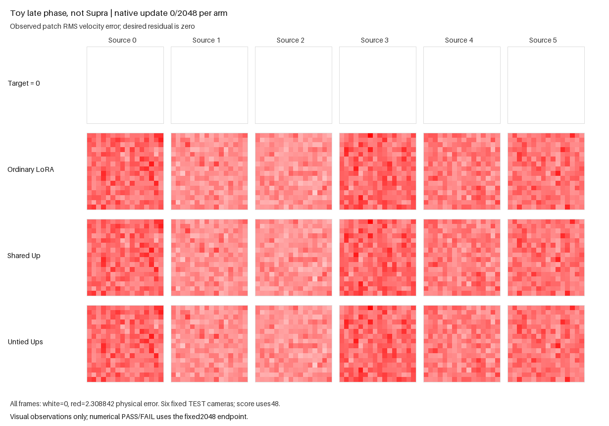

The fixed 2,048-update caption benchmark passed. Untied particles reached
physical TEST48 RMSE **0.484234982**, improving **11.411%** over ordinary LoRA
and **6.570%** over shared-Up particles. All six sources improved against both
controls. Extending this generated fixture through the observed native penalty
blend did not reproduce the remaining actual-caption failure. The original
full-Supra target remains unresolved.

| Fixed offline endpoint | Ordinary BF16 LoRA | Shared-Up particles | Untied-Up particles |
|---:|---:|---:|---:|
| 512 | .775393729235 | .745392136297 | .737163908808 |
| 768 | .700825367372 | .667957030865 | .640446309280 |
| 800 | .698034302348 | .663106179504 | .635047754968 |
| 1024 | .654839897314 | .622548271479 | .589415776780 |
| 1536 | .595986705256 | .564969305846 | .526273706540 |
| 2048 | .546611430702 | .518284612391 | .484234982037 |

Each score uses all 48 physical residuals, 256 tokens × 16 coordinates per
context, with eight contexts for each synthetic source. Only the predeclared
2,048 endpoint determines PASS/FAIL. Earlier evaluations and media captures
preserved native policy/caller RNG, modes, gradients and diagnostics; their
scores never chose a state, altered controls or stopped training.

| Synthetic source at 2048 | Ordinary | Shared | Untied | Untied with codes zero |
|---:|---:|---:|---:|---:|
| 0 | .582274059295 | .546187610027 | .517131571235 | .861758212058 |
| 1 | .535681949300 | .503757975736 | .473794069645 | .630512476346 |
| 2 | .512258435098 | .488476678802 | .452069966708 | .556796338422 |
| 3 | .553984527972 | .525884168504 | .494471679723 | .720758245673 |
| 4 | .552633632693 | .518694405547 | .484084986321 | .671340478472 |
| 5 | .540365258472 | .524798173032 | .481443095023 | .711111313303 |

Code removal increased aggregate RMSE to **0.698339119**, a **44.215%** increase,
and harmed every source. Bank/router gradients were live on all 2,047
post-first updates; all six C and particle-Up norm witnesses were positive.
Each particle arm recorded 20 controller events with zero accepted proposals
and zero accepted row moves. The unchanged structural guards score learned
critic-feature errors with zero permitted per-context harm; output-error
guards remain disabled. No accepted structural change accounts for this win.

All three arms recorded 799 pure-A penalty calls and 1,249 blended calls, with
the first observed blend at update 800. Critic call and completed-step counters
both reached 2,048. This confirms that the current run crossed the phase that
the earlier 512-update fixture did not reach. Phase coverage is descriptive;
compatible future API schedules are not required to reproduce these historical
counts to pass the fixed accuracy gate.

Public sigma/LR snapshots were taken after each native update. Sigma ranged
from `.125` to `.125532329` and ended at `.125` in every arm. All critic groups
started at `.00425`; terminal observed post-update rates were `.000425079` ordinary,
`.000782593` shared and `.000842098` untied. These different trajectories came
from the unchanged native controller. Applied generator/router/table rates
were not separately logged. Additional training, native adaptation and the
phase change occurred together; this run does not isolate a phase or LR cause.

The same fixed scalar-calibrated frozen host, correlated flow/caption inputs,
public fresh initialization, paired live teacher and RpGAN/KA2/DV12 laws were
retained. Only the horizon changed. Initial FIT-std units remained frozen,
with no old `.04` floor or epsilon activation. No output-MSE objective,
accuracy guard, target-fraction adjustment or seed/scale/horizon search ran.
Ordinary here is the matched native-game comparator; historical Supra examples
used a different training cohort. Generated scalar moments still omit
pretrained directions, covariance, positional structure, semantic token
geometry and the deeper Supra host.
Untied retains 82,944 additional output-head parameters; matched update budgets
do not isolate capacity or separate-head arithmetic.

The sole GPU0 campaign completed in **610.634 seconds** of its 900-second budget
(producer 609.905 s). All 58 launch pins remained unchanged. The
[independent saved-CPU review](e22_routed_caption_late_phase_independent_review.json)
passed **147 checks in 1.954 seconds**, with zero model constructions, native/API
calls, updates or CUDA. It reproduced the 29 frozen samples and flow contexts,
checked all 6,144 recorded external stream entries, reduced all 18 full TEST
curves and terminal source/code/live bounds, and checked recorded phase/rate
snapshots and media selections. Fresh/terminal public restore, initial native
loss tangent, finite learned owners and frozen host/teacher integrity remain
producer/source-bound witnesses; the independent reviewer did not rebuild models.

Preparation ran only the 18 NEW reduced-CPU cases once in 3.733 process seconds,
including exactly four tiny updates for a 2+2 public replay. Earlier suites
were not rerun. Saved-state rendering took 2.392 CPU seconds, with no models,
native/API calls, updates or CUDA. The media below are byte-exact copies.

The [final frame](media/e22_routed_caption_late_phase/goal-final.png) keeps the
initial-only color scale and six fixed cameras. The formal metric uses TEST48.
The [metric figure](media/e22_routed_caption_late_phase/metrics.png) shows full
offline RMSE above recorded native G/D game losses; D excludes the penalty.
Those game losses are not interchangeable with accuracy. Dashed lines mark
observed first blends without establishing causality. The
[media receipt](media/e22_routed_caption_late_phase/media-completion.json)
binds the images, input tensors, traces, producer and renderer.

The unchanged [protocol README](e22_routed_caption_late_phase.md) supplies the
single asset-free public-API command. [Compact results](e22_routed_caption_late_phase_results.json)
contain exact six-source curves, metrics, gates and provenance. The parent
[PR243](https://github.com/255BITS/ParticleGAN/pull/243) is merged into develop;
the prepared historical parent card remains unchanged. This adds a portable
2,048-update numerical test, with no native default promotion, actual-caption
fix, new actual/full training run or full-Supra win.
