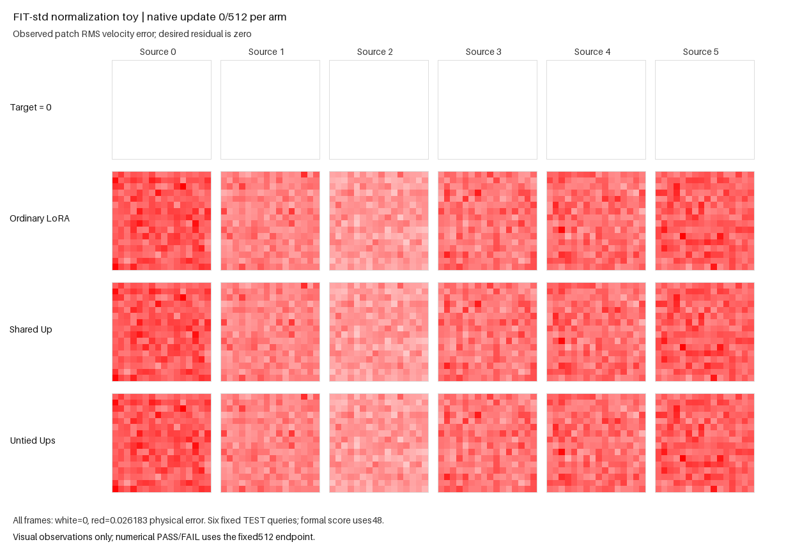

The fixed FIT-std variant passed. Untied particles beat ordinary LoRA by 2.273%
and shared-Up particles by 2.008% at the fixed 512-update endpoint, with all six
sources better than both controls. This rejects normalization alone as sufficient
to remove the win in this one generated fixture. The actual pretrained-caption
and full-Supra failures remain unresolved.

| TEST48 condition | Raw paired RMSE |
|---|---:|
| Ordinary BF16 LoRA | .006543289293 |
| Shared-Up BF16 particles | .006525590065 |
| Untied-Up BF16 particles | .006394539507 |
| Untied, codes zeroed | .007031394196 |

Zeroing codes increased aggregate error by 9.959% and strictly harmed every source.
Bank/router gradients were live for all 511 scored updates after the first.
Both particle arms had five controller events, zero accepted proposals and zero
accepted row moves. No accepted structural change accounts for this result.

All sixteen untrained FIT coordinate standard deviations were below the old
`.04` floor and above `1e-8`; their range was `.0074863–.0145496`. FIT normalized
RMS rose from `.366335` under the old scale to `1.404525`. Its token-mean share
of squared power was 78.93% after normalization, versus 82.20% in physical
coordinates. At the endpoint, mean power represented 3.264% of untied error and
20.506% with codes zeroed. Code zero slightly lowered centered power, so code
benefit concerns the declared total/source metric, not every spatial component.

The original data digest exactly matches PR240's parent run; the inherited
data/update/untied helpers and native Python bytes also match. This comparison
changes only the frozen scale and its derived digest. It does not change the
generated backbone, caption directions, iid latents, held-out times, initialization,
native D/G DV12 or three-arm horizon. The actual task also demanded an absolute
`.0005` gain, which this variant does not assess.

[Independent F64 reduction](e22_routed_caption_normalization_independent_review_v2.json)
passed 35 checks with zero model/native calls, updates or CUDA initialization.
It reconstructed all 512 data/Gaussian draws and matched all three owned penalty
streams. Its first 1.008-second attempt incorrectly hashed a stacked Gaussian
tensor rather than the updater's list of two draws; that
[failed reduction receipt](e22_routed_caption_normalization_independent_review.json)
is preserved. The separate v2 reduction took 1.018 seconds. No training test,
source or result was changed or rerun.

The sole GPU campaign took 162.683 seconds within its 300-second cap. Sixteen
new software checks passed beforehand with four tiny native replay updates;
full-host prerequisites and terminal public replay passed in the producer.
Learned-state finiteness and head norms remain producer/source-bound witnesses,
while raw scores, scales, source counts and full trace streams were reduced
independently. Adaptive output-noise and learning-rate trajectories were not
logged per update, so constant dynamics are not claimed.

The [actual saved-state goal GIF](e22_routed_caption_normalization/goal.gif)
compares target zero, ordinary, shared and untied residual maps at updates
0/64/128/256/384/512. It uses a color range fixed only from initial frames and
does not affect scoring. Reproduction commands and the unchanged gate are in
the [protocol README](e22_routed_caption_normalization.md); exact scores and
source/artifact identities are in the [compact result](e22_routed_caption_normalization_results.json).

The published [final frame](e22_routed_caption_normalization/goal-final.png) and
[media receipt](e22_routed_caption_normalization/media-completion.json) are
byte-exact copies of the rendered campaign artifacts. This variant imports
the public-API helpers from [PR240](https://github.com/255BITS/ParticleGAN/pull/240)
and depends on that PR; none of its executable files or earlier evidence change.
