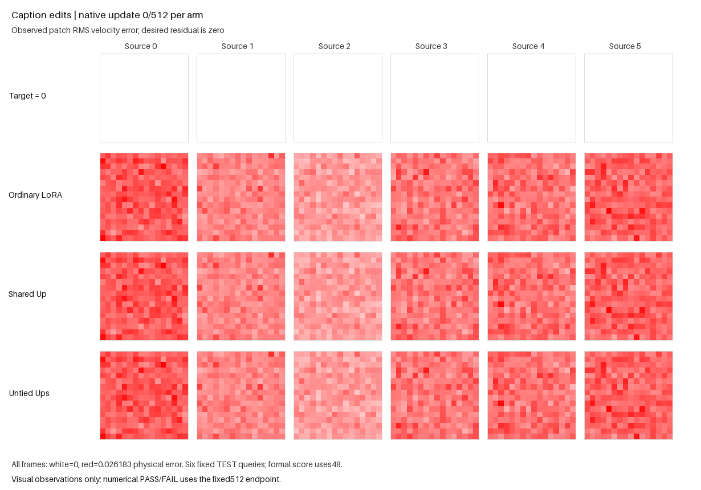

# Untied output-head caption variant

The fixed 512-update public-API experiment **passed**: untied particle heads
reduced terminal held-out RMSE by 0.624% versus ordinary LoRA and 0.884% versus
shared-head particles. All six sources improved against both controls. This is
a generated-task result; actual Supra verification remains outstanding.

| Model at update 512 | TEST48 RMSE ↓ |
| --- | ---: |
| Ordinary LoRA, BF16 | 0.006489918631 |
| Shared-head particles, BF16 | 0.006506938520 |
| Untied-head particles, BF16 | **0.006449427078** |
| Untied-head particles with codes zeroed | 0.007026862884 |

Removing particle codes worsened RMSE by 8.95% and harmed every source.
Bank/router gradients were live on all 511 eligible updates, and all six
particle-head/C norms were nonzero. Each particle arm recorded five proposal
events including skips, with **zero accepted row moves or proposals**. The
sole execution completed in 161.973 seconds within its 300-second budget.
The [compact readout](e22_routed_caption_untied_results.json) binds the raw
report, completion, external clock and all three matched update traces.
The [independent reduction](e22_routed_caption_untied_independent_review.json)
confirms the gate and verifies both control endpoint tensors exactly reproduce
PR239. Their earlier FAIL remains unchanged.



The [media receipt](e22_routed_caption_untied/media-completion.json) binds these
six fixed observations to the completed run. Rendering took 1.350 seconds on
CPU with zero model forwards or native updates.

This standalone variant tests whether ordinary and particle features benefit
from independent output heads. It imports the bundled PR239 fixture's unchanged
data, native-game update and public state helpers. That fixture and its
[prior scientific FAIL](e22_routed_caption_accuracy.md) remain unchanged.

For shared `h=Down(x)`, the new adapter is

```
U_h[h+tanh(Hh+b)] + U_p[h*tanh(Cz)]
```

Both Up heads are registered and publicly initialized before optimizers/EMA,
then zeroed along with fresh H/b; C remains sampled. Down and both Ups use BF16
matmuls; query, bridge, guidance and head summation use FP32. The heads add
82,944 learned parameters at six sites: 241,400 particle parameters versus
158,456 for shared-head particles and 141,312 for ordinary LoRA. Extra capacity
and separate BF16 product rounding prevent a unique head-interference claim.
This is not a native optimizer bug fix or a proof
of lower total gradient variance.

The [fixed protocol](e22_routed_caption_untied_v1.json) trains all three fresh
arms for 512 updates each under the same public native paired game, 128×4
routed bank, DV12, feature-only structural controls and isolated streams. No
output objective, output guard, checkpoint selection, seed/rate scan or
metric-dependent stopping is used. The dense particle-cloud sigma0 prior is
an explicit shared-bank task exception, not a default Forge qualification.

From the repository root:

```sh
CUDA_VISIBLE_DEVICES=0 python -m examples.e22_routed_caption_untied --run --out runs/caption-untied-up-v1
```

One 300-second budget includes startup, the full-geometry zero-update proof,
3×512 updates, fixed observations, terminal restoration and final writes.
Terminal TEST48 physical RMSE is reduced in float64, offline only. PASS requires
untied particles improve aggregate RMSE by at least 0.1% against **both**
ordinary and shared-head controls, no source harmed by more than 1e-6 against
either, at least 0.1% aggregate code benefit and strictly positive code benefit
for every source. Bank/router gradients must be live on at least 90% of
updates 2–512, with all six particle Up/C norms finite and nonzero. Exit 0 is
scientific PASS, 1 completed scientific FAIL and 2 incomplete/error. Future
imported APIs can pass directly; package identity is recorded and checked
within-run without a permanent native version allowlist.

The prerequisite also uses the public native loss and DV12 to verify the
initial main-Up gradient agrees exactly with ordinary LoRA while all six
particle-head gradients are nonzero. It restores native/caller streams,
modes and gradients afterward. This is an initial-point software/integration
proof, not convergence evidence.

After a completed verdict, render the actual saved observations:

```sh
python -m examples.render_e22_routed_caption_untied --run-directory runs/caption-untied-up-v1
```

The optional NumPy/Pillow>=10.1 renderer has a separate 60-second CPU budget,
no models or updates, and preserves existing media. Four rows show target
zero beside ordinary, shared-head and untied predictions at fixed steps
0, 64, 128, 256, 384 and 512. Six fixed source-conditioned patch RMS maps share
one initial-only color scale; all 48 TEST queries determine the numerical gate.

```sh
python -m pytest tests/test_e22_routed_caption_untied.py -q
```

The CPU software suite passed 20 cases in 1.87 seconds with exactly four tiny
native updates for 2+2 public replay. It tests initialization/tangents, live
heads, EMA/optimizer ownership, BF16 matmuls, gate/scorer destructive controls,
trained subclass restore and observation/output preservation. Preparation
agents performed no full-geometry or CUDA training. The sole science run's
full-geometry prerequisite passed: initial ordinary-head gradients matched
ordinary LoRA exactly, all six particle-head gradients were nonzero, and
state/stream rollback and terminal public restores were exact.

The generated captions/backbone require no external assets. TEST includes
novel times/latents, unlike the actual caption task's common time grid. Actual
BF16 transfer still loses to ordinary LoRA; full Supra's original top score
remains unbeaten. This toy PASS supports separate actual-task verification;
it establishes neither a unique convergence cause nor a full-Supra improvement.
