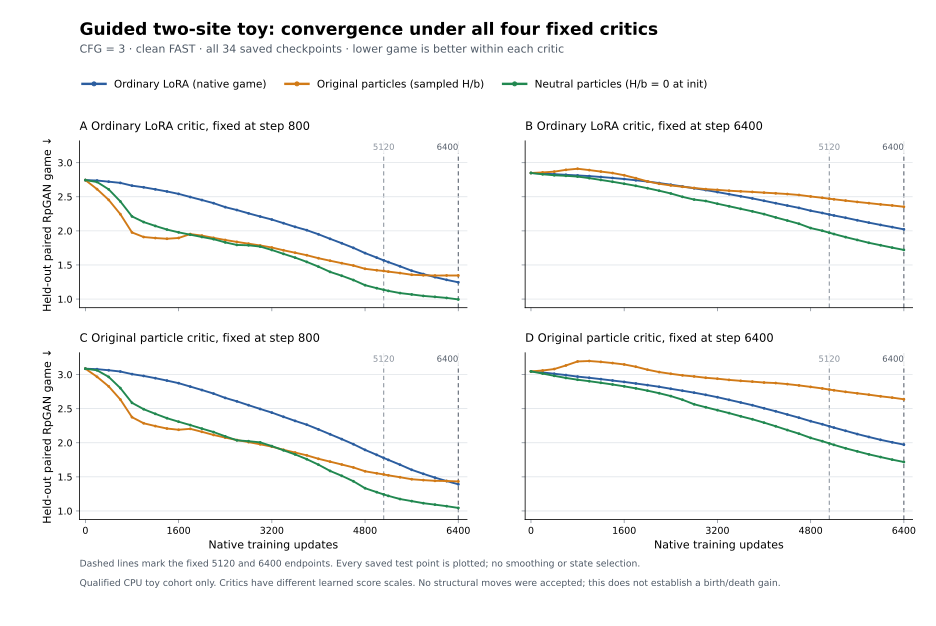

# Shared guidance-pair convergence diagnostic

This is one standalone CPU task for PR227. After 35 software checks and
zero-update source review passed, the user's request to isolate the problem
authorized the fixed [card](e22_routed_convergence_guided_pair_v1.json). Its
scientific settings and budgets were frozen before the first quality update.
The [preparation receipt](e22_routed_convergence_guided_pair_software.json)
retains the original source-only card and readiness identities.

The qualified unguided rotated teacher did not consistently reproduce the
original ParticleGAN disadvantage. Neutral particles beat ordinary training
under all four fixed critics at both endpoints and every subject. That result
does not identify the cause of full Supra's convergence gap. This task tests
one missing execution mechanism: the same two sites and parameters process
conditional and unconditional halves, then combine their outputs at CFG=3.

Conditional source vectors and input panels stay exact. The unconditional
source is the fixed mean of the six parent vectors, with the same latent/time
input. Host activations use `[conditional B, unconditional B]`; routing chunks
that order and stacks `[B,2,T,N]` logits. Mixed codes use the inverse
concatenation. Native DV12 independently perturbs both halves at both sites,
and native evidence still counts B=4 contexts. Every candidate recomputes both
sites and the complete guided output. Output guards remain disabled; the
learned-feature per-context guard remains zero.

The teacher's down/up weights, every existing fresh parameter, named API
initializer, native recipe, rates, and streams remain held. New frozen source
projection and mean-source buffers are serialized in FAST and EMA states.
Targets, frozen base outputs, and the fixed fit residual scale follow the
guided law. Each half retains its BF16 boundaries; the final FP32 expression
is `unconditional + 3*(conditional - unconditional)`, matching Supra's
arithmetic order. The synthetic mean-source unconditional input still differs
from Supra's real null-caption sequence and mask.

The [factory](../examples/e22_routed_convergence_guided_pair.py) subclasses the
held host and invokes the exact held factory code object with an isolated
globals dictionary. The [campaign adapter](../examples/e22_routed_convergence_guided_campaign.py)
binds the same held update, checkpoint, restore, replay, and independent score
helpers. No native optimizer or training loop is copied or changed. Actual
callback bindings, source bytes, code objects, runtime, card, data and archive
identities enter the receipts. Code-object hashes also bind the interpreter
and absolute checkout path.

Run and independently review the fixed task from the repository root:

```sh
PYTHONPATH=. python -u examples/run_e22_routed_convergence_guided_pair.py \
  --out runs/routed-convergence-guided-pair-v1
PYTHONPATH=. python examples/review_e22_routed_convergence_guided_pair.py \
  --run runs/routed-convergence-guided-pair-v1 \
  --out runs/routed-convergence-guided-pair-v1/independent-review.json
```

Raw progress is in `runs/routed-convergence-guided-pair-v1/run.log`; it stays
outside Git along with checkpoints, score streams, and replay artifacts.

Preparation checks run without a quality experiment:

```sh
PYTHONPATH=. python -m pytest \
  tests/test_e22_routed_convergence_guided_pair.py \
  tests/test_e22_routed_convergence_guided_campaign.py -q
PYTHONPATH=. python examples/review_e22_routed_convergence_guided_pair.py \
  --source-only --out runs/guided-pair-source-readiness.json
```

The frozen quality plan remains three arms with 6400 updates each, both fixed
5120/6400 endpoints, all four newly trained baseline critics, 105 states,
102 clean curves, and exact recovery for all arms. The total 2700-second budget
includes independent review. Every signed score and any failure to reproduce
the gap must be retained. This task grants no Forge, default, or full Supra
qualification credit.

The completed task passed independent review: **570,039 checks**, all 105
states, all 102 fixed curves, and exact recovery for all three arms. Execution
and review took **566.990 seconds** within the declared 2700-second budget.
[Qualified results](e22_routed_convergence_guided_pair_results.json) retain both
endpoints, every judge, every subject, particle ablations and source identities.

Held-out native game at 6400, lower is better:



The [plot receipt](e22_routed_convergence_guided_pair_plot.json) binds all 408
values and the figure to the qualified curve stream. Its
[plotter](../examples/plot_e22_routed_convergence_guided_pair.py) performs no
training or model loading.

| Fixed critic | Ordinary LoRA | Original particles | H/b-neutral particles |
| --- | ---: | ---: | ---: |
| Ordinary @800 | 1.245403 | 1.345233 | **0.994643** |
| Ordinary @6400 | 2.022018 | 2.353401 | **1.720607** |
| Original particles @800 | 1.390754 | 1.432618 | **1.044352** |
| Original particles @6400 | 1.972537 | 2.637286 | **1.717662** |

This isolates an initialization-sensitive convergence problem in the guided
host. The original particle arm loses to ordinary under all four critics at
6400. Zeroing only fresh H/b removes that disadvantage; C, bank and router stay
trainable and beneficial. Neutral particles beat ordinary for every subject
under every critic at **both** 5120 and 6400. The original disadvantage is a
late result: at 5120 it still beats ordinary under the two @800 critics. All
observations and curves remain in the report; no checkpoint was chosen by score.

The matched H/b intervention establishes its effect on this fixture. Changing
guided execution also changes targets, scale and trained critic weights, so
absolute scores from the unguided parent cannot measure a unique CFG effect.
Both adapter families remain exactly teacher-reachable. The toy **does not
reproduce the remaining full-Supra disadvantage of H/b-neutral particles**
against the historical MSE/AdamW reference. That reference also has a different
initializer and editing/preservation schedule. No general optimizer or SOTA
claim follows from the toy result.

A separate [zero-update stationarity reproducer](e22_routed_game_stationarity.md)
checks whether a frozen learned critic pushes an already exact solution. Its
unit tests also show why canceling that force alone does not guarantee safe
attraction or faster acquisition.
