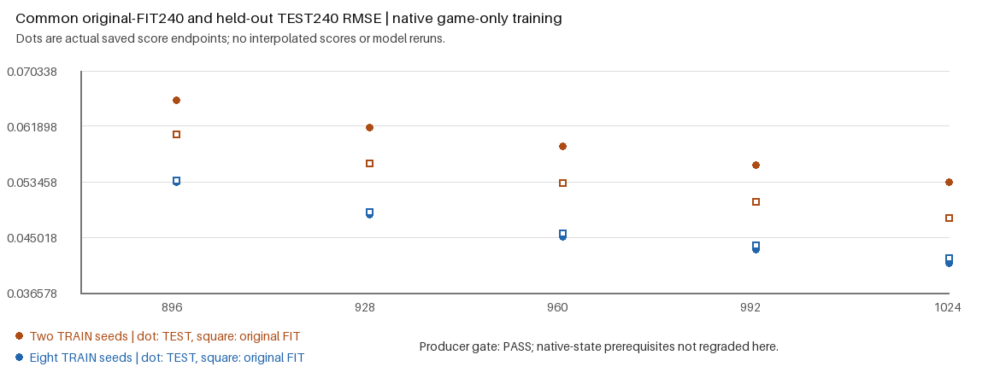

# Routed latent coverage: generated diagnostic v2

Expanding the training latent support from two shared noise seeds to eight
reduced final held-out RMSE by **23.09%**, from **0.0533702454** to
**0.0410462237**, at the same 1,024 native updates per arm. All 11 preregistered
gates passed. This is a generated FP32 two-site diagnostic; transfer of this
improvement to the actual Supra teacher and full model remains untested.

The question comes from Supra's actual fixed 12,800-update particle checkpoint:
training-context RMSE was approximately 0.0297 versus 0.0697 on held-out noise,
and the observed game gradient improved training accuracy while pointing
against held-out accuracy. Both training noise tensors were reused across all
six caption pairs and both Euler paths. This motivated changing support size,
without changing the native game or feeding accuracy metrics into optimization.

| Native updates per arm | Two-seed TEST RMSE | Eight-seed TEST RMSE |
| ---: | ---: | ---: |
| 896 | 0.0658699358 | 0.0533574620 |
| 928 | 0.0617616084 | 0.0484976015 |
| 960 | 0.0588498791 | 0.0451336732 |
| 992 | 0.0559871256 | 0.0431103365 |
| 1024 | 0.0533702454 | 0.0410462237 |

Every caption source and both held-out noise seeds improved at all five fixed
endpoints. Both common frozen terminal critics preferred the eight-seed arm at
all five endpoints. The final TEST-minus-original-FIT MSE gap decreased from
0.0005545459 to -0.0000674414. Removing the eight-seed arm's particle code raised
TEST RMSE to 0.0895439938 and worsened both common game scores.

Particles, routing queries and dense rows had live gradients in all 1,023
eligible post-initial updates in each arm. The bank and router changed, both
particle sites remained nonzero, and all observed owners were finite. Both
arms proposed 10 structural events and accepted **zero** moves. These results
support improving data coverage; they do not demonstrate a better structural
controller or identify a native optimizer defect.

The frozen [protocol](e22_routed_latent_coverage_v2.json) retains the public
`e22_routed` recipe, learned output noise, KA2's update-800 phase transition,
DV12, shared-Up particle sites, exact public recovery, game-only training and
the explicit zero-width particle-cloud exception. Carrier and learned owners
use public `init.initialize_` before optimizer/EMA construction. Both arms use
the same initialization and paired uniform source/time/path addresses. The
240 versus 960 ordered FIT contexts contain 228 versus 912 unique inputs;
the two paths duplicate their initial time-zero input. TEST240, the old
64-row guard, coordinate scales, endpoints and tolerances stay fixed.

This sampling comparison does not reproduce the historical `randint(240)`
address sequence. The generated toy uses FP32 and smaller dimensions than
Supra. Its RMSE units cannot be compared with the original full-model LoRA
score. No output-MSE objective, structural guard or score-based checkpoint
selection was introduced. No default or Forge promotion follows from this
standalone result.

[Actual-training goal GIF](e22_routed_latent_coverage/media-v2/goal.gif) shows
the same six held-out time-zero camera queries at updates 0, 128, 256, 512,
800 and 1024. The color scale is fixed from initial observations. Its numeric
scores use all 240 TEST contexts and are measured only at the five endpoints
above; the camera subset is not used as the gate.

GPU execution completed in **228.241 seconds within 300**, including the
external envelope, with all 44 bound inputs stable. The saved-array CPU reader
passed **1,984 assertions in 2.201 seconds within 60**, with all 49 bound inputs
stable, recomputing all 11 gate decisions from saved observations. It performed
zero model forwards, API calls, optimizer steps or training updates.

The [saved-metric review](e22_routed_latent_coverage/media-v2/saved-metric-review.json)
independently verifies physical RMSE, subgroup metrics, saved common-game means,
camera observations and gate arithmetic. Native live-gradient, owner, moment
and exact-recovery evidence remains authenticated producer evidence; those
states were not reexecuted by the reader. The
[media receipt](e22_routed_latent_coverage/media-v2/media-completion.json) binds
the actual GIF and figures. The
[external verification receipt](e22_routed_latent_coverage/media-v2/external-verification-receipt.json)
records the whole-process CPU allowance and immutable producer evidence.

Producer report SHA256:
`b3e926090f7eef219bbcba015dc819b57ef30d21d6b86505f35dc15b9b8317b7`.
Raw observations SHA256:
`4da8f30dc1c9aad5cdfe574e0d7c7c11c12ed87e92844842e34c332bced4e61f`.
Raw traces, checkpoints and tensor observations remain local in
`runs/latent-coverage-science-v2`; they are not added to Git.

The original v1 CPU attempt remains failed and preserved. It restored a
clock-zero checkpoint with an unresolved output shape into an already begun
policy with a resolved shape, violating the public immutable output-scope
contract. V2 restores that initial checkpoint into a fresh unresolved owner.
No native package bytes, metric gates, numerical tolerances or training budget
were changed to obtain this compatibility correction.

The next validation uses the actual frozen Supra teacher with expanded latent
support. The original LoRA still leads the last qualified full-model comparison:
RMSE **0.0633609846** versus best particle RMSE **0.0679143351**. Those full-task
results remain authoritative until the actual coverage experiment completes.
