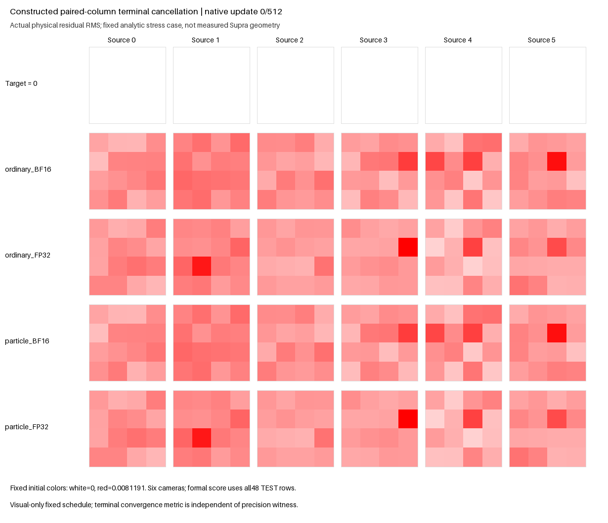

The constructed terminal-cancellation benchmark completed **FAIL** at the fixed 512-update endpoint. Independent saved-data qualification passed all 565 checks in 1.496058 external CPU seconds; all 75 bindings remained unchanged. This qualifies the recorded negative result and leaves every scientific bound unchanged.

| Arm | Physical TEST48 RMSE |
|---|---:|
| Ordinary LoRA, BF16 terminal | 0.003854491 |
| Ordinary LoRA, FP32 terminal | 0.003457183 |
| Routed particles, BF16 terminal | 0.004136585 |
| Routed particles, FP32 terminal | 0.003563903 |
| FP32 particles with zero codes | 0.003422292 |

Lower is better. FP32 particles are 3.087% worse than FP32 ordinary LoRA; they harm sources 0, 2, 3 and 4. Removing codes improves aggregate particle RMSE by 3.973%, so both code-utility bounds fail. Bank and router gradients were live in all 511 eligible updates, and both sites retained nonzero C and particle heads. Liveness did not establish useful convergence.

The separate last-update precision diagnostic passes its fixed 75% bounds: the FP32/BF16 squared-output-movement ratio is 0.019548, and the absolute finite-change/VJP-discrepancy ratio is 0.359571. Both parameter-VJP slopes are positive. Consequently this run does **not** reproduce the actual reduced-model phenotype of a helpful parameter tangent followed by finite-step harm. This diagnostic PASS leaves the convergence FAIL unchanged.

This is an analytic stress fixture with constructed paired projection columns [W, -W], a shared carrier and edit amplitude 1/64. The teacher remains BF16; widening the student terminal changes input, weight, matmul and output arithmetic together. The constructed directions are not measured full-Supra geometry, and the harmful code result is not an established full-model cause.

The retained qualified full-Supra neutral-12800 BF16 ablation points the other way: live codes give RMSE 0.070021495, versus 0.117306329 with zero codes and 0.110450110 with mass-only routing. D1856 rises from 0.893615349 live to 1.155845233 with zero codes. Codes therefore help that full checkpoint. Separately, the qualified full terminal-FP32 control lowers neutral RMSE from 0.070021495 to 0.069659898 (about 0.516%); original LoRA improves from 0.063777300 to 0.063360985 (about 0.653%) and still leads. These zero-update serving observations do not establish faster training or a particle-specific precision remedy. The original full-Supra goal remains unbeaten.

The sole four-arm campaign used 2,048 native updates and 65.875590 seconds of its 300-second external allowance. All 51 launch bindings remained unchanged. Training used the public ParticleGAN game and controls; the terminal task metric supplied no optimizer objective, guard, stopping rule or snapshot selection. A future API can pass the unchanged numerical gate without reproducing this historical failure.

Run the self-contained API benchmark in a fresh output directory:

```bash
python -m examples.e22_routed_terminal_cancellation --run --out runs/terminal-cancellation-new --device cuda:0
```

The CLI exits 0 for completed convergence PASS, 1 for completed FAIL and 2 for incomplete execution. Imported package identity is recorded and checked within the run, with no permanent revision allowlist. Optional media rendering uses retained observed states and a separate CPU budget; it changes no scientific verdict.

- [Fixed protocol](e22_routed_terminal_cancellation_v1.json)
- [Software qualification](e22_routed_terminal_cancellation_preparation.json)
- [Producer readout and bindings](e22_routed_terminal_cancellation_results.json)
- [Portable example](../examples/e22_routed_terminal_cancellation.py)

The full-model comparisons above are supporting local evidence; those actual assets are not external dependencies of this portable fixture.

The [first frozen reader attempt](e22_routed_terminal_cancellation_independent_review.json) remains failed and preserved. Native `Recipe.to_dict()` keeps tuple-valued fields in saved Torch state; report JSON represents them as arrays. The separate [v2 compatibility descriptor](../reports/toy_audit/api_contract/terminal_cancellation/e22_terminal_cancellation_reader_v2.json) documents the one-line metadata comparison correction. The original reader and all receipts remain unchanged, and v2 changes no numerical reduction, tolerance or gate. It was frozen after science, before its single saved-data CPU execution; no training, old test or model evaluation was rerun.

- [Qualified independent review](e22_routed_terminal_cancellation_independent_review_v2.json)
- [Compact qualification and preserved lineage](e22_routed_terminal_cancellation_qualification.json)
- [Actual-training media receipt](media/e22_routed_terminal_cancellation/media-completion.json)
- [Final observed frame](media/e22_routed_terminal_cancellation/goal-final.png)

The actual-training GIF below uses the six fixed source cameras and one initial-only color scale. Rendering consumed 1.940459 external CPU seconds, with all 57 bindings unchanged and zero model/API calls or updates. The numerical TEST48 gate remains authoritative.


