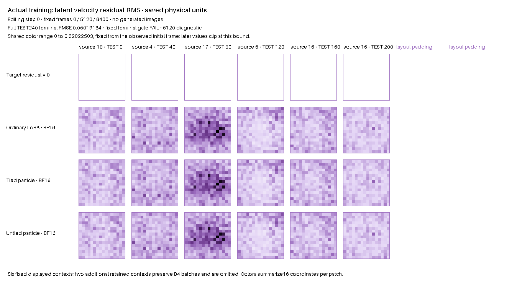

# Actual-caption untied heads: completed FAIL

The untied particle heads improved aggregate terminal accuracy, but failed the declared actual-task gate. At 6,400 updates, physical TEST240 RMSE was **0.050191642**, versus ordinary native-game LoRA 0.050397003 and tied BF16 particles 0.050601121. The gain over ordinary was 0.000205361 (0.407%), below the required **>0.0005**; sources 4, 15 and 17 were worse than ordinary. Full-Supra quality promotion is ineligible, and the original full-Supra top score remains unbeaten.

| Fixed update | Ordinary native game | Tied BF16 particles | Untied BF16 particles | Untied, zero codes |
|---:|---:|---:|---:|---:|
| 5120 | 0.050088026 | 0.050364926 | 0.050218781 | 0.052003135 |
| 6400 | 0.050397003 | 0.050601121 | 0.050191642 | 0.052444212 |

At 5,120, untied remained worse than ordinary by 0.000130755. Its aggregate RMSE then improved by only 0.000027139 to 6,400 (0.0540%). Four sources worsened over that interval; the aggregate improvement was concentrated in sources 5 and 18. These two fixed endpoints do not establish a plateau or its cause.

| Source ID | 6400 untied−ordinary | 6400 untied−tied | 5120→6400 untied change |
|---:|---:|---:|---:|
| 4 | +0.000383852 | -0.000125859 | +0.000243580 |
| 5 | -0.000389946 | -0.000115908 | -0.000094278 |
| 15 | +0.000111027 | +0.000160513 | +0.000152330 |
| 16 | -0.000887432 | -0.001107755 | +0.000002106 |
| 17 | +0.000201548 | +0.000009098 | +0.000150072 |
| 18 | -0.000656324 | -0.001285195 | -0.000626915 |

Codes remain useful: removing them at 6,400 raised RMSE to 0.052444212, a 0.002252569 increase (4.488%), and worsened every source. Bank and router gradients were live on 6,399/6,399 post-first updates; all six C and particle-Up norms were positive. There were 64 structural probe events and **zero accepted proposals or row moves**. No population-change improvement is claimed.

The single GPU0 campaign completed in 710.125 s of its 1,750 s budget (child 709.280 s; exit 1 for science FAIL). Cached ordinary and tied-BF16 terminal predictions replayed exactly over all 240 TEST contexts. Candidate-owned 800→802 row/full-native/caller/mode/gradient replay, shared initial prediction, FAST/EMA class/arithmetic/ownership and finite learned-state checks passed. These integrity checks do not change the scientific verdict. Cached whole histories remain provisional.

The model retains a shared Down and two public-initialized zero Up heads, H/b zero, sampled C, a 128×4 native particle bank, native D/G DV12 and RpGAN/KA2 updates, and feature-only structural guards. Physical RMSE is an offline terminal evaluation; it never controls optimization, guards, stopping, or checkpoint selection. The additional 82,944 parameters and separate BF16 products prevent a unique head-tying causal claim. This is the actual depth-one six-site host, distinct from full Supra and its historical selected 28k reference.

[Fixed protocol](e22_routed_untied_caption_v1.json) · [Preparation](e22_routed_untied_caption_preparation.json) · [Compact results](e22_routed_untied_caption_results.json) · [Independent saved-artifact review](e22_routed_untied_caption_independent_review.json)

The independent review matched the saved numerical reductions within 6.94e−18, verified all 6,400 caller-stream rows, and constructed no models or native updates. Its SHA256 is `f8c04ca2f914315dcb1073a10f87d7988501308f7d65d36ce8639f527bd596db`.



The GIF shows the actual zero residual target and ordinary/tied/untied observations at 0, 5,120 and 6,400, with one fixed initial color scale. Six displayed TEST contexts are illustrations; the metric uses all 240. [Media receipt](e22_routed_untied_caption/media-completion.json) binds saved inputs and byte-exact GIF; rendering used 1.009 s CPU with no model forwards or native updates.

This is supporting local transfer evidence. The following is the recorded local command; its driver requires the plan's exact output path and refuses that existing path. The local driver and model assets are not bundled with PR240:

```sh
CUDA_VISIBLE_DEVICES=0 PYTHONPATH=. python -u -m examples.run_e22_routed_untied_caption --plan docs/e22_routed_untied_caption_v1.json --out runs/caption-untied-Up-accuracy-v1
```

Exit 0 means scientific PASS, 1 completed FAIL, and 2 incomplete/error. For an executable asset-free test, use PR240's [portable public-API example](../examples/e22_routed_caption_untied.py) and [toy protocol/readout](e22_routed_caption_untied.md). That toy passed separately; this actual-task result is its transfer limitation, not a retroactive change to the toy gate. All executed sources, cards, tests, preparation records and raw artifacts remain unchanged.
