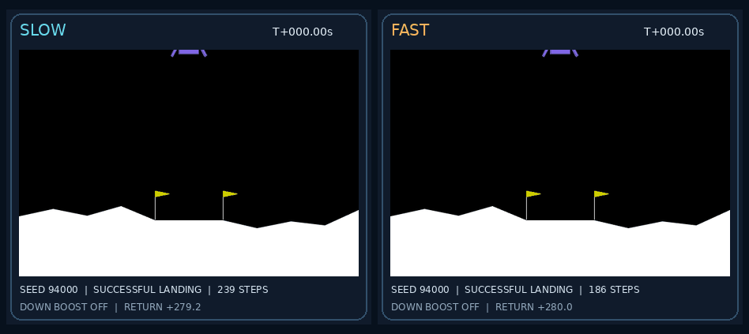

# Fast Lunar lander

From this checkout, run:

```bash
uv run --extra lunar python -u examples/fast_lander.py
```

Alternatively, install once with `python -m pip install -e '.[lunar]'`, then run
`python -u examples/fast_lander.py`. Python 3.10+ is required. No pre-existing
checkpoint, downloaded expert dataset, display server, or GPU is needed.
The default output directory is `results/gym/fast_lander`; use `--out PATH`
for another run. Existing output directories are preserved and never silently
reused. `--device cuda:0` is supported; these small networks default to CPU.

The terminal shows seven stages, flushed training progress, and a landing
leaderboard. Follow another terminal with
`tail -F results/gym/fast_lander/run.log`. Structured events are in
`metrics.jsonl`. Open `results/gym/fast_lander/index.html` for the local demo.

The [recorded full run](../reports/lunar_fast/README.md) landed **29/30** held-out
test worlds with the fast policy versus **28/30** with the learned slow policy.
Fast won all 27 matched successful flights, with **1.180× paired speedup** and
32 median steps saved. The entire run took about 73 seconds on this host.
Neither policy crashed or flew away; the three failed flights settled with
incomplete leg contact and still count as failures under the strict gate.
These measurements use the declared variant below, not stock Lunar.



## What the command trains

1. Collect slow and fast heuristic expert trajectories in the actual Box2D
   simulator, with states, actions, successors, and episode provenance.
2. Train a small action-conditioned delta world model. A separate subset of
   training-world episodes measures dynamics generalization. Before fitting,
   replay training-only prefixes and branch into off, down, and upward commands.
   These real counterfactuals teach dynamics, never policy imitation targets.
   Action features encode the simulator's main-engine ignition threshold and
   side-engine dead zone; the network learns the resulting motion.
3. Initialize a slow policy by behavior cloning, then train it with conditional
   paired relativistic logistic GAN loss and the public ParticleGAN gradient
   cap. A frozen world model also supplies a differentiable successor loss.
4. Extract pairs only when both experts land on the same reset and the fast
   trajectory finishes sooner. Export progress-aligned pairs for inspection
   and real fast transitions for policy training. Fast action targets keep
   their own physical states; progress-aligned slow states are not substituted.
5. Refine the learned slow policy into fast candidates over several rounds.
   Select on real validation landing count first, then successful flight time.
6. Evaluate the frozen winner on a separate test cohort only after validation
   passes. Training and selection never read test trajectories.
7. Export `slow.gif`, `fast.gif`, `comparison.gif`, a local HTML dashboard,
   checkpoints, datasets, hashes, configuration, and a machine-readable report.

The policy is a learned network at inference; it does not call an expert.
All training, checkpoint selection, and flight evaluation use **live weights**.
There is no EMA. New checkpoints explicitly record `weight_kind: live`, and
the policy recipe sets `ema_decay: 0`; loaders reject checkpoints declared as
EMA. Legacy checkpoints used live weights too, despite an unused inherited
recipe `ema_decay: 0.995` field. New formats require explicit live provenance.
An explicit main-engine deadband maps commands with absolute value below 0.12
to exact zero, avoiding Gym's minimum half-power upward burn for arbitrarily
small positive commands. The same projection is used during training, with a
straight-through gradient; its setting is saved and restored with each policy.
The world model affects policy gradients during training. It is not an online
planner. Dynamics fitting and the explicitly labeled behavior-cloning warmup
use squared error; the later RpGAN phase has no direct action-MSE term.
Resolved objective weights and the `get_recipe()` configuration are saved in
each checkpoint. These are the current `develop` public API primitives.
The [training rounds](lunar-training-rounds.md) explain the failed first attempt,
the engine decoder fix, declared recipe overrides, and measured limitations.
The [failure analysis](lunar-failure-analysis.md) reproduces the training-world
flyaway and explains the dynamics correction. Defaults use 1,200 slow-policy
RpGAN updates (`--slow-gan-steps`) and 400 per fast round (`--gan-steps`), each
after 8,000 cloning updates. Longer adversarial training can still drift.

This is a consolidated, independently runnable application, informed by the old
Lunar experiments. It does not claim to reproduce the historical three-generator
architecture or the earlier slow-to-fast paired-edit loss. Existing research
trainers remain available. The [PR map](lunar-consolidation.md) records the
historical approaches and their limitations.

## Downward thrust and measurement

`LunarLanderContinuous-v3-bidirectional-main-v1` preserves Gymnasium 1.2.3
Box2D terrain, contacts, side engine, and positive main engine. Negative main
commands apply a vertical downward impulse through the center of mass, with a
fuel cost; zero turns the engine off. This is a declared simulator variant,
not the stock Lunar benchmark. The library supports stock physics via
`make_lunar_env(bidirectional=False)`.

A successful landing requires no crash flag, both legs touching, a sleeping
lander, and its center inside the pad. A settled one-leg landing is labeled
`incomplete_landing`, a settled off-pad landing `off_pad_landing`, and a real
simulator crash `crash`; none counts as success. Failed flights never become
policy imitation targets, though their transitions can teach dynamics.
Speed means steps through successful
termination, including settling. First contact is reported separately.

The promotion gate requires at least 90% landings, no reduction in landing
count versus the learned slow policy, and at least 1.1× speedup on worlds where
both land. A full result also requires at least 20 validation and 30 test
episodes. The report includes matched-flight counts, wins, and median steps
saved. A failed full run exits 2 and saves its evidence; it does not label the
result merge-ready. `--smoke` exercises all stages with a tiny training budget
and separate seeds; it always remains a smoke result, never landing evidence.

GIFs render real simulator frames on the same reset and use the same simulation
clock: 50 steps/second, sampled every three steps. The finished side is held
while the other continues. The first successful matched reset is selected in
fixed order, not the best-looking or largest speedup. If no pair succeeds, the
demo explicitly shows the failure. A downward-boost indicator identifies burns.

## Saved artifacts

| File | Purpose |
| --- | --- |
| `config.json`, `source/` | Exact settings, cohorts, dependency versions, Git revision, source snapshots/hashes |
| `transitions.npz`, `world_validation.npz` | Episode-disjoint dynamics data |
| `counterfactuals.npz` | Training-only simulator branches with seed, anchor, controller, and action provenance |
| `slow_expert.npz`, `fast_expert.npz` | Successful physical state/action/successor trajectories |
| `slow_fast_pairs.npz` | Same-reset, both-land progress alignment, with both seed columns |
| `world.pt`, `slow.pt`, `fast_round_*.pt`, `fast.pt` | Learned dynamics, baseline, candidates, validation-selected winner |
| `world_metrics.json`, `slow_metrics.json`, `slow_validation.json`, `validation.json`, `report.json` | Dynamics errors, slow baseline, selection history, held-out landing results |
| `run.log`, `metrics.jsonl` | Tail-friendly text and structured progress |
| `slow.gif`, `fast.gif`, `comparison.gif`, `index.html` | Real-time flight evidence and a standalone demo page |

For a quick installation/integration check:

```bash
uv run --extra lunar python -u examples/fast_lander.py --smoke --out /tmp/lunar-smoke
```
