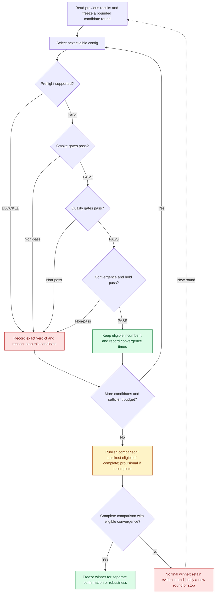

# PLAN: find a converging config, then choose the quickest

Status: proposed implementation plan, based on develop `81402d6b` (2026-10-02).

Run each candidate through increasingly expensive gates. Stop a failing candidate,
preserve its evidence, and select the next eligible candidate. Once a config
converges and remains stable, keep it as the incumbent and finish the declared
comparison: if several qualify, select the one with the shortest measured time
to confirmed convergence under the same conditions.

The outcome is **the fastest observed eligible config in a declared comparison**.
Each round has a finite candidate list and budget. A round can finish with no
winner; finding one is a research goal, not a guarantee.

## The process

This is the proposed orchestration. Individual task execution still follows its
frozen evaluator, horizon and dependencies. A first threshold crossing cannot
stop a full-budget quality protocol early or change its annealing schedule.

## 1. Select the next candidate

Read the [experiment memory](../reports/forge/EXPERIMENT_MEMORY.md) and
[current leaderboard](../reports/forge/technique-inventory.md) first. Use a new
study ID for a new scientific source or protocol. Within one round, freeze a
finite grid of public `Recipe` settings, its substantive hypothesis, compatible
reference controls, runtime and candidate order before training. Use configuration
hash order as the initial deterministic order; it expresses no quality preference.

Reuse exact compatible evidence. Do not repeat an unchanged failed revision,
vary only seeds, or launch a candidate whose required capabilities are missing.
An infrastructure failure requires a recorded repair and linked retry; a
scientific failure requires a substantively revised hypothesis or configuration.

After each terminal outcome, take the next unfinished candidate whose dependencies
pass and whose complete next-task allowance fits the remaining budget. Keep the
failed candidate's metrics and explanation. When a round has no winner, use those
failures to justify a new bounded round rather than extending the same search
without a declared limit. Record the total search spend across rounds as well as
each candidate's qualification cost.

## 2. Advance only after the gates pass

For the current `discriminator_stability` view:

| Stage | Required evidence | Next action |
| --- | --- | --- |
| Preflight | Public API, resolved recipe, task capabilities, source/runtime and sampling compatibility | Unsupported candidates are BLOCKED before training |
| Tier 1: smoke | All 3 cheap tasks pass their full behavior and sustained-success predicates | Advance that exact config to quality |
| Tier 2: quality | All 19 tasks pass, including the full native coverage and accuracy protocols | Advance that exact config to endurance |
| Tier 3: endurance | Both own-state hold/extension requirements pass | Admit that config to convergence-speed selection |

Other goals use their own [declared requirements](../reports/forge/EXPERIMENTS_BY_TIER.md).
Diagnostics retain their separate role. A required failure stops the remaining
work for that candidate, including work in the same tier. Missing, invalid or
blocked evidence cannot become a pass, and every required task stays in the
denominator. All cells for a candidate come from the same complete config.

Current screening profiles are provisional. Their ability to reject candidates
that would fail a deeper reference has not passed calibration. Before relying on
this loop as a validated filter, freeze a justified screen and bounded calibration
against independent positive and negative references. Do not automatically fill
the failed calibration profiles or weaken a gate after seeing a candidate fail.
Provisional experimental results must remain labelled provisional; default
adoption still requires accepted calibration and the separate robustness stage.

## 3. Define convergence before measuring speed

The round must declare the target task or fixed target suite, numerical accuracy
and coverage predicates, observation cadence, confirmation window, acquisition
deadline, subsequent stability window, and full execution budget. The existing
[ring hold declaration](../configs/forge/tasks/ring_hold.json) illustrates
first confirmed acquisition followed by uninterrupted hold. Preserve each task's
actual evaluator; a later attractive window cannot replace a failed first hold.

`confirmed_convergence_step` is the first observation that completes the declared
consecutive passing acquisition window. `confirmed_convergence_seconds` is its
measured elapsed execution time. The time becomes eligible for ranking only
after the config also passes all required quality, hold and endurance checks.
A transient early success followed by collapse is a failed candidate.

This proposed acquisition timestamp is additional source-bound telemetry.
Existing transfer/native confirmation fields can certify the terminal passing
suffix rather than the first passing acquisition window. Preserve their archived
meaning and the frozen suffix/hold evaluators. Validate and reuse an existing
timestamp only when its convergence definition, clock scope and cohort match
the new contract; otherwise report speed unavailable or collect timing in a new,
explicitly declared scientific cohort. Do not regrade an old endpoint as an
earlier acquisition or rerun unchanged science merely to refresh a report.

Keep complete protocols running where required, even when convergence is observed
earlier. An incomplete run is INCOMPLETE; a completed numerical rejection is FAIL.
Missing convergence timestamps mean **speed unavailable**, not zero seconds.
Existing endpoint-only results do not establish an earlier convergence time.

If several candidates pass smoke, every survivor in the preregistered finalist
set gets the same later gates while budget allows. Advancing only one hash-chosen
smoke winner cannot answer which survivor converges quickest.

## 4. Choose the quickest eligible config fairly

For a single target task, minimize `confirmed_convergence_seconds`. For a fixed
suite, minimize `suite_time_to_convergence_seconds`: sum the confirmed acquisition
times of its independent execution groups. If required targets share one
uninterrupted run, charge that group's elapsed prefix once, through its last
required confirmation. Publish every target time alongside the aggregate.

The speed contract fixes these rules before execution:

- Compare the same tasks, full budgets, host architecture, prior, initialization,
  named RNG streams, sampling law, evaluation cadence and source/runtime cohort.
  Different trainer recipes are the declared candidate differences.
- Use the same hardware model, precision, threads, setup/warm-up policy and
  exclusive resource policy. Record actual device and contention. CPU/CUDA or
  differently contended runs stay in separate speed cohorts.
- Measure monotonic elapsed execution time from the task/group's declared start,
  including initialization, updates, sampling and required evaluation through
  confirmation. Synchronize CUDA at timing boundaries. Exclude queue waiting and
  post-run GIF rendering. Record phase timings and full paid cost separately.
- Reuse preserves the original convergence time and prefix provenance; cached
  work never becomes a zero-time convergence. Exclude incomplete timing or
  incompatible evidence from speed selection while retaining its task verdicts.
- Freeze a timing tolerance from the measurement method before seeing results.
  Report the observation cadence and timestamp precision. Within that tolerance,
  label candidates within that tolerance of the minimum eligible time as a
  speed tie and choose a deterministic config hash for display; claim no
  measured speed advantage.

Do not stop the comparison on the first converging config. Keep it as an incumbent
and process the remaining declared finalists. If budget leaves candidates
unmeasured, publish an incomplete comparison and a provisional incumbent; do not
claim the fastest of the entire list. Once the comparison is complete, freeze
the eligible winner. Selection uses these observations, so they are not independent
confirmation; register reserved confirmation/robustness separately with frozen
criteria and budget before its execution.

Illustrative example only; these numbers are not ParticleGAN measurements:

| Candidate | Smoke | Quality | Hold/endurance | Confirmed acquisition time | Decision |
| --- | --- | --- | --- | ---: | --- |
| A | FAIL | UNKNOWN | UNKNOWN | unavailable | Stop cheaply; select next candidate |
| B | PASS | PASS | FAIL | 20 s | Exclude: early acquisition did not remain stable |
| C | PASS | PASS | PASS | 40 s | Select: quickest eligible converging config |
| D | PASS | PASS | PASS | 65 s | Preserve as a slower eligible alternative |

## 5. Keep one shared result and its proof

Extend the current result capture and publication instead of creating another
leaderboard. Each record must bind the round and config identities, source/task/
protocol hashes, resolved recipe, runtime/resource policy, actual metric and
threshold, gate verdict/reason, required denominator, observed convergence step
and time, hold verdict, timing method, paid cost, reuse and linked retry history.
Also preserve candidate order, skipped candidates, remaining budget and selection
scope so the next person can reconstruct the decision.

| Artifact | Purpose |
| --- | --- |
| `configs/forge/searches/` and `configurations/` | Frozen round declarations and complete config identities |
| `reports/forge/configuration-search/<study>.json` | All candidates, gates, selection scope, convergence times and costs |
| `reports/forge/technique-inventory.md` and `.json` | One current team leaderboard, with selected configs and alternatives |
| `reports/forge/technique-evidence/` and archive manifests | Numerical publication evidence and original content identities |
| Ignored `runs/forge/` or a shared artifact archive | Original receipts, logs, traces, checkpoints and evaluator inputs |

Workers capture attempts automatically. Publication independently verifies
original receipts, then updates the existing compact report and leaderboard.
Commit those compact artifacts and store the originals in a durable team-accessible
archive with checksums and restoration instructions. Another checkout must be
able to reconstruct the published comparison without training; full independent
regrading needs the original archive. One shared coordinator queue is currently
local to a machine; Git publication and archive access provide team sharing.

Every future target test executes through the ParticleGAN API, declares numerical
PASS/FAIL and supplies an actual-training GIF that illustrates its goal. The GIF
shows the target, progression and relevant error/coverage; selection uses the
saved metrics and receipt, rather than visual preference. Atlas/E22 policy
cohorts need a truthful policy-aware task contract before these Forge hosts can
score them; a parameter grid cannot repair a missing capability.

## Implementation sequence and acceptance

| Step | Deliverable | Acceptance evidence |
| --- | --- | --- |
| 1 | Freeze a convergence/speed contract and suitable screen calibration | Positive/negative references, cohorts, complete budgets and stop rules are declared; failed profiles stay closed |
| 2 | Validate reusable confirmation timing and add missing acquisition telemetry to shared adapters and receipts | Regrading rejects semantic mismatches and missing, changed or non-monotonic timing; CUDA timing is synchronized; full protocols and RNG streams remain intact |
| 3 | Extend bounded search to advance the declared survivor set and select by eligible convergence time | Fast-but-unstable loses; the quickest stable survivor wins; ties, blocked rows, missing evidence, reuse and exhausted budgets are handled explicitly |
| 4 | Extend the existing compact report and single leaderboard | Fresh-checkout reconstruction gives the same selection and hashes; all failures, alternatives and raw archive identities remain accessible |
| 5 | Run one new bounded comparison, publish it, then register the frozen winner's confirmation | Full gate and speed receipts support the conclusion; no default promotion is inferred from screening |

Forge already supplies finite Recipe grids, preflight, prerequisite stopping,
budget reservation, exact-evidence reuse, durable attempts, phase timing, some
task-specific confirmation timing, and the single published leaderboard.
Its current search objective is tuning-task PASS
counts with a hash tie-break; the first R1/R2 study confirms only one smoke winner.
The timing contract, survivor progression and fastest-convergence objective above
are proposed additions, not existing CLI behavior. This plan changes no recipes,
gates, recorded results or defaults and launches no experiments.

See the [current configuration-search guide](forge-configuration-search.md),
[R1/R2 measured readout](../reports/forge/R1R2_CONFIGURATION_SEARCH_READOUT.md),
and [operational workflow](../EXPERIMENTATION.md) for the implemented baseline.
