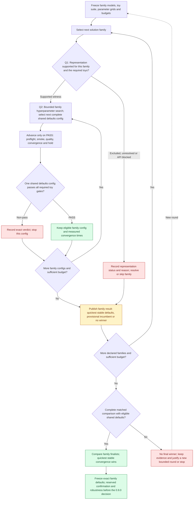

# PLAN: verify family representation, then choose winning defaults

Status: proposed implementation plan, based on develop `81402d6b` (2026-10-02).

Implementation update: [PLAN #249](https://github.com/255BITS/ParticleGAN/pull/249)
is merged. Bounded whole-config progression and the separate public-policy
capacity/acquisition/hold path have executed a
[60-configuration screen](../reports/forge/family-winner-round1/README.md).
It has no fully qualified winner. Controlled speed selection, accepted calibration
and reserved confirmation/robustness remain prerequisites for shipping defaults.

Start with solution families: a training mechanism is a family, and its complete
hyperparameter configurations are the candidates. Run a bounded hyperparameter
search within each family, advancing its configs through increasingly expensive
gates. Stop a failing config, preserve its evidence, and select the next config
from that family's declared grid. Once a config converges and remains stable,
keep it as the family incumbent and finish the declared comparison. Compare the
eligible family finalists under the same conditions; if several qualify, select
the shortest measured time to confirmed convergence.

The two questions are:

1. **Can this exact solution family and host represent the declared toy target?**
   Establish representability separately from whether an optimizer can learn it.
2. **What defaults should the family ship if it wins?** Choose one complete shared
   configuration across all required toys; if several fully qualify, choose the
   quickest stable convergence under matched conditions.

The outcome is **the fastest observed eligible family/defaults config in a declared comparison**.
Each round has a finite candidate list and budget. A round can finish with no
winner; finding one is a research goal, not a guarantee.

## The process

This is the proposed orchestration. Individual task execution still follows its
frozen evaluator, horizon and dependencies. A first threshold crossing cannot
stop a full-budget quality protocol early or change its annealing schedule.

## 1. Answer representation first, then search family defaults

Read the [experiment memory](../reports/forge/EXPERIMENT_MEMORY.md) and
[current leaderboard](../reports/forge/technique-inventory.md) first. Use a new
study ID for a new scientific source or protocol. A solution family identifies
the training mechanism; a hyperparameter trial changes public `Recipe` settings
within that family. Register a new mechanism through the shared ParticleGAN API
and family registry before freezing the round. Parameter trials do not become
extra families or require copied training loops.

Freeze all family implementations, each family's finite hyperparameter grid,
substantive hypotheses, compatible references, task/runtime/timing contracts,
family order, config order, per-family allowances and total round budget before
training. Coupled schedule endpoints form one grid dimension. Seeds, task gates,
host architecture, prior and sampling law are not hidden hyperparameter axes.
Use declared family order and configuration hash order within each grid as the
initial deterministic order; neither expresses a quality preference.

### Question 1: can the family represent the toy?

Bind the answer to the exact public family parameterization, host architecture,
conditioning, prior support/masses and public sampling/serving law. Supply a
constructive or analytic argument, or a retained parameter witness whose public
output meets that toy's declared numerical tolerance. A finite empirical witness
supports the declared protocol and tolerance; it is not a universal approximation
claim. Reference fitting can investigate representability within a separately
declared diagnostic budget, without granting ordinary training qualification.

| Representation status | Meaning | Before hyperparameter search |
| --- | --- | --- |
| SUPPORTED | Compatible construction or parameter witness realizes the declared target/tolerance | Admit the family for those exact supported toys |
| EXCLUDED | An analytic bound or explicit support/capacity contradiction rules out the declared target/tolerance | Record the reason; revise the family/host in a new declared round |
| UNRESOLVED | No compatible witness; a finite fitting attempt failed or evidence is missing | Record uncertainty; use a bounded diagnostic if justified |
| API BLOCKED | The required family/host/prior/serving path is unsupported | Resolve the shared API contract before spending on a grid |

A training FAIL means that config failed to learn under that protocol and budget.
It does not prove the family lacks representation capacity. Reuse a representation
witness across parameter trials only while its complete family/host/prior/serving
identity remains compatible. It cannot fill their quality PASS cells. This
supporting certificate does not replace the public-API training test, numerical
gate or actual-training GIF.

### Question 2: which defaults should that family ship?

Search the supported family's finite grid for one unchanged complete `Recipe`
configuration that learns every required toy and passes stability. Each toy may
learn its own weights; the defaults are shared. Do not select a different recipe
for each toy or assemble a family score from different trial winners. Existing
host-owned recipe adaptations must be frozen, disclosed and identical across
parameter candidates; the eventual shipping claim must list those exceptions.

Keep the actual resolved settings, family identity, supported task scope and
serving law with each candidate. The winning defaults must resolve through the
public factory to the exact qualified configuration, with no silent fallback or
per-toy tuning. Freeze the choice, then obtain the separately reserved confirmation,
accepted calibration and registered robustness evidence before adopting it for
the [0.9.0 release integration](https://github.com/255BITS/ParticleGAN/pull/247).

Reuse exact compatible evidence. Do not repeat an unchanged failed revision,
vary only seeds, or launch a candidate whose required capabilities are missing.
An infrastructure failure requires a recorded repair and linked retry; a
scientific failure requires a substantively revised hypothesis or configuration.

After each terminal outcome, take the next unfinished config in that family whose
dependencies pass and whose complete next-task allowance fits both the family and
round budgets. Keep the failed config's metrics and explanation. Finish its
declared grid, retain the quickest fully eligible family config and any timing
ties, then process the next declared family. A family whose grid has no eligible
converging config has no winner; a canonical fallback is not a qualified solution.

Across families, rank only matched task/source/runtime/resource cohorts and
retain each selected config as a whole. Family timing ties remain in the finalist
pool even when the leaderboard displays one deterministic representative. Do not
force incompatible cloud/clean-MoG or CPU/CUDA families into a speed ranking.

An analytically EXCLUDED family can close its representation question without a
grid. UNRESOLVED, API-blocked or budget-unmeasured families remain visible in the
declared comparison and keep that family-choice conclusion provisional. Define
supported-cohort exclusions before seeing results; do not drop unresolved
families afterwards to manufacture a complete comparison.

If no family qualifies, use the recorded failures to justify a new bounded round
instead of extending the same search without a declared limit. Record each
family's search spend, total spend across rounds, and per-config qualification cost.

## 2. Advance only after the gates pass

For the current `discriminator_stability` view:

| Stage | Required evidence | Next action |
| --- | --- | --- |
| Preflight | Public API, resolved recipe, task capabilities, source/runtime and sampling compatibility | Unsupported candidates are BLOCKED before training |
| Tier 1: smoke | All 3 cheap tasks pass their full behavior and sustained-success predicates | Advance that exact config to quality |
| Tier 2: quality | All 19 tasks pass, including the full native coverage and accuracy protocols | Advance that exact config to endurance |
| Tier 3: endurance | Both own-state hold/extension requirements pass | Admit that config to convergence-speed selection |

Other goals use their own [declared requirements](../reports/forge/EXPERIMENTS_BY_TIER.md).
Diagnostics retain their separate role. A required failure stops the remaining
work for that candidate, including work in the same tier. Missing, invalid or
blocked evidence cannot become a pass, and every required task stays in the
denominator. All cells for a candidate come from the same complete config.

Current screening profiles are provisional. Their ability to reject candidates
that would fail a deeper reference has not passed calibration. Before relying on
this loop as a validated filter, freeze a justified screen and bounded calibration
against independent positive and negative references. Do not automatically fill
the failed calibration profiles or weaken a gate after seeing a candidate fail.
Provisional experimental results must remain labelled provisional; default
adoption still requires accepted calibration and the separate robustness stage.

## 3. Define convergence before measuring speed

The round must declare the target task or fixed target suite, numerical accuracy
and coverage predicates, observation cadence, confirmation window, acquisition
deadline, subsequent stability window, and full execution budget. The existing
[ring hold declaration](../configs/forge/tasks/ring_hold.json) illustrates
first confirmed acquisition followed by uninterrupted hold. Preserve each task's
actual evaluator; a later attractive window cannot replace a failed first hold.

`confirmed_convergence_step` is the first observation that completes the declared
consecutive passing acquisition window. `confirmed_convergence_seconds` is its
measured elapsed execution time. The time becomes eligible for ranking only
after the config also passes all required quality, hold and endurance checks.
A transient early success followed by collapse is a failed candidate.

This proposed acquisition timestamp is additional source-bound telemetry.
Existing transfer/native confirmation fields can certify the terminal passing
suffix rather than the first passing acquisition window. Preserve their archived
meaning and the frozen suffix/hold evaluators. Validate and reuse an existing
timestamp only when its convergence definition, clock scope and cohort match
the new contract; otherwise report speed unavailable or collect timing in a new,
explicitly declared scientific cohort. Do not regrade an old endpoint as an
earlier acquisition or rerun unchanged science merely to refresh a report.

Keep complete protocols running where required, even when convergence is observed
earlier. An incomplete run is INCOMPLETE; a completed numerical rejection is FAIL.
Missing convergence timestamps mean **speed unavailable**, not zero seconds.
Existing endpoint-only results do not establish an earlier convergence time.

If several configs in a family pass smoke, every survivor in its preregistered
finalist set gets the same later gates while budget allows. Advancing only one
hash-chosen smoke winner cannot answer which config in that family converges
quickest. Family incumbents and the cross-family comparison remain provisional
until their declared candidate coverage is complete.

## 4. Choose the quickest eligible config fairly

For a single target task, minimize `confirmed_convergence_seconds`. For a fixed
suite, minimize `suite_time_to_convergence_seconds`: sum the confirmed acquisition
times of its independent execution groups. If required targets share one
uninterrupted run, charge that group's elapsed prefix once, through its last
required confirmation. Publish every target time alongside the aggregate.

The speed contract fixes these rules before execution:

- Compare the same tasks, full budgets, host architecture, prior, initialization,
  named RNG streams, sampling law, evaluation cadence and source/runtime cohort.
  Different trainer recipes are the declared candidate differences.
- Use the same hardware model, precision, threads, setup/warm-up policy and
  exclusive resource policy. Record actual device and contention. CPU/CUDA or
  differently contended runs stay in separate speed cohorts.
- Measure monotonic elapsed execution time from the task/group's declared start,
  including initialization, updates, sampling and required evaluation through
  confirmation. Synchronize CUDA at timing boundaries. Exclude queue waiting and
  post-run GIF rendering. Record phase timings and full paid cost separately.
- Reuse preserves the original convergence time and prefix provenance; cached
  work never becomes a zero-time convergence. Exclude incomplete timing or
  incompatible evidence from speed selection while retaining its task verdicts.
- Freeze a timing tolerance from the measurement method before seeing results.
  Report the observation cadence and timestamp precision. Within that tolerance,
  label candidates within that tolerance of the minimum eligible time as a
  speed tie and choose a deterministic config hash for display; claim no
  measured speed advantage.

Do not stop the comparison on the first converging config. Keep it as an incumbent
and process the remaining declared finalists. If budget leaves candidates
unmeasured, publish an incomplete comparison and a provisional incumbent; do not
claim the fastest of the entire list. Once the comparison is complete, freeze
the eligible winner. Selection uses these observations, so they are not independent
confirmation; register reserved confirmation/robustness separately with frozen
criteria and budget before its execution.

Illustrative parameter trials within one representation-supported family only;
these numbers are not ParticleGAN measurements:

| Candidate | Smoke | Quality | Hold/endurance | Confirmed acquisition time | Decision |
| --- | --- | --- | --- | ---: | --- |
| A | FAIL | UNKNOWN | UNKNOWN | unavailable | Stop cheaply; select next candidate |
| B | PASS | PASS | FAIL | 20 s | Exclude: early acquisition did not remain stable |
| C | PASS | PASS | PASS | 40 s | Select: quickest eligible converging config |
| D | PASS | PASS | PASS | 65 s | Preserve as a slower eligible alternative |

## 5. Keep one shared result and its proof

Extend the current result capture and publication instead of creating another
leaderboard. Each record must bind the round and config identities, source/task/
protocol hashes, resolved recipe, runtime/resource policy, actual metric and
threshold, gate verdict/reason, required denominator, observed convergence step
and time, hold verdict, timing method, paid cost, reuse and linked retry history.
Also preserve representation status and witness/bound provenance, family
membership, complete per-family grids, family/config order,
skipped configs, remaining family/round budgets and selection scope so the next
person can reconstruct both the family search and the final solution decision.

| Artifact | Purpose |
| --- | --- |
| `configs/forge/searches/` and `configurations/` | Frozen round declarations and complete config identities |
| `reports/forge/configuration-search/<study>.json` | All candidates, gates, selection scope, convergence times and costs |
| `reports/forge/technique-inventory.md` and `.json` | One current team leaderboard, with selected configs and alternatives |
| `reports/forge/technique-evidence/` and archive manifests | Numerical publication evidence and original content identities |
| Ignored `runs/forge/` or a shared artifact archive | Original receipts, logs, traces, checkpoints and evaluator inputs |

Workers capture attempts automatically. Publication independently verifies
original receipts, then updates the existing compact report and leaderboard.
Commit those compact artifacts and store the originals in a durable team-accessible
archive with checksums and restoration instructions. Another checkout must be
able to reconstruct the published comparison without training; full independent
regrading needs the original archive. One shared coordinator queue is currently
local to a machine; Git publication and archive access provide team sharing.

Every future target test executes through the ParticleGAN API, declares numerical
PASS/FAIL and supplies an actual-training GIF that illustrates its goal. The GIF
shows the target, progression and relevant error/coverage; selection uses the
saved metrics and receipt, rather than visual preference. Atlas/E22 policy
cohorts need a truthful policy-aware task contract before these Forge hosts can
score them; a parameter grid cannot repair a missing capability.

## Implementation sequence and acceptance

| Step | Deliverable | Acceptance evidence |
| --- | --- | --- |
| 1 | Freeze family representation contracts, shared-defaults grids, convergence/speed criteria and suitable screen calibration | Supported witnesses or analytic exclusions bind exact hosts/priors/serving; unresolved and API-blocked families stay explicit; budgets and stop rules are declared |
| 2 | Validate reusable confirmation timing and add missing acquisition telemetry to shared adapters and receipts | Regrading rejects semantic mismatches and missing, changed or non-monotonic timing; CUDA timing is synchronized; full protocols and RNG streams remain intact |
| 3 | Search each family's frozen hyperparameter grid, advance its survivor set, and compare eligible family finalists by convergence time | Fast-but-unstable loses; the quickest stable config represents its family; family ties remain eligible; incomplete grids or missing families cannot produce a final fastest winner |
| 4 | Extend the existing compact report and single leaderboard | Fresh-checkout reconstruction gives the same selection and hashes; all failures, alternatives and raw archive identities remain accessible |
| 5 | Run one new bounded family/defaults comparison, publish it, then register the frozen winner's confirmation | One unchanged public defaults config passes every required toy; declared host exceptions and full gate/speed receipts support the conclusion; no adoption is inferred from screening |

At this plan's original baseline, Forge supplied finite Recipe grids, preflight,
prerequisite stopping, budget reservation, exact-evidence reuse, durable attempts,
phase timing and some task-specific confirmation timing. The first R1/R2 study
confirmed only one smoke winner.

Whole-config progression now advances every smoke survivor in a declared
full-view study. The separate public-policy CLI also verifies served-state
capacity and first acquisition with uninterrupted hold. Both retain exact
required denominators and use PASS counts with a content-ID presentation tie.
The general matched timing contract, controlled fastest-convergence selection,
accepted calibration and shipping-default decision remain incomplete. The
linked completed campaign records the implemented scope and observed outcomes;
this plan document itself changes no recipe, gate or recorded result.

See the [current configuration-search guide](forge-configuration-search.md),
[R1/R2 measured readout](../reports/forge/R1R2_CONFIGURATION_SEARCH_READOUT.md),
and [operational workflow](../EXPERIMENTATION.md) for the implemented baseline.
