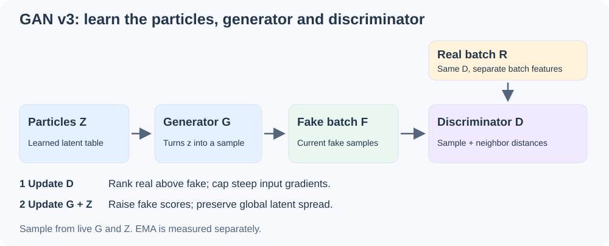
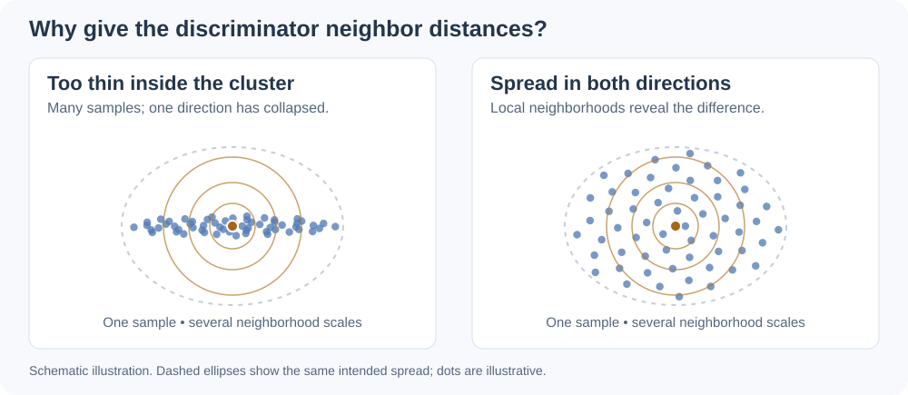

# GAN v3: the default, explained

**GAN v3 passes 19/19 live behavioral toys with one shared training recipe and
explicit discriminator choices.** It is now selected by `get_recipe()` and
`get_recipe("gan")`. The final improvement gives the discriminator information
about nearby samples, providing local spread information.



## Versions and measured results

These are **recipe versions**, separate from the Python package version.
Versioned names preserve their settings; `gan` follows the current default.

| Recipe | Required toys | Data toys | Image toys | Total live PASS | Reference D profile |
| --- | ---: | ---: | ---: | ---: | ---: |
| `gan_v1` / `gan_legacy` | 1/9 | 3/6 | 1/4 | **5/19** | 5/19 |
| `gan_v2` — previous default | 1/9 | 6/6 | 1/4 | **8/19** | 8/19 |
| **`gan_v3` / `gan` — current default** | **9/9** | **6/6** | **4/4** | **19/19** | 15/19 |

V3 is the measured `shared_c6` recipe, now promoted to the public API. Its
19/19 score includes documented discriminator variants per task. The reference
D profile alone scores 15/19; a single universal network has not been established.
The older adjusted 19/19 result used per-toy optimizer settings and is a separate
comparison. [Full leaderboard and every attempted variant](../reports/transfer_suite/unadjusted/README.md).

A toy passes only if **every metric passes at five or more consecutive final
observations**, using the complete 24-point live curve. EMA is scored separately.
Tests keep their data, generators, batch sizes, particle counts, budgets and
thresholds. This is a development-suite result; new-task transfer is unmeasured.

## The recipe in numbers

| Setting | v1 | v2 | **v3** |
| --- | ---: | ---: | ---: |
| Adversarial loss | Rp logistic | Rp logistic | Rp logistic |
| Gradient-cap coefficient | 1 | 3 | **6** |
| Allowed input-gradient norm, κ | 1 | 1.25 | **1.25** |
| Particle spread weight | 1 | .05 | **.05** |
| Adam: generator LR | .0006 | .001 | **.00425** |
| Adam: discriminator LR | .0009 | .0015 | **.00425** |
| Adam: particle LR | .006 | .01 | **.0085** |
| Adam betas | (0, .999) | (0, .99) | **(0, .99)** |
| LR schedule | 60% hold, cosine to 5% | Same | Same |

There is no particle L2 penalty. The generic API retains 20,000 particles,
latent dimension 4, batch size 256 and 7,000 updates; these are configurable
resources, not the resource sizes used by every toy. The final unequal-mass
toy uses 256 particles, batch size 128 and 1,200 updates.

## 1. Particles and generator learn together

The prior is a table of learnable latent vectors $Z=\{z_1,\ldots,z_M\}$.
Sampling selects a row uniformly, then the generator maps it to a sample:

```math
k \sim \mathrm{Uniform}\{1,\ldots,M\},
\qquad \widetilde{x}=G_\theta(z_k).
```

One Adam optimizer updates G and the particles in separate parameter groups.
The particles use twice G's learning rate. A separate Adam optimizer updates D.
Each iteration updates D first, then freezes D's parameters while updating G
and Z. Gradients still flow through D into the generated samples.

## 2. Compare real and fake scores

Let $R$ and $F$ be equally sized real and generated batches. Write $D_i(X)$ for
the score of sample $i$ within batch $X$, and define
$\Delta_i=D_i(R)-D_i(F)$. With $\mathrm{sp}(u)=\log(1+e^u)$:

```math
\begin{aligned}
\mathcal{L}_D &= \frac{1}{B}\sum_{i=1}^{B}\mathrm{sp}(-\Delta_i)
                 + \mathcal{R}_{\mathrm{cap}},\\
\mathcal{L}_{G,Z} &= \frac{1}{B}\sum_{i=1}^{B}\mathrm{sp}(\Delta_i)
                 + 0.05\,\mathcal{R}_{\mathrm{spread}}(Z).
\end{aligned}
```

D learns to rank real samples above generated samples; G and Z learn to reverse
that ranking. There is no extra target-matching or cluster-label loss.

## 3. Cap steep gradients; preserve global particle spread

The one-sided cap charges D only for input-gradient norms above 1.25:

```math
\begin{aligned}
n_i(X) &= \sqrt{\left\|\nabla_{x_i}\sum_{j=1}^{B}D_j(X)\right\|_2^2+10^{-12}},\\
\mathcal{R}_{\mathrm{cap}}
&= \frac{6}{2B}\sum_{i=1}^{B}
\left([n_i(R)-1.25]_+^2+[n_i(F)-1.25]_+^2\right).
\end{aligned}
```

Here $[u]_+=\max(0,u)$. Slopes below the cap are unpenalized. The cap does not
force a flat discriminator, and it does not by itself ensure useful gradients.
With a batch-dependent D, the summed-score derivative includes cross-sample
paths; this is the exact gradient used by the implementation.

For $d$ latent dimensions and sample covariance matrix $C$ of the regularized
particle rows, the spread term is:

```math
\mathcal{R}_{\mathrm{spread}}(Z)
=\frac{1}{d}\sum_{a=1}^{d}\left[1-\sqrt{C_{aa}+10^{-4}}\right]_+
+\frac{1}{d}\sum_{a\ne b}C_{ab}^{2}.
```

It discourages small global latent variance and correlated dimensions. It does
not guarantee spread *within* every output cluster; that gap motivated the new D.
Small particle tables are regularized in full; the general trainer uses unique
sampled rows for larger tables.

## 4. Give D a view of local spread



The new `BatchDistanceDiscriminator` combines a sample's ordinary neural
features with four local neighbor-distance features. For each scale
$s\in\{0.1,0.25,0.5,1\}$, nearby samples receive a larger weight:

```math
\begin{aligned}
w_{ij}^{(s)} &= \exp\!\left(-\frac{\|x_i-x_j\|_2^2}{2s^2}\right),\\
q_i^{(s)} &= \frac{\sum_{j\ne i}w_{ij}^{(s)}\|x_i-x_j\|_2^2}
{s^2\left(\sum_{j\ne i}w_{ij}^{(s)}+10^{-5}\right)}.
\end{aligned}
```

The ordinary feature path has three width-96 hidden layers. Each layer subtracts
its own feature mean, then applies Softplus with sharpness β=6. This is
**per-sample feature centering**, with no variance normalization. The score head
learns how to combine those features with the four distances:

```math
D_i(X)=a^\top h(x_i)+b^\top
\begin{bmatrix}q_i^{(0.1)}&q_i^{(0.25)}&q_i^{(0.5)}&q_i^{(1)}\end{bmatrix}^{\!\top}+c.
```

The 2D default has **19,013 trainable parameters**. Real and fake batches each
compute their own features. No known centers, target labels, evaluation metrics
or running statistics enter the model. All paths remain differentiable.

This architecture changes the adversarial game through batch context: one
sample's score and gradient can depend on its neighbors. Cost grows quadratically
with batch size; kernel scales are in raw input units. The supported witness is
2D with batch size 128. Different dimensions, scales or batches need validation.
Generation itself uses only G and Z, so it needs no neighbor calculation.

### The final test, before and after

| Unequal-mass result | Earlier LayerNorm D | New batch-distance D |
| --- | ---: | ---: |
| Consecutive final live passes | 0 | **7** |
| Worst minimum variance over final five | .0310 | **.42385** |
| Required minimum variance | ≥ .15 | ≥ .15 |
| First confirmation of five stable checks | Never | **Update 1100 / 1200** |
| Live verdict | FAIL | **PASS** |
| EMA verdict | FAIL | FAIL |

The new model passes from update 900 through 1200. EMA reaches only two final
passing checks and remains a separate failure. An independent replay and a
fresh full-suite run reproduce the selected results exactly.
[Metrics and architecture profile](../reports/transfer_suite/unadjusted/FINDINGS.md).

## 5. Hold the rate, then settle

Let $t=0,\ldots,T-1$ count completed updates before the next update.
For total budget $T$, all three optimizer groups share the
same multiplier $m_t$, applied to their own starting rates:

```math
\begin{aligned}
u_t &= \mathrm{clip}\!\left(\frac{t-0.6T}{0.4T},0,1\right),\\
m_t &= 0.05+\frac{0.95}{2}\left(1+\cos(\pi u_t)\right),
\qquad \eta_t=\eta_0m_t.
\end{aligned}
```

The first 60% uses the full rate. The remaining updates decay smoothly toward
5%. This schedule and every loss/optimizer setting are identical across toys.

## Use it

For a 2D application, supply your generator and real batches:

```python
from particlegan import BatchDistanceDiscriminator, get_recipe

recipe = get_recipe()                  # Canonical name: gan_v3
D = BatchDistanceDiscriminator()        # 2D input; move G and D to your device.
trainer = recipe.make_trainer(G, D)
for real in batches:
    stats = trainer.step(real)
samples = trainer.sample(256)           # Live weights.
```

Use `get_recipe("gan_v1")`, `get_recipe("gan_v2")` or
`get_recipe("gan_v3")` to pin a version. `gan_legacy` stays on v1; the historical
`100gaussians` alias stays on v2. MoG, DDGAN and autoencoder recipes preserve
their separately selected settings. Restore old checkpoints from their full
saved recipe and original architecture.

The full 19/19 result requires the declared D profile, including different
architectures for anisotropic data, overlap and unequal widths. The public
batch-distance D is the final unequal-mass witness, not an automatic substitute
for every discriminator. [One-command full-profile reproduction](../benchmarks/transfer_suite/UNADJUSTED_SEARCH.md).

[API reference](api.md) · [Versioned leaderboard](../reports/transfer_suite/unadjusted/README.md)
