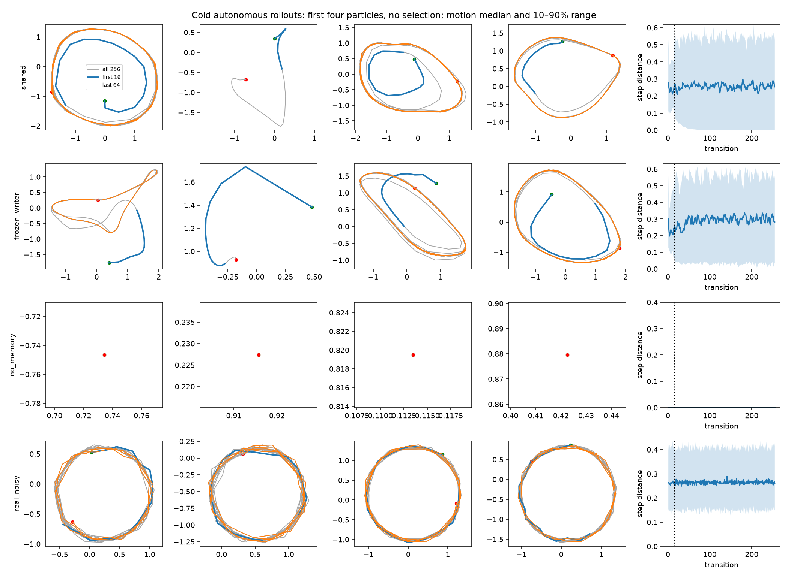

# Autonomous memory: first GPU study

**Latest:** the [64-step two-GPU study](horizon64/README.md) is complete, following
the [unclipped baseline](unclipped/README.md). This page
preserves the original clipped study for comparison.

The feedback loop produces sustained motion without any runtime expert or real
starting prefix. It does not yet reliably produce circles from a cold start.
Both learned and frozen writers develop recurring loops, distorted paths, and
some stationary endpoints. This study does not establish an advantage for
training the writer with D.

## Diagnostic leaderboard

Each variant received 2,000 updates on 16-step sequences, batch 128, on one RTX
A6000. Evaluation uses the first 128 learned particles, each held fixed through
256 generated steps, with independent zero-initialized memory. Same seeds and
sampling schedules across mechanisms; no seed sweep. Training and evaluation
took about 218 seconds total, excluding startup and plotting.

All models tie at zero on the primary full-trajectory circle criterion. The
table is ordered by full-trajectory radial error among models with valid fits,
not a claim of an overall winner.

| Mechanism | Full 256-step circles ↑ | Relative radial RMSE ↓ | Stopped in final 64 steps ↓ | Late-only circles ↑ |
|---|---:|---:|---:|---:|
| Frozen writer | 0% | 0.410 | 8.6% | 14.1% |
| D-trained shared writer | 0% | 0.466 | 20.3% | 17.2% |
| No memory | 0% | n/a | 100% | 0% |
| Real noisy reference | 99.2% | 0.032 | 0% | 99.2% |

The full metric fits a circle to the first 32 points and keeps that circle fixed.
Its pass conditions cover radius, radial error, drift, angular speed, and
direction consistency; see [trainer](../../experiments/autonomous_memory.py).
All learned/frozen full trajectories had valid initial fits; no-memory paths
had none. The real clean reference passes at 100%.

"Stopped" means mean distance per transition below 0.01 over the final 64
transitions. Whole-trajectory averages hide this failure: only 0.8% of shared
and 1.6% of frozen trajectories look stationary by that looser average.

"Late-only" separately refits a circle using the beginning of steps 129–256,
then evaluates that segment. It measures whether circular motion emerges after
a transient, and does **not** count as success from the requested cold start.
Late fits are valid for 83.6% of shared and 94.5% of frozen trajectories; the
pass fraction includes all 128 trajectories, including invalid fits as failures.



The first four particles are plotted without selection. Blue shows the trained
16-step horizon, orange the final 64 points, gray the full trajectory. Green/red
markers indicate start/end. Each panel has its own equal-aspect axes. The right
column shows median step distance and its 10th–90th percentile range.

## Interpretation

- **Runtime feedback works.** Shared-writer mean step distance is 0.253 during
  the first 16 points and 0.266 during the final 64 transitions (real: 0.272).
  Frozen writer gives 0.255 and 0.300. Movement alone does not imply circularity.
- **Cold starts and later dynamics disagree.** The example loops often settle
  onto a different orbit from the early path. Some paths settle to a point;
  others have distorted loops. The late-only scores show that a minority can
  sustain approximate circles after the transient.
- **Learned memory has no clear win here.** Frozen memory has fewer stopped
  paths and lower full radial error. Learned memory has a slightly higher
  late-circle fraction. One run per mechanism does not resolve small differences.
- **No memory is a structural negative control.** A deterministic G receiving
  the same z and zero memory each time necessarily repeats the same point.
- **Short training is already imperfect.** Only 10.2% shared and 10.9% frozen
  paths pass the 16-point version of the circle check. Its short-arc fit is less
  reliable (noisy real reference: 74.2%), so this is a secondary diagnostic.
  Longer-horizon failure cannot be attributed solely to extrapolation.

## API defaults and gradient logs

B-cap comes directly from `recipe.make_gradient_penalty()` without overrides:
`arm=b_cap`, coefficient 1, cap 1, L2 input-gradient norm, exact autograd,
every update (`reg_every=1`), no target annealing. `penalty` logs that loss.
It differentiates D with respect to the entire input sequence.

`d_grad_norm` and `g_grad_norm` log parameter-gradient norms **before** global
clipping at 10. G's norm includes the particle prior. That clipping is an
experiment-specific addition, not an API B-cap setting. At least one logged
frozen-writer update activated clipping; sparse logs cannot establish the total
activation frequency. This run does not use an every-four-updates penalty.

Offline real circles still train the discriminator. D trains the writer on
both real and detached generated sequences. During G updates, writer parameters
are frozen while gradients propagate through the complete recurrent state.
At runtime only G, writer, and the particle prior are needed.

## Recommendations

Following this run, the user requested removal of gradient clipping. The current
trainer removes clipping and the D/G parameter-gradient norm logs; these logs
were absent from `examples/100gaussians.py`. B-cap settings are unchanged. The
results above remain the original **clipped** run. Establish an unclipped
16-step shared/frozen baseline before comparing horizons, so these changes are
not conflated. Removal passed five autonomous tests and a five-update CUDA smoke
run of all three variants (`runs/memory_path/autonomous_unclipped_smoke/`).

1. Compare the learned and frozen writers at a **64-step training horizon**,
   retaining the 256-step cold evaluation and fixed particles. This exposes
   several revolutions and later memory states to D. It also enlarges the
   flattened temporal critic, so interpret it as a horizon/configuration change,
   not a pure test of memory alone. Keep the 2k budget initially.
2. If cold transients remain, try a horizon curriculum or a temporal critic
   sharing weights across windows. Preserve the full cold-start score alongside
   separately labelled late-segment diagnostics.
3. Defer new shapes and per-step noise until circles are reliable. Do not repeat
   the no-memory control for every horizon: its static behavior is structural.

No follow-up substantive training has been launched. Training code was unchanged
during this study; clipping was removed afterward. The new analysis script
completed and its plot was inspected. Existing
runtime/gradient contracts were covered by the 38 tests recorded in the prior
[handoff](../memory-path/NEXT.md).

## Reproduce and inspect

```bash
.venv/bin/python -u experiments/autonomous_memory.py \
  --out runs/memory_path/autonomous_2k_reproduce --device cuda:0 \
  --steps 2000 --batch-size 128 --train-length 16 \
  --eval-steps 256 --eval-batch 128 --log-every 100
tail -F runs/memory_path/autonomous_2k_reproduce/experiment.log
```

The command above now uses the unclipped trainer. To reproduce the original
clipped protocol, use the trainer at revision `4c336da` (also snapshotted in the
completed run directory).

Completed outputs: `runs/memory_path/autonomous_2k/`. The log ends in
`suite_complete`; no process remains running. Each variant has an inference
checkpoint, config, metrics, summary, and full trajectories. Source snapshots
and provenance accompany the run. The durable [results](results.json) include
resolved recipes and diagnostics; [provenance](provenance.json) identifies the
training revision. Rebuild this analysis with:

```bash
.venv/bin/python reports/autonomous-memory/analyze.py runs/memory_path/autonomous_2k
```
