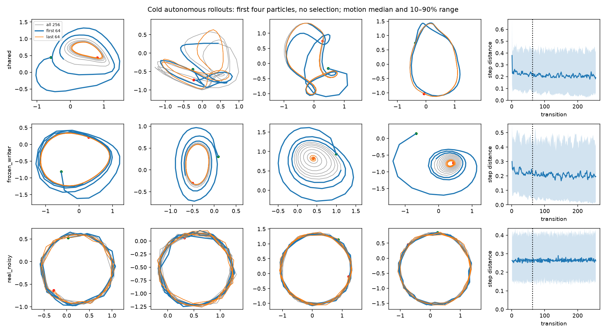
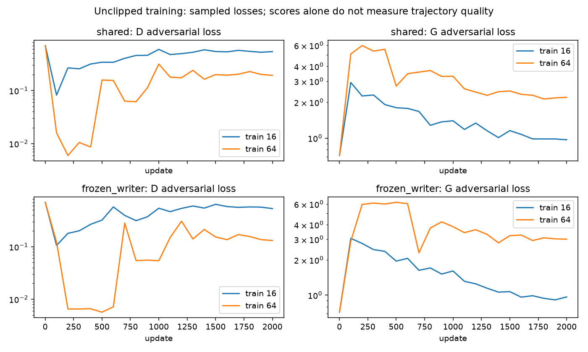

# Unclipped 64-step training

Longer training sequences improve circle quality and reduce late stopping, but
reliable cold-start generation remains unsolved. The frozen writer has the most
circle passes; the learned writer stops less often and retains both directions
among its successful late circles. Neither is an overall distribution-matching
winner. Both runs completed without numerical failures in about seven minutes
of concurrent wall time (learned 400.6 seconds, frozen 324.4 seconds).

## Leaderboard

All rows use no clipping and the same 256-step evaluation protocol. Ranked by
full circle passes, with the 16-step baselines retained for comparison.

| Writer / training horizon | Full circles ↑ | Late-only circles ↑ | Stopped late ↓ | Full radial RMSE ↓ |
|---|---:|---:|---:|---:|
| Frozen / 64 | 7.8% (10/128) | 34.4% | 8.6% | 0.298 |
| Learned / 64 | 6.3% (8/128) | 26.6% | 3.9% | 0.295 |
| Learned / 16 | 0.8% (1/128) | 23.4% | 16.4% | 0.396 |
| Frozen / 16 | 0% | 11.7% | 12.5% | 0.406 |
| Real noisy reference | 99.2% | 99.2% | 0% | 0.032 |

Full initial fits are valid for every generated trajectory. Late fits are valid
for 97.7% learned and 96.1% frozen. Mean radial error improves about 26% for each
writer relative to its 16-step baseline. Late stopping falls from 21 to 5 of 128
learned-writer trajectories and from 16 to 11 frozen-writer trajectories.

## What changed and what still fails

- **Longer training helps persistent motion.** The learned writer's final-64
  stopping rate improves substantially. However, the examples still include
  shrinking spirals, irregular motion, distorted loops, and startup transients.
  Final-64 mean step distances are 0.224 learned and 0.220 frozen versus 0.272
  real, so sustained motion is not yet distribution-matched motion.
- **Frozen-writer circle quality hides missing direction diversity.** All 44
  passing late frozen circles rotate counterclockwise. Learned late circles
  include 24 counterclockwise and 10 clockwise; real reference passes include
  62 counterclockwise and 65 clockwise. These counts condition on passing the
  late circle test, not all generated paths. The frozen model's full-trajectory
  mean signed angular speed (0.211) is also close to its mean absolute speed
  (0.233), consistent with a broader counterclockwise bias. Direction diversity
  must accompany future geometry leaderboards. [Exact counts](directions.json).
- **Starting-position coverage narrows.** Initial-position spread falls from
  1.094 to 0.622 for learned and from 1.147 to 0.675 for frozen; real is 1.180.
  This is another sign that better individual circles need not imply better
  coverage of the training distribution.
- **Training remains difficult.** D separates 64-step sequences more strongly
  than 16-step sequences throughout much of training. Errors already occur
  inside the 64-step horizon: its prefix circle check passes 6.3% learned and
  2.3% frozen. Long-run extrapolation alone does not explain the failures.
- **This does not demonstrate D deliberately hiding memory.** Both learned
  and random frozen memory support motion. Geometry, optimization, startup
  behavior, and mode coverage remain entangled in this experiment.

## Recommendation

Next, test a critic that scores **short trajectory windows as well as the full
64-step path**, including an explicit cold-prefix score. Keep 64-step generation,
fixed particles, B-cap defaults, no clipping, and 256-step cold evaluation.
The hypothesis is that local motion and startup receive clearer adversarial
feedback alongside whole-orbit consistency. Compare learned and frozen writers
again and retain direction counts plus initial-position spread. A short-to-long
curriculum is a subsequent alternative if optimization remains difficult.
Neither proposal has been implemented or launched. No experiment is running.

Working choice for the next iteration: learned writer as the primary model,
frozen writer retained as the comparison. This prioritizes lower late stopping
and retention of both directions; it does not establish a learned-writer win.

## Setup

Learned writer on GPU 0 and frozen writer on GPU 1, both RTX A6000, run
concurrently. Each receives 2,000 updates, batch 128, a fixed particle throughout
each trajectory, zero initial memory, and no runtime expert or real prefix.
Evaluation remains 128 learned particles and 256 generated points. No clipping,
EMA, teacher forcing, supervised reconstruction loss, or fresh per-step noise.
B-cap remains at API defaults: exact autograd, cap/coefficient 1, every update.
No seed sweeps. The no-memory control is structurally static and was not rerun.

The training source is byte-identical to the [unclipped 16-step baseline](../unclipped/README.md).
This compares complete horizon configurations: extending the sequence from 16
to 64 also expands D from 86,761 to 295,657 parameters, quadruples generated and
real points per update, and increases compute. G remains at 6,658 parameters.
G and writer start with identical weights across horizons. Although the seed
is unchanged, the larger critic consumes more initialization randomness before
the particle prior is initialized, so initial particles differ across horizons.
Longer noise tensors also change subsequent training-data RNG consumption.
Both writer variants within the 64-step study share initialization and sampling
schedules; horizon changes are not a strictly isolated, equal-compute ablation.

## Metrics

Full circle passes fit the first 32 points, then hold that circle fixed across
all 256 points. Late-only passes refit and evaluate points 129–256; these do not
count as cold-start success. Stopped late means average displacement below 0.01
over the final 64 transitions. Relative radial RMSE is normalized by fitted
radius. Invalid fits count as failed circle passes; mean fit statistics use
valid fits only. These are geometry diagnostics, not calibrated distribution
distances. See [metric code](../../../experiments/autonomous_memory.py).



First four particles without selection. Blue shows the 64-point training
horizon, orange the final 64 points, gray the entire path, and green/red the
start/end. Each panel has independent equal-aspect axes. Right: median step
distance with the 10th–90th percentile range.



Losses are sampled every 100 updates. They diagnose optimization behavior but
do not directly measure circle quality.

## Validation

Both GPU processes finished all 2,000 updates and produced finite trajectories,
summaries, and checkpoints. Their real evaluation arrays match each other and
the 16-step baseline exactly. Both training source snapshots match the unclipped
baseline byte for byte. The combined analysis supports separate GPU run
directories and uses the actual training horizon in its plot. Reanalyzing the
older 16-step run reproduced its results JSON exactly. Both plots were inspected
and `git diff --check` passed. No training code changed in this study.

## Reproduce

Launch each command on its specified card with a fresh output directory:

```bash
.venv/bin/python -u experiments/autonomous_memory.py \
  --out runs/memory_path/autonomous_h64_2k/shared_run --device cuda:0 \
  --steps 2000 --batch-size 128 --train-length 64 \
  --eval-steps 256 --eval-batch 128 --log-every 100 --variants shared

.venv/bin/python -u experiments/autonomous_memory.py \
  --out runs/memory_path/autonomous_h64_2k/frozen_writer_run --device cuda:1 \
  --steps 2000 --batch-size 128 --train-length 64 \
  --eval-steps 256 --eval-batch 128 --log-every 100 --variants frozen_writer

tail -F runs/memory_path/autonomous_h64_2k/{shared_run,frozen_writer_run}/experiment.log
```

Rebuild combined diagnostics and plots:

```bash
.venv/bin/python reports/autonomous-memory/analyze.py \
  runs/memory_path/autonomous_h64_2k/shared_run \
  runs/memory_path/autonomous_h64_2k/frozen_writer_run \
  --out reports/autonomous-memory/horizon64
.venv/bin/python reports/autonomous-memory/horizon64/learning_curves.py
```

[Results](results.json) include resolved configs. [Provenance](provenance.json)
records each GPU process separately; [source hashes](source.json) identify the
training patch that was uncommitted at run launch against the recorded revision. Raw outputs retain
source snapshots, inference checkpoints, logs, and complete evaluation arrays.
