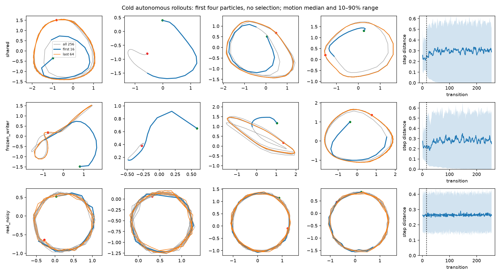

# Unclipped autonomous baseline

**Follow-up complete:** [64-step training on both GPUs](../horizon64/README.md).
The results below preserve the 16-step baseline.

Both mechanisms completed 2,000 GPU updates without numerical failures. The
learned writer produces more approximate circles after startup than the frozen
writer, but reliable circles from zero memory remain unsolved. This is the
baseline for subsequent experiments; gradient clipping stays disabled.

## Leaderboard

128 fixed learned particles, one trajectory and independent zero-initialized
memory per particle, 256 generated points, no real prefix or runtime expert.
Ranked by full-trajectory circle passes, then late-only passes.

| Mechanism | Full circles ↑ | Late-only circles ↑ | Stopped late ↓ | Full radial RMSE ↓ |
|---|---:|---:|---:|---:|
| Learned writer, unclipped | 0.8% (1/128) | 23.4% (30/128) | 16.4% | 0.396 |
| Frozen writer, unclipped | 0% | 11.7% (15/128) | 12.5% | 0.406 |
| Real noisy reference | 99.2% | 99.2% | 0% | 0.032 |

Full circles use the original fit to the first 32 points and evaluate all 256.
Late-only circles fit and evaluate points 129–256 separately. They reveal
settled dynamics but do not satisfy the cold-start target. Stopped late means
mean step distance below 0.01 in the last 64 transitions. Radial RMSE is relative
to fitted radius. All full generated paths had valid fits. Late fits were valid
for 83.6% learned and 93.0% frozen; pass percentages include invalid fits as
failures. These are heuristic geometry diagnostics, not distribution distances.



First four particles, without selection. Blue: first 16 points; orange: final
64; gray: all 256; green/red: start/end. Each panel has equal-aspect independent
axes. Right column: median step length with 10th–90th percentiles. Examples show
startup drift, recurring distorted loops, and trajectories that settle to points.

## Effect of removing clipping

Comparison with the [completed clipped run](../README.md):

| Mechanism | Full radial RMSE, clipped → unclipped | Late circles | Stopped late |
|---|---:|---:|---:|
| Learned writer | 0.466 → 0.396 | 17.2% → 23.4% | 20.3% → 16.4% |
| Frozen writer | 0.410 → 0.406 | 14.1% → 11.7% | 8.6% → 12.5% |

Removing clipping improved several learned-writer diagnostics in this run;
frozen-writer outcomes were mixed. Both runs initially reproduce their clipped
counterparts' logged losses exactly through update 600, then diverge by 700.
No seed experiments were performed. These comparisons establish the current
configuration's behavior, not statistical significance or a universal benefit
from either writer learning or clipping removal.

Mean step distance over the final 64 transitions is 0.303 learned, 0.291 frozen,
and 0.272 real. Motion therefore persists for many trajectories. Its geometry
and startup behavior are the problem. Even the short 16-point circle diagnostic
passes only 14.8% learned and 11.7% frozen (74.2% noisy real; short arc fits are
less reliable). The error is not confined to the untrained tail.

## Exact setup and validation

Same architecture, initialization and data/latent schedules as the clipped
study: batch 128, 512 learned particles with z dimension 4, 16-point training
sequences, fixed z within a trajectory, RTX A6000 on CUDA 0. Offline circle noise
remains 0.03 per coordinate. No EMA, teacher forcing, time input, or supervised
reconstruction loss. Training and evaluation took approximately 190 seconds,
excluding startup and plotting.

B-cap uses the public API defaults without overrides: exact autograd, L2
input-gradient cap 1, coefficient 1, every update. Parameter-gradient clipping
and its norm logs are absent. New configs record `gradient_clipping: null`.
Source comparison verified that clipping and its associated logging/config
changes are the only trainer changes. Resolved recipes match the clipped study,
and real evaluation arrays match exactly.

The learned writer still receives D gradients from both real and detached fake
sequence scoring. Its weights remain frozen during G updates, with full
backpropagation through rollout state. Reloading only G, writer and the particle
prior reproduced all 128 saved learned-writer trajectories within the checked
1e-6 absolute/1e-5 relative tolerances, without a critic scorer or real inputs.

The analysis script now supports selected mechanisms and separate output
directories. Rebuilding the older three-mechanism analysis reproduced its JSON
exactly. Both new analyses completed, plots were inspected, and `git diff --check`
passed. Runtime/gradient tests and the unclipped GPU smoke run passed before this
study; training code was not changed during this run.

## Recommended next experiment

Train **both writers on 64-step sequences**, retaining 2,000 updates, no clipping,
fixed particles, and 256-step cold evaluation. This gives D several revolutions
and later memory states to judge. Keep the cold and late-only metrics separate.
The flattened temporal critic grows with the horizon and compute per update
increases, so this tests the longer-horizon configuration, not an isolated memory
change at equal compute. No need to rerun the structurally static no-memory
control. Defer new shapes and fresh per-step particles.

The follow-up is now complete: see the [64-step study](../horizon64/README.md).

## Artifacts and reproduction

Raw output: `runs/memory_path/autonomous_unclipped_2k/`, with source snapshots,
configs, logs, inference checkpoints, and trajectories. `experiment.log` ends
with `suite_complete`. Durable [results](results.json) contain resolved configs;
[provenance](provenance.json) records the command and environment. Because the
trainer changes were uncommitted when training started, [source hashes](source.json) and the
[patch against the recorded revision](clipping-removal.patch) identify the
actual training source.

```bash
.venv/bin/python -u experiments/autonomous_memory.py \
  --out runs/memory_path/autonomous_unclipped_2k_reproduce --device cuda:0 \
  --steps 2000 --batch-size 128 --train-length 16 \
  --eval-steps 256 --eval-batch 128 --log-every 100 \
  --variants shared frozen_writer
tail -F runs/memory_path/autonomous_unclipped_2k_reproduce/experiment.log

.venv/bin/python reports/autonomous-memory/analyze.py \
  runs/memory_path/autonomous_unclipped_2k \
  --out reports/autonomous-memory/unclipped
```
