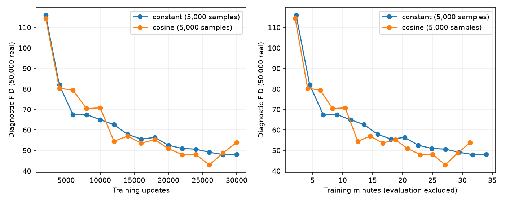
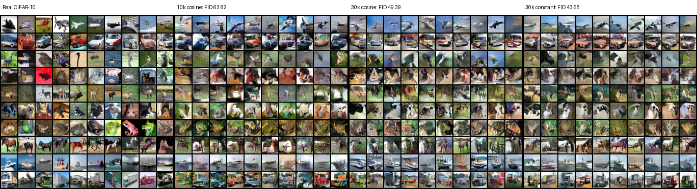

# CIFAR-10 particle DDGAN: training schedule round

**Best final FID50k: 43.678**, using 30k updates at constant learning rates.
Both runs finished on the two A6000 GPUs in 39.2 minutes with zero failures.
The initial baseline, image experiments and prepared configs were committed as
`62843b9` before launch. No push was requested this turn.

| Configuration | Updates | Final FID50k ↓ | Train min | Total min |
|---|---:|---:|---:|---:|
| Constant LR | 30,000 | **43.678** | 33.95 | 39.08 |
| Cosine LR | 30,000 | 49.390 | 31.29 | 36.18 |
| Previous selected cosine baseline | 10,000 | 62.819 | 10.40 | 12.92 |

Both new runs retain the convolutional U-Net / GroupNorm D, class-only UCD,
learned20k x128 latent particles, Gaussian step noise and T=4. Same shared
train_denoising.py posterior, Rp logistic loss, candidate-only bcap1/kappa1,
UCD CE .02, unique-row VICReg1, batch64, Adam(0,.999), EMA .995, and toy rates
G .0006 / D .0009 / particles .006. The two full configs differ only in
`lr_floor` (.05 versus1) and output directory. No architecture/objective change.

## Interpretation

Extending training improved final FID with both schedules. Constant rates beat
cosine at the final endpoint by5.71 FID (11.6%). Relative to the previous10k
baseline, its score is19.14 lower (30.5%), for about3x the training updates.
The old10k run had an earlier decay horizon, so that comparison is not a pure
training-duration intervention. GPU1 drives a desktop; timing is approximate.

The pair uses the same seed24002; no seed sweep. Production kernels are not
bitwise deterministic: trajectories differ even before the rates diverge at18k.
At18k their diagnostic FIDs were55.248/56.343 (cosine/constant); at20k50.865/52.523;
at24k48.062/50.593; at26k42.904/49.079; at28k48.718/47.969; at30k53.850/48.004.
Cosine briefly led but regressed late; do not select the26k checkpoint based on
its minimum or treat a single pair as a universal schedule result. The practical
choice for the next CIFAR comparison is constant LR at the tested30k budget.

Diagnostic FID uses5k generated samples; the leaderboard uses final50k.
Global FID does not measure requested-class accuracy. UCD is only over class c;
D retains explicit xt and timestep inputs. G receives class and timestep.

Rows are airplane, automobile, bird, cat, deer, dog, frog, horse, ship, truck.
Columns are distinct samples, not timesteps or fixed particle IDs. The fixed
sampling seed aids checkpoint comparison. Vehicles and silhouettes are more
recognizable after longer training; animal anatomy and fine detail remain rough.
There is no evidence here isolating the benefit of UCD or particles on CIFAR.

## Next experiment and defaults

The toy joint-UCD scout is complete: [readout](../denoising-toy/joint_ucd/READOUT.md).
Joint(t,c) is competitive with class-only, with small metric tradeoffs. User
prefers the simpler conditioning rule when competitive and authorized promotion.

**No-argument CIFAR default is now30k updates, constant LR, joint timestep/class
UCD, and FID every10k**. This is a candidate configuration, not the model that
achieved43.678. That measured winner uses class-only UCD. Joint UCD has40 heads,
no D timestep embedding, and retains xt input. Both real-CIFAR100-update smoke
runs passed; full CIFAR joint-UCD quality is unmeasured.

Ready after compact: a matched30k constant-LR class-only versus joint comparison
in [configs/cifar_ddgan/joint_ucd](../../configs/cifar_ddgan/joint_ucd/).
Both use the lower FID cadence. [default.yaml](../../configs/cifar_ddgan/default.yaml)
matches its joint candidate except output directory. Historical repository
configs now explicitly select class-only so they retain their prior behavior.
Archived configs/source certificates remain unchanged. Spatial particles and
pretrained D are later priorities.

## Validation and artifacts

25 focused image/CUDA-resume/toy/regularizer tests passed before CIFAR launch.
Both full runs have verified saved-source certificates and archived configs,
metrics, grids, environment, protocol and source digests. Exported records are
in [schedule_30k/TABLE.md](schedule_30k/TABLE.md). Checkpoints and source.zip stay
under ignored results/cifar_ddgan/schedule_30k. After certification, the optional
toy UCD implementation and default FID cadence changed source hashes: strict
historical resume needs the matching archived source, not current files.

Combined log: `tail -F results/cifar_ddgan/live.log` (also follows the toy scout).
Normalization results: [ROUND2.md](ROUND2.md); earlier image runs: [ROUND1.md](ROUND1.md).
