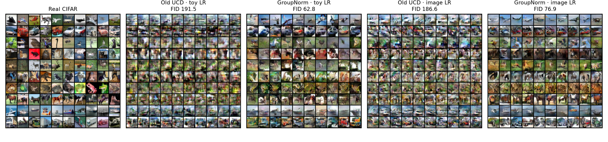
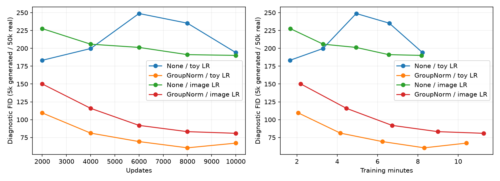

# CIFAR-10 particle DDGAN: normalization round

**Best final FID50k: 62.819**, down from the previous best UCD 186.564.
The winning model trained for 10.40 minutes. Both new runs completed on the two
RTX A6000 GPUs in 14 minutes wall time, including evaluations. This is a much
better starting baseline, but images remain rough and class fidelity is uneven.

## Leaderboard

Every row uses 10k updates, batch64, seed24002, learned latent particles,
Gaussian step noise and the same final 50k-generated / 50k-real FID protocol.
No seed repetitions were run. Training times exclude evaluation.

| Rank | D | Width G/D | D norm | LR recipe | FID50k ↓ | Train min |
|---|---|---:|---|---|---:|---:|
| 1 | UCD | 32 | GroupNorm | toy | **62.819** | 10.40 |
| 2 | UCD | 32 | GroupNorm | image | **76.863** | 11.26 |
| 3 | concat | 32 | none | image | 180.069 | 8.76 |
| 4 | UCD | 32 | none | image | 186.564 | 8.18 |
| 5 | UCD | 32 | none | toy | 191.516 | 8.23 |
| 6 | concat | 32 | none | toy | 198.464 | 8.18 |
| 7 | UCD | 64 | none | toy | 220.189 | 17.98 |

Toy rates: G .0006, D .0009, particles .006. Image rates: G .00016,
D .000125, particles .0016. Comparing rates changes the G/D ratio as well as
absolute rates. Each new normalized run differs from its historical matched
UCD control only by D normalization and output directory. The code also includes
the previously described logging detach fix; the old unnormalized architecture
was checked against its archived source for exactly equal initial state/output.

## What changed, and what stayed the same

Added configurable per-image GroupNorm inside D residual blocks, retaining
additive time conditioning. G was already a GroupNorm residual U-Net. GroupNorm
has no batch statistics, preserving independent-sample bcap gradients.

The formulation remains the one in `experiments/train_denoising.py`:

```
clean = G(xt, latent_particle, t, class)
xt-1 = A[t]*clean + B[t]*xt + sqrt(posterior_var[t])*GaussianNoise
```

T=4, alpha_bar=[1,.9,.5,.05,.0001]; learned20k x128 prior; independent Gaussian
initial image and step noise; continuous xt/time conditioning in D; UCD ten
heads and CE .02; shared Rp logistic GAN loss; candidate-only bcap1/kappa1;
unique-row VICReg1; Adam(0,.999); EMA .995; cosine decay after60% to floor.05.
No reconstruction loss, epsilon-regression objective or pure diffusion training.
The change is to D architecture, not the adversarial diffusion formulation.

No arguments now selects the winning configuration in
[default.yaml](../../configs/cifar_ddgan/default.yaml). Exact round configs:
[toy rates](../../configs/cifar_ddgan/normalized_d/toy_lr.yaml),
[image rates](../../configs/cifar_ddgan/normalized_d/image_lr.yaml).

## Interpretation

Normalization improved final FID from 191.516 to62.819 with toy rates and from
186.564 to76.863 with image rates. It costs about26% more training time in the
matched toy-rate comparison. GPU assignment differs across some historical
controls and GPU1 also drives a desktop, so timing differences are approximate.
The toy-rate recipe wins after normalization; the earlier preference for image
rates did not transfer across architectures.



Rows: airplane, automobile, bird, cat, deer, dog, frog, horse, ship, truck.
Cars/trucks/planes and some animal silhouettes are more recognizable. Animal
anatomy, diversity and requested-class consistency still need improvement.
Global FID alone cannot establish class fidelity. This round holds UCD,
particles and Gaussian noise fixed; it does not show that any of them beats
its alternatives on CIFAR.



The toy-rate progress FIDs at2k/4k/6k/8k/10k were109.5/81.1/69.3/60.5/67.1
(5k samples). Use the **final50k score62.819** for the leaderboard; do not select
the lowest intermediate FID or compare sample counts as equivalent.

## Checkpoint diagnostics

Read-only probes used the same256 real images, RNG seed and raw G/D weights.
These are diagnostic batches, not independent held-out estimates. The old
model loads through the verified unchanged `d_norm:none` architecture.

| t | Old toy-rate D candidate gradient norm | GroupNorm toy-rate norm |
|---|---:|---:|
| 1 | .0112 | 1.0241 |
| 2 | .0112 | 1.0222 |
| 3 | .0088 | .6522 |
| 4 | .0022 | .0620 |

D now has a stronger candidate gradient, with the cleaner steps near the
existing soft bcap threshold1. Small exceedances are expected from a penalty,
not a hard constraint. This supports the weak-gradient hypothesis; it does not
prove which feature statistics caused the original failure. The noisiest step
still has a weaker signal. Changing the latent particle changes outputs, most
strongly at noisier steps, but that is not evidence that particles improve FID.
Full probes are saved under [normalized_d](normalized_d/).

## Recommended next experiments

**Updated after discussion:** the agreed next pair is 30k width32 cosine versus
constant LR, followed by spatial particle injection and pretrained D features.
See [the prepared plan](NEXT_ROUND.md). The original recommendations below are
retained as historical context.

1. Extend the winning width32 recipe to30k updates, retaining the objective,
   particles and four-step schedule. Its improvement slowed around8k and the
   final diagnostic ticked upward, so longer training is a test, not a promise.
2. In parallel, train width64 with GroupNorm for the same30k updates. Earlier
   width64 failed with unnormalized D; that does not settle capacity after this
   fix. Compare FID versus both updates and elapsed training time.
3. After a useful baseline, isolate prior/batch scaling and prior/noise controls.
   VICReg off-diagonal covariance pressure scales roughly with
   (latent_dim-1)/(unique_batch_rows-1): ~2 here versus~.012 in the toy. Preserve
   the current formula for the next capacity/duration pair and change it only
   as a separate ablation. Add an independent class metric before claiming UCD
   class fidelity. No transformer change is needed yet.

A30k run should start fresh with a full config and planned schedule. Current
strict resume cannot extend the10k horizon. Nothing else is queued.

## Validation and artifacts

Before launch: 6 image/resume tests and19 toy/regularizer tests passed; both
real-CIFAR GPU smoke runs passed; exact old-source G/D compatibility checked.
After default promotion, the6 image/resume tests passed again, including CUDA
checkpoint replay with normalized D. The pinned FID SciPy deprecation remains
benign. All completed runs have verified saved-source completion certificates.

The default promotion happened after both runs were certified, changing the
trainer hash. Historical checkpoints must use their matching `source.zip` and
saved `config.yaml` for strict resume. Saved artifacts/provenance were not
rewritten. Full configs, scores, histories and certificates:
[round table](normalized_d/TABLE.md). Raw checkpoints and source archives remain
in `results/cifar_ddgan/normalized_d/`. Prior findings: [round1](ROUND1.md).
No commit or push performed. All experiments have finished.
