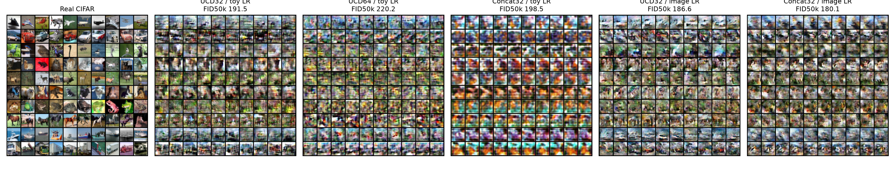

# CIFAR-10: first baseline round

We now have a fast, reproducible CIFAR-10 U-Net DDGAN experiment, but **not yet
a strong image generator**. Five 10k-update runs completed on both RTX A6000s.
The best measured FID was 180.069 (concat); the best UCD run scored 186.564.
These are single-seed starting results, far from the eventual ~3.8 target.

All final scores below use 50,000 balanced generated samples against the same
50,000 unaugmented CIFAR training images, with torch-fidelity Inception features.
Training times exclude evaluation; total times include sampling/FID/checkpoints
but exclude the one-time data download and reference-cache preparation.

| D conditioning | G/D width | LR recipe | Final FID50k ↓ | Training min | Total min |
|---|---:|---|---:|---:|---:|
| UCD | 32 | inherited toy | 191.516 | 8.23 | 10.62 |
| UCD | 64 | inherited toy | 220.189 | 17.98 | 20.80 |
| Concat | 32 | inherited toy | 198.464 | 8.18 | 10.62 |
| UCD | 32 | image anchor | 186.564 | 8.18 | 10.63 |
| Concat | 32 | image anchor | **180.069** | 8.76 | 11.31 |

Inherited rates: G .0006, D .0009, particles .006. Image anchor: G .00016,
D .000125, particles .0016. The latter G/D rates come from the
[official DDGAN training instructions](https://github.com/NVlabs/denoising-diffusion-gan/blob/main/readme.md).
This changes the G/D ratio and absolute particle LR too; it does not isolate
which individual rate matters. Width changes affect both G and D.

All other settings are held fixed: seed 24002; batch64; T=4;
alpha_bar=[1,.9,.5,.05,.0001]; learned latent table 20k x128; Gaussian reverse
noise; Rp logistic; candidate-only bcap coeff/kappa1 every step; UCD CE .02;
unique-row VICReg1; Adam (0,.999); EMA .995; cosine decay after 60% to a .05
floor; random horizontal flips. The scalar concat control uses class embeddings
in D instead of ten UCD heads/CE. D has no normalization in this round.

## What the experiments say

- Doubling width increased cost and worsened final FID in this seed. Width32 is
  the practical starting point for the next round.
- Neither UCD nor concat clearly wins across rate recipes. The best concat
  result is modestly better than the best UCD result; this is not a multi-seed
  significance claim.
- The image-rate anchor modestly improved both final scores. It did not resolve
  the central quality problem. The no-argument config now uses its G/D rates
  while retaining the requested UCD baseline.
- Samples have class-related color/texture and some coarse object structure,
  but remain blurry, repetitive, and weakly structured. Global FID is not an
  independent class-fidelity measure. No pretrained CIFAR classifier was used.
- Progress FIDs were often non-monotonic. All selections above compare final
  50k evaluations, not a cherry-picked minimum of the 5k progress checks.
- This round holds latent particles and Gaussian step noise fixed. It does
  **not** establish that either is better than its alternatives on CIFAR.

Rows are airplane, automobile, bird, cat, deer, dog, frog, horse, ship, truck.
Individual grids, metric histories, configs, source hashes and completion
certificates are in [baseline](baseline/TABLE.md),
[conditioning](conditioning/TABLE.md), and [image-rate runs](image_lr/TABLE.md).
Actual checkpoints/source archives remain under `results/cifar_ddgan/`.

## Diagnostics and next hypothesis

The interim UCD32 probe found candidate-gradient norms roughly .004–.012,
well below the bcap threshold1. Changing z changes G outputs; its effect is
smaller at cleaner steps. A separate t=4 probe found large time shifts and
about 71% of channels in the later D blocks almost always on one side of the
activation. This suggests testing feature normalization; it does not prove
that time conditioning is the sole cause of poor quality. Keep xt conditioning.

Next round: width32 UCD with GroupNorm in D, comparing inherited and image-anchor
rates against this round's unnormalized controls. Per-image GroupNorm preserves
bcap's independent-sample interpretation. Keep G/particles/schedule/objectives
fixed. A draft implementation patch is saved as `normalized_d.patch`; it has
**not been applied or trained**. Validate its per-image cap gradients and GPU
smoke path before running the next pair.

A second scaling issue to revisit separately: for iid unit Gaussian particles,
the expected off-diagonal covariance term in the existing VICReg implementation
is approximately (latent_dim-1)/(unique_batch_rows-1). Going from toy dim4/batch256
to image dim128/batch64 changes this from ~.012 to ~2.0. Preserving coefficient1
therefore preserves the formula, not its relative scale. This round deliberately
held it fixed; no conclusion about the best image particle regularization yet.

## Validation and source integrity

Initial CPU suite: 66 tests +22 subtests passed; both real-data GPU smoke runs
passed; every baseline run has a valid completion certificate. The real-CIFAR
GPU interruption/resume integration test passed with fixed deterministic CUDNN
kernels. It stubs FID for speed and tests state continuation, not metric accuracy.
Production enables CUDNN benchmarking/TF32 and does not promise bitwise identity.

The startup warning was a missing detach in the particle-movement logging
metric. It never entered the training loss. It was fixed **after all runs
completed**, together with promoting the no-argument learning rates. Those edits
change the current source hash; saved summaries/certificates and source.zip files
still describe the exact code used for each completed run. To resume an older
checkpoint, restore its matching source archive first. No commits/pushes were
made during this round. No training experiments remain active.
