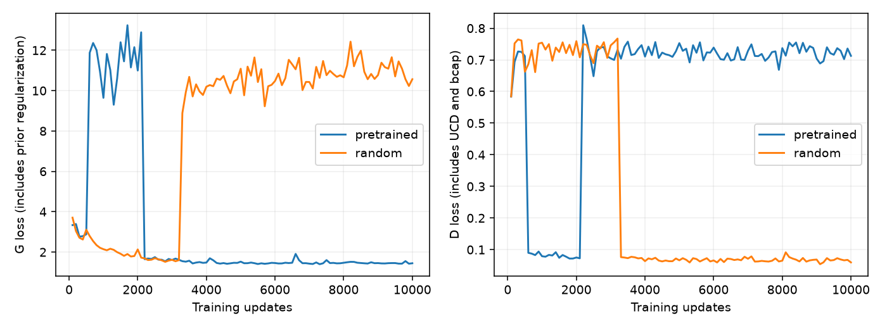

# Unfreezing Anima regresses at the inherited constant learning rate

All six processes completed and their certificates verified: two profiles,
two 1k scouts, and two 10k validations. **Trainable pretrained Anima reaches
FID50k 36.558**, worse than the frozen transplant's 30.263. The trainable
random control collapses to solid-yellow outputs, FID50k 496.351. Completion
certificates establish recorded execution, not successful generative training.

Keep the existing defaults. No further training is queued; both GPUs are free.
The implementation/configs remain on `experiment/anima-transplant`. This tests
unfreezing at the inherited **constant G learning rate of 0.0006**; it does not
rule out trainable transplants with a different optimization recipe.

## 10k-update leaderboard

All rows use batch64, 640,000 samples per optimizer and final FID with 50,000
generated images against the same CIFAR-train reference. Only the two new
trainable rows are simultaneous controls with matching source provenance.

| Generator | FID50k ↓ | Training min | Total min |
|---|---:|---:|---:|
| Attention U-Net, historical | **29.327** | 10.73 | 12.44 |
| Frozen pretrained Anima | 30.263 | 19.98 | 22.62 |
| Plain U-Net, historical | 31.555 | **9.22** | 10.75 |
| Frozen random donor | 32.550 | 20.82 | 23.54 |
| **Trainable pretrained Anima** | **36.558** | **24.89** | **27.65** |
| Trainable random donor | 496.351† | 25.62 | 28.37 |

† The random control's 5k-sample diagnostic produced a singular-covariance
warning. Its final FID50k also reports496.351; the numerical FID is secondary
to the directly observed output collapse. In a separate100-image EMA probe,
all 100 quantized outputs were the same yellow image. The final image head
had 99.87% of pre-tanh values at absolute magnitude>=10, consistent with heavy
output saturation. No NaN/Inf training failure was reported.

Unfreezing pretrained Anima costs about 25% more training time and worsens FID
by 6.295 points versus the frozen run. Both trainable donors have157,339,107
trainable G parameters, including 155,192,320 donor parameters. Frozen G trained
only 2,146,787 parameters. D and the 2,560,000-parameter particle table are unchanged.
Steady throughput is429.1 samples/s pretrained and 416.8 random; peak training
allocation is5.60 GiB versus2.63 GiB frozen. Evaluation allocation is excluded.
GPU1 also serves the desktop; do not attribute the pair's speed difference to
pretraining. Historical comparisons and this single controlled pair do not
establish statistical significance; no seed repeats were performed.

## Early scores did not predict the outcome

| Donor | 1k FID5k ↓ | Training min |
|---|---:|---:|
| Frozen pretrained | 67.514 | 2.00 |
| Frozen random | 74.227 | 2.06 |
| Trainable random | **74.709** | 2.57 |
| Trainable pretrained | 82.771 | 2.52 |

The random initialization led the new 1k screen, then failed during its fresh
10k validation. The pretrained 10k run also had a severe early loss excursion
around updates 600–2100, but recovered by about 2200. The random run's loss
excursion starts around 3300 and persists through the end. Final images confirm
random collapse; losses alone do not establish intermediate image collapse.



The pretrained 10k prefix differed substantially from its 1k scout despite
the same seed and training settings. An audit found only `steps`,
`final_samples`, and `out_dir` differ; LR remains constant and evaluation occurs
only at the respective endpoint. This execution uses TF32 and cuDNN benchmark
mode and does not guarantee bitwise deterministic CUDA trajectories. We do
not assert an exact cause of the divergence or treat the 1k and 10k runs as one
continuous training trajectory. No changed-checkpoint resume was used.

FID5k and FID50k have different sample-count bias and are not interchangeable.
The 128-update profiles used ten samples only to exercise the evaluation path;
their FID is excluded from the quality tables. Both profiles produced expected
small-sample singular-covariance warnings.

## What changed and what was verified

`anima_trainable: true` unfreezes the same two donor blocks, including all
self/cross-attention, MLP, Q/K normalization, timestep embedding/norm and
AdaLN modulation parameters. The common G rate/betas also apply to these
weights. No learning-rate decay, donor-specific rate, clipping, or new loss.

Learned timestep modulation is recomputed from current weights instead of
using the frozen experiment's cache. This is also true for the EMA generator:
eval/no-grad does not accidentally select stale conditioning. Only fixed
sinusoidal inputs and rotary coordinates are reused. The zero-start output
adapter remains; donor gradients become active after the first output-adapter
update.

Trainable parameters, gradients, Adam moments and EMA stay float32. Donor
matrix operations use bfloat16 autocast; Q/K normalization uses float32 before
casting back for attention. Frozen mode keeps its old bfloat16 parameter
storage/cached modulation. The freeze/unfreeze comparison includes these
precision changes required for reliable parameter updates. The discriminator
and its exact double-backward bcap path retain float32 operation.

All four DDGAN steps, the learned 20k×128 latent particles, Gaussian step noise,
joint time/class UCD, Rp logistic, VICReg, exact lazy-4 bcap, cached ResNet18 D
features, optimizer ratios, EMA .995 and constant learning rates remain. The
plain U-Net is still the no-argument default; `anima_trainable` defaults false
for compatibility with existing frozen configurations. Every new experiment
config explicitly sets it true.

Validation:

- 56 tests plus 13 subtests passed; after fixing the mixed-dtype RMSNorm warning,
  all 18 Anima tests passed again without that warning.
- Both real-size GPU checks passed: exact initial output match to U-Net,
  finite nonzero gradients and actual updates for every donor parameter tensor,
  float32 Adam state, and active image/particle gradients.
- Tests cover the live timestep path, EMA parameter updates and conditioning,
  exact output agreement after restoring EMA state, and frozen-mode compatibility.
- All six run certificates verified, with one unchanged source manifest across
  profiles/scouts/validations. Configs record donor revision and bundle hashes.
- Checkpoint audits at 1k and 10k confirmed every donor parameter tensor changed
  from initialization in both G and EMA, with finite float32 values.

The pretrained donor's global relative L2 weight change was 1.435 at 1k and 2.380
at 10k; random was 0.400 and 0.665. These are ratios of weight-change norm to
initial weight norm across the donor, not evidence that a specific amount of
knowledge was lost. They show substantial movement at the inherited rate.
The final pretrained 100-image probe had 100 distinct quantized outputs and no
pre-tanh values with absolute magnitude>=10. Neither that probe nor global
FID establishes mode coverage or class fidelity.

## Recommendation and artifacts

Do not promote unfreezing at this rate or spend 50k updates on this configuration.
Attention remains the better established 10k architecture/cost tradeoff. If
continuing trainable transplants, a single smaller **constant** donor learning
rate is a targeted next optimization test; the observed drift motivates it but
does not prove it will fix the failure. No sweep or further run is queued.

Read [plan](PLAN.md), [1k exports](scouts/TABLE.md),
[10k exports](promotions/TABLE.md), [throughput](promotion_speed/TABLE.md),
[pretrained samples](promotions/pretrained/samples.png),
[collapsed random samples](promotions/random/samples.png),
[weight audit](checkpoint_audit_10k.json), and [output probe](output_probe_10k.json).

Full configs: `configs/cifar_ddgan/anima_trainable_{profile,1k,10k}/*.yaml`.
Use fresh output directories and `--workers_per_gpu 1`. The pinned bundle,
checkpoints, source archives and raw traces remain in ignored data/results.

```
tail -F results/cifar_ddgan/anima_trainable.live.log
```
