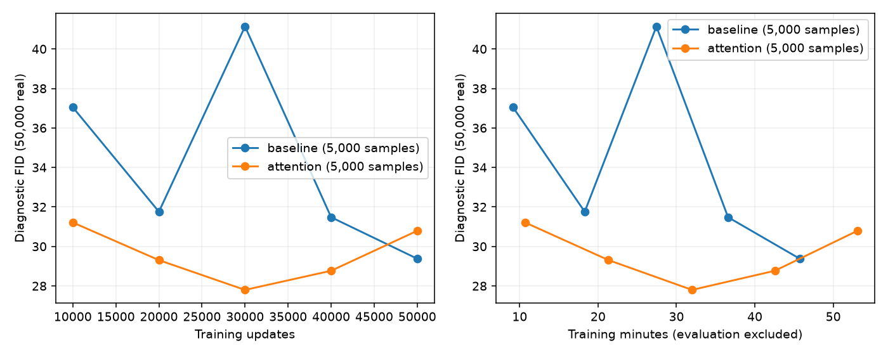

# Attention helps early; plain U-Net wins the 50k endpoint

All four experiments completed successfully. The fast plain U-Net reaches
**FID 25.397 at 50k updates in 45.73 training minutes**. Attention improves
the 10k scout and most intermediate diagnostics, but finishes at FID 26.334
after 53.09 training minutes. Keep the existing no-argument architecture.
Both GPUs are free; nothing further is queued.

## Final results

All rows below use 50,000 generated samples for final FID.

| Generator and recipe | Updates | Final FID ↓ | Training min | Total min |
|---|---:|---:|---:|---:|
| Plain U-Net, exact lazy-4 | 50,000 | **25.397** | **45.73** | 48.27 |
| Attention U-Net, exact lazy-4 | 50,000 | 26.334 | 53.09 | 55.79 |
| Plain U-Net, historical every-step bcap | 50,000 | 26.680 | 99.34 | — |
| Attention U-Net, exact lazy-4 scout | 10,000 | **29.327** | 10.73 | 12.44 |
| Plain U-Net, historical exact lazy-4 scout | 10,000 | 31.555 | 9.22 | 10.75 |

The fast baseline now has longer-budget validation: about 54% less training
time than the historical every-step run, with a slightly lower observed FID.
This historical comparison is not a controlled significance test.
Attention adds 104,128 parameters (about 10%) to the 1,044,835-parameter G,
and costs about 16% more training time at 50k. D and particle counts are unchanged.

The initial attention screen reached FID **69.311 with 5k samples at 1k updates**,
in 1.07 training minutes. Historical baseline FID5k was 68.455. That screen
established viability, not the eventual quality ranking. After attention's
completed 10k improvement, GPU1 ran a fresh 50k validation alongside the
ongoing GPU0 baseline. These are budget changes, not seed experiments.

## The trajectory matters

These are matched **5k-sample diagnostic FIDs from the two 50k runs**; they
must not be substituted for the final 50k-sample scores above.

| Updates | Plain U-Net | Attention U-Net |
|---|---:|---:|
| 10,000 | 37.047 | **31.213** |
| 20,000 | 31.758 | **29.307** |
| 30,000 | 41.138 | **27.799** |
| 40,000 | 31.479 | **28.769** |
| 50,000 | **29.379** | 30.792 |



Attention's best recorded diagnostic occurs at 30k, after about 32 training
minutes. It is better than the plain U-Net's best recorded diagnostic in this
comparison, but it worsens afterward. Plain U-Net also has a substantial
temporary setback at 30k, then recovers. These curves argue against assuming
that more updates monotonically improve either generator.

The practical inference is that attention may improve early learning, while
the training schedule or stability becomes important later. This does not
establish a G/D bottleneck or prove overfitting. A selected minimum from five
noisy diagnostics is also not an independently validated best checkpoint.

The trainer overwrites `checkpoint.pt` at each evaluation. Intermediate sample
grids and diagnostics are retained, but **the attention 30k weights are not**.
We therefore cannot evaluate that point with 50k generated samples retrospectively,
and do not claim it beats the certified final FID 25.397.

## Recommendation

Use the plain U-Net for the established low-cost baseline. Its full longer-run
config is `configs/cifar_ddgan/duration_50k/baseline.yaml`. No-argument training
still uses the same plain architecture and 10k scouting budget.

Keep attention available via `g_attn_resolutions: [8, 16]`. Before another
architecture or width increase, the useful next experiment is to preserve
periodic/best checkpoints and validate attention near 30k with final FID50k,
then test a gentler learning-rate tail against constant LR. This is a proposal,
not a queued run or evidence that annealing will help. It preserves the existing
DDGAN/ParticleGAN/UCD objective. No 1200-epoch experiment is needed to test it.

## Implementation and controls

The shared `ImageGenerator` optionally applies spatial self-attention after
encoder and decoder residual blocks at 8×8 and 16×16 resolution (four blocks
total). Each uses GroupNorm, 1×1 QKV projections, four attention heads and a
zero-initialized output projection. Its residual path starts as an identity.
Convolutions, skip concatenations, image resolutions, particle/time/class
modulation and the DDGAN input/output interface remain intact.

Attention construction isolates CPU RNG consumption. Tests verify that the
initial convolution weights, initial G outputs, D weights and subsequent CPU
RNG state match the plain baseline. Attention QKV gradients become active
after the zero-initialized projection's first optimizer update. Particle and
noisy-image gradients remain finite and nonzero. CUDA trajectories are not
claimed to be bitwise reproducible across separate launches.

`g_attn_resolutions: []` is the default. This config option applies only to
the existing U-Net; invalid resolutions/head counts and incompatible
architectures are rejected. No shared training-loop or regularizer changes
were made in this round.

All runs retain batch64, seed24002, four reverse steps, learned 20k×128 latent
particles, Gaussian step noise, joint time/class UCD, Rp logistic, VICReg,
exact lazy-4 bcap, existing optimizer rates, constant LR and EMA.995. D is
the same frozen ImageNet ResNet18 feature branch plus trainable pixel/head
networks. Feature caching and fused Adam remain enabled. At 50k, each
optimizer sees 3.2M samples (64 CIFAR dataset passes); total real draws across
D and G are 6.4M. Batch sizes did not change.

## Evaluation, validation and artifacts

- Four certified successful GPU runs; GPU0 baseline, GPU1 attention.
- 38 tests plus 13 subtests passed before launch, including attention learning,
  identical baseline initialization, particle gradients, bcap/cache checks,
  config validation and runner provenance tests.
- Diagnostics run every 10k. Final FID uses the existing 50k CIFAR-train reference,
  50k generated images and TF-compatible Inception protocol. The 1k screen
  uses 5k generated samples. Global FID does not verify requested-class accuracy.
- The final grids show recognizable class structure and persistent animal
  shape/detail errors in both models. Visual inspection is not a coverage test.
- Training time excludes evaluation and I/O. The long-run allocation peaks in
  the speed export include earlier evaluation allocations; they should not be
  interpreted as isolated training-memory requirements.
- Sources stayed fixed throughout training. Saved source archives and configs
  are authoritative for reproduction; historical runs have different provenance.
- [1k screen](screen/TABLE.md), [10k scout](scout/TABLE.md),
  [50k finals and curves](finals/TABLE.md), [throughput](final_speed/TABLE.md).
- [Plain final samples](finals/baseline/samples.png),
  [attention final samples](finals/attention/samples.png),
  [attention 30k samples](finals/attention/samples_030000.png).
- Full configs: `configs/cifar_ddgan/duration_50k`, `attention_1k`,
  `attention_10k`, and `attention_50k`.
- Exported reports include configs, metrics, grids, provenance and completion
  certificates. Checkpoints and source archives remain under ignored `results/`.

Historical logs:

```sh
tail -F results/cifar_ddgan/duration.live.log results/cifar_ddgan/attention.live.log
```
