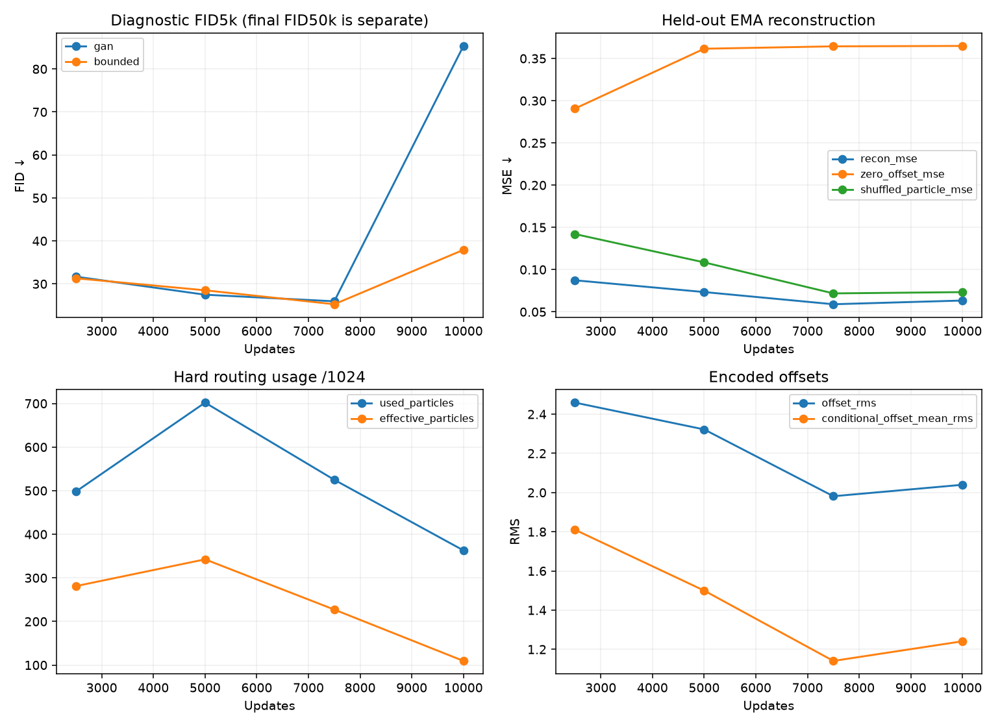
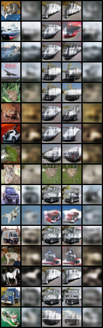
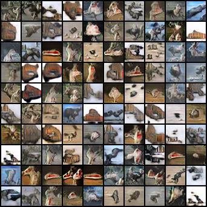
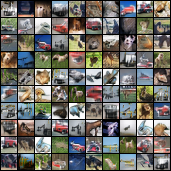

# Direct CIFAR particle autoencoder: first matched baseline

Completed 2026-09-17. **The bounded autoencoder finishes substantially better
than the matched GAN, at 7.8% extra training time, but both deteriorate late in
training. This establishes a cheap, measurable image experiment; it does not
yet establish a stable generation advantage.**

| Final EMA, 10k updates | FID50k ↓ | Test reconstruction MSE ↓ | Training min | Total min |
|---|---:|---:|---:|---:|
| Bounded particle autoencoder + GAN | **33.266** | 0.06337 | 8.61 | 10.84 |
| Matched MoG GAN | 81.411 | — | 7.99 | 10.32 |

One shared seed, identical G/D/E/prior initialization and data/prior RNG streams,
unconditional CIFAR-10 at native 32x32, no label input. 1024 particles, latent64,
fixed sigma 0.212616. G has 645,123 parameters; E 428,320. D reuses the frozen
ResNet18 feature critic with a scalar head and constant context. Both models
generate directly from a code, without noisy-image conditioning or diffusion.
See the [prespecified protocol](PROTOCOL.md) and [full leaderboard](LEADERBOARD.md).

A later [numerical conditional-variation audit](variation/README.md) finds that
adding noise at 0.5x sigma around the encoded point produces eight distinct
outputs per input, with +5.8% reconstruction MSE and 99.34% own-reconstruction
retrieval. This is inference-time perturbation, not a trained stochastic encoder.

The main pair ran concurrently on GPUs 0 and 1 in 10.9 wall minutes; summed
per-run time including evaluation was 21.2 minutes. Peak allocated memory was
5.32 GiB per process, including Inception evaluation (about 1.6 GiB before the
first evaluation). Pilots and the extra diagnostic audit are separate costs.

## Why the final margin needs qualification

At 7500 updates, diagnostic FID5k was 25.951 for GAN and 25.267 for bounded.
The final FID50k gap was large enough to warrant a read-only audit with the
original 5k-sample protocol. This confirms deterioration in **both** arms:

| Model | FID5k at 7500 | FID5k at 10000 |
|---|---:|---:|
| GAN | 25.951 | 85.361 |
| Bounded | 25.267 | 37.918 |

The sample-count change does not explain the regression. Final grids generated
by the audit match the original final grids within one uint8 quantization level;
checkpoint hashes are unchanged. The generation advantage at the endpoint is
real for this comparison, but the large margin is dominated by the control's
late regression. We cannot attribute that to a universally better particle
representation or infer seed-to-seed reliability from this pair.

Intermediate metrics and grids are retained, but the trainer overwrites the
latest checkpoint at each evaluation. Only the final checkpoint remains, so
we cannot rerun 7500-update FID50k. Future rounds should retain numbered
checkpoints. The final ranking follows the protocol, without selecting a best
checkpoint after seeing results.



## What the encoder learned

```text
E(X) -> (query, offset)
query -> nearest particle k
G(p[k] + fixed_sigma * 3*tanh(offset/3)) -> X_hat
```

Test MSE is 0.063365 in [-1,1] pixels, equivalent to aggregate PSNR 18.00 dB.
Reconstruction preserves some broad colors and spatial structure but remains
blurry; this is not faithful semantic image reconstruction.

- Zeroing offsets raises MSE to 0.364833 (5.76x).
- Replacing them with Gaussian noise gives 0.367605 (5.80x).
- Shuffling selected particle IDs while keeping each image's offset gives
  0.073319, a 15.7% increase.

Unlike the toy, offsets carry substantial input information. Particle selection
helps, but these measurements do not establish that it is the main information
channel. The continuous branch appears dominant in the tested ablations.

Hard routing uses 363/1024 particles, with only 109.5 effective particles under
the held-out usage distribution. Effective usage fell from 342.5 at 5k updates
to 109.5 at 10k. This is encoder usage, not unconditional generation coverage:
generation still samples particles uniformly. Offset RMS is 2.04; 11.3% of
coordinates have magnitude above 2.9. Conditional mean RMS is 1.24, with
within-particle RMS 1.62, so the offsets do more than add a constant particle bias.
Encoded offsets are not constrained to match the sampling Gaussian.

Reconstruction grid columns: input, predicted, zero offset, Gaussian offset,
shuffled particle. The first 16 held-out examples are fixed, not selected.



## Generated images

Fixed first 100 evaluation draws; rows have no class labels. These grids are
qualitative checks, not coverage or memorization tests.

GAN:



Bounded particle autoencoder:



The existing conditional DDGAN's FID31.56 at 10k is useful context only. Its
labels, diffusion, architecture, prior and objective differ, so it is not the
matched control in this experiment.

## Recommendation

Keep this two-arm comparison and first test a more conservative optimizer
setting: halve all three learning rates, maintaining their ratios and the same
10k budget. This is a proposed stability experiment, not a demonstrated fix.
Retain numbered checkpoints to locate late regressions without retraining.
There is no need to add oracle supervision, larger networks, or a seed sweep.

Once the control is stable, compare the particle autoencoder with a continuous
encoder + GAN to measure whether particle selection adds value beyond the
offset/encoder channel. No further training is queued yet.

## Reproduction and pipeline

Worktree: `/home/martyn/dev/ParticleGAN-mog-autoencoder`, branch
`feature/mog-autoencoder`. Main worktree source files were left untouched.

```sh
/home/martyn/dev/ParticleGAN/.venv/bin/python -u experiments/follow_grid.py \
  --root runs/cifar_particle_ae/scout --log runs/cifar_particle_ae/scout.live.log -- \
  --configs 'configs/cifar_particle_ae/scout/*.yaml' --gpus 0,1 --workers_per_gpu 1 \
  --python /home/martyn/dev/ParticleGAN/.venv/bin/python \
  --trainer experiments/train_cifar_particle_ae.py

tail -F runs/cifar_particle_ae/scout.live.log

/home/martyn/dev/ParticleGAN/.venv/bin/python experiments/analyze_cifar_particle_ae.py
```

The existing runner handles queued configs, one process per GPU, flushed combined
logs, failed-run preservation and completion certificates. Repeating this exact
queue reuses verified completed runs; new experiments need distinct output dirs.
Keep source files fixed while a queue runs. The new trainer conforms to the
existing runner interface; no scheduler changes were needed. For this first
round, two pilot configs accidentally shared GPU0 because the runner defaults
to five workers per GPU. Both completed; the full queue explicitly used one
worker per GPU. Pilot results and this limitation are preserved in [pilot.json](pilot.json).

The final-checkpoint audit is `experiments/audit_cifar_particle_ae.py RUN_DIR`.
The first bounded audit process terminated with code143 before emitting metrics;
the cause was not reported. Its partial files/log were preserved, and an
evaluation-only retry completed. No training or checkpoints were changed.

Raw checkpoints, source archives and logs: `runs/cifar_particle_ae/` (ignored).
Reports retain exact configs, metadata/source hashes, summaries, metrics,
completion certificates, reconstruction errors/IDs, final grids and audit JSON.
The analyzer verifies the matched pair and audits before publishing results.

Validation: 62 tests plus 13 subtests passed across the new image/routing tests,
MoG, image DDGAN/feature critic and queue tests. One existing SciPy deprecation
warning. Verified exact shared initialization, terminal data/prior RNG hashes,
fixed sigma, frozen feature weights/BN state, complete budgets and matching
saved reconstruction errors. The new trainer does not implement exact resume;
failed training can be rerun as a preserved new attempt.
