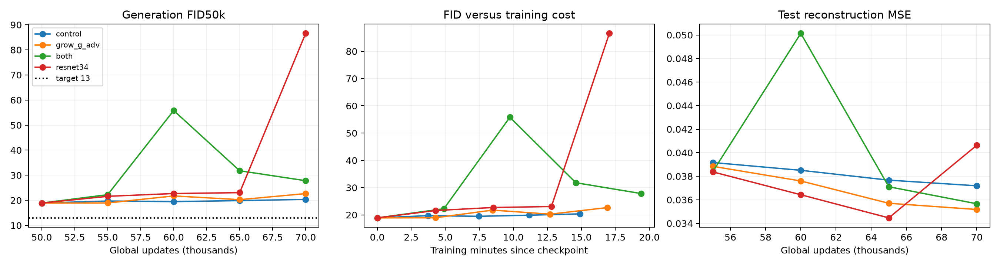

# CIFAR AE-GAN feature and selective-gradient scouts

4/4 certified runs complete.

All arms resume the original one-D 50k checkpoint (FID50k18.9012). ResNet34 replaces only the frozen discriminator backbone while retaining trainable heads and Adam state. This changes D scores immediately and tests replacement plus adaptation, not capacity alone. G growth adds identity-initialized refinements; reconstruction gradients are blocked only on those new parameters, retaining reconstruction updates on old G, E and prior. No extra D warmup, head reset, or change in the one-D update ratio.

| Rank | Run | Final FID50k ↓ | Δ vs control ↓ | Test MSE ↓ | Train min | Wall min | G updates/s |
|---:|---|---:|---:|---:|---:|---:|---:|
| 1 | control | 20.3672 | +0.0000 | 0.03719 | 14.91 | 19.65 | 22.36 |
| 2 | grow_g_adv | 22.6733 | +2.3061 | 0.03518 | 16.91 | 21.66 | 19.71 |
| 3 | both | 27.8205 | +7.4534 | 0.03567 | 19.40 | 24.21 | 17.18 |
| 4 | resnet34 | 86.5698 | +66.2026 | 0.04064 | 17.06 | 21.83 | 19.54 |

FID uses 50,000 prior samples, EMA G/prior, and the existing TF-compatible Inception CIFAR train50k reference. Reconstruction uses the 10k test split. Same seed and parent state throughout; these are architecture interventions, not seed experiments. Final endpoints determine ranking. Intermediate minima are reported separately.

| Run | Global step | FID50k ↓ | Test MSE ↓ | Train min since 50k |
|---|---:|---:|---:|---:|
| control | 55000 | 19.7154 | 0.03916 | 3.74 |
| control | 60000 | 19.4755 | 0.03851 | 7.46 |
| control | 65000 | 19.8832 | 0.03767 | 11.18 |
| control | 70000 | 20.3672 | 0.03719 | 14.91 |
| grow_g_adv | 55000 | 18.9398 | 0.03884 | 4.28 |
| grow_g_adv | 60000 | 21.7500 | 0.03760 | 8.49 |
| grow_g_adv | 65000 | 20.2640 | 0.03571 | 12.70 |
| grow_g_adv | 70000 | 22.6733 | 0.03518 | 16.91 |
| both | 55000 | 22.2484 | 0.03840 | 4.90 |
| both | 60000 | 55.8057 | 0.05013 | 9.75 |
| both | 65000 | 31.7872 | 0.03711 | 14.60 |
| both | 70000 | 27.8205 | 0.03567 | 19.40 |
| resnet34 | 55000 | 21.5958 | 0.03837 | 4.28 |
| resnet34 | 60000 | 22.7068 | 0.03643 | 8.54 |
| resnet34 | 65000 | 23.0585 | 0.03447 | 12.80 |
| resnet34 | 70000 | 86.5698 | 0.04064 | 17.06 |

## Interpretation and recommendation

The earlier all-gradient G-growth scout ended at FID22.8981; its contemporaneous control was19.2033. Use that as historical context for selective routing, not a same-run paired estimate. Reconstruction is never an unconditional-generation benchmark.
G growth with selective routing: +2.3061 FID; ResNet34: +66.2026; both: +7.4534, relative to the contemporaneous control.
Factorial interaction (both − G − D + control): -61.0554. A negative value means the combined result improves more than the sum of the individual changes on this FID scale. This single trajectory provides no uncertainty estimate or proof of a unique bottleneck.
Recommendation: do not promote the tested expansions. They did not beat unchanged continuation at the matched endpoint.
Best observed measurement: 18.9398, grow_g_adv at 55,000. Checkpoint: `/home/martyn/dev/ParticleGAN/runs/cifar_particle_ae/features_scout/grow_g_adv/checkpoint_055000.pt`. This minimum is selected across evaluations.
Target below 13 remains unmet at the final endpoints.

