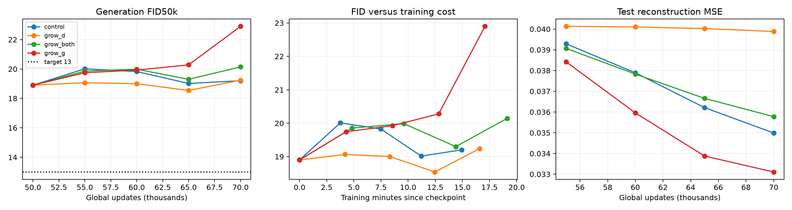

# CIFAR AE-GAN checkpoint capacity scouts

4/4 certified runs complete.

All arms resume the same one-D 50k checkpoint (FID50k 18.9012), run one D update per G update, and retain the original reconstruction routing. G growth adds one identity-initialized residual refinement at each resolution. D growth adds identity-initialized refinements to the three trainable pretrained-feature heads; the ResNet18 backbone stays frozen.

| Rank | Run | Final FID50k ↓ | Δ vs control ↓ | Test MSE ↓ | Train min | Wall min | G updates/s |
|---:|---|---:|---:|---:|---:|---:|---:|
| 1 | control | 19.2033 | +0.0000 | 0.03499 | 14.93 | 19.65 | 22.32 |
| 2 | grow_d | 19.2402 | +0.0369 | 0.03988 | 16.58 | 21.24 | 20.11 |
| 3 | grow_both | 20.1437 | +0.9405 | 0.03578 | 19.12 | 23.93 | 17.43 |
| 4 | grow_g | 22.8981 | +3.6948 | 0.03311 | 17.08 | 21.93 | 19.51 |

FID uses 50,000 prior samples, EMA G/prior, and the existing TF-compatible Inception CIFAR train50k reference. Reconstruction uses the 10k test split. Same seed and parent state throughout; these are architecture interventions, not seed experiments. Final endpoints determine ranking. Intermediate minima are reported separately.

| Run | Global step | FID50k ↓ | Test MSE ↓ | Train min since 50k |
|---|---:|---:|---:|---:|
| control | 55000 | 20.0109 | 0.03929 | 3.76 |
| control | 60000 | 19.8281 | 0.03789 | 7.48 |
| control | 65000 | 19.0169 | 0.03621 | 11.21 |
| control | 70000 | 19.2033 | 0.03499 | 14.93 |
| grow_d | 55000 | 19.0663 | 0.04013 | 4.20 |
| grow_d | 60000 | 19.0030 | 0.04010 | 8.32 |
| grow_d | 65000 | 18.5407 | 0.04002 | 12.46 |
| grow_d | 70000 | 19.2402 | 0.03988 | 16.58 |
| grow_both | 55000 | 19.8554 | 0.03907 | 4.84 |
| grow_both | 60000 | 19.9870 | 0.03783 | 9.62 |
| grow_both | 65000 | 19.3007 | 0.03666 | 14.39 |
| grow_both | 70000 | 20.1437 | 0.03578 | 19.12 |
| grow_g | 55000 | 19.7458 | 0.03842 | 4.29 |
| grow_g | 60000 | 19.9265 | 0.03596 | 8.56 |
| grow_g | 65000 | 20.2800 | 0.03388 | 12.82 |
| grow_g | 70000 | 22.8981 | 0.03311 | 17.08 |

## Interpretation and recommendation

G-only change: +3.6948 FID; D-only: +0.0369; both: +0.9405, relative to the contemporaneous control.
Factorial interaction (both − G − D + control): -2.7912. A negative value means the combined result improves more than the sum of the individual changes on this FID scale. This single trajectory provides no uncertainty estimate or proof of a unique bottleneck.
Recommendation: do not promote the tested expansions. They did not beat unchanged continuation at the matched endpoint.
Best observed measurement: 18.5407, grow_d at 65,000. Checkpoint: `/home/martyn/dev/ParticleGAN/runs/cifar_particle_ae/growth_scout/grow_d/checkpoint_065000.pt`. This minimum is selected across evaluations.
Target below 13 remains unmet at the final endpoints.

