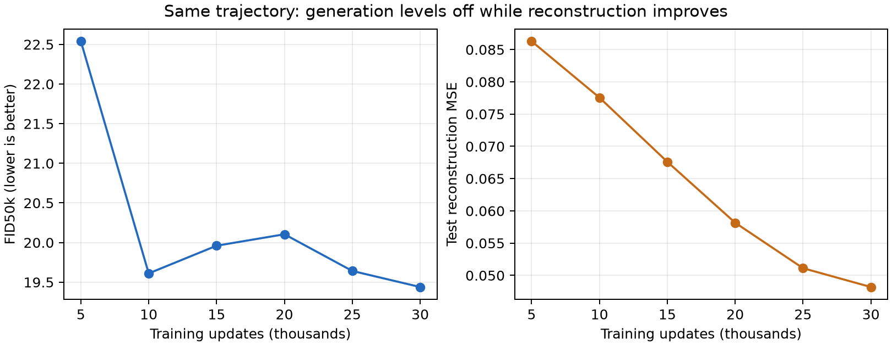

# AE-GAN checkpoint curve: consistent FID50k

All six checkpoints now use 50,000 generated samples against the same CIFAR train50k reference, EMA G/prior, evaluation RNG seed, batch size and TF-compatible Inception protocol. Earlier checkpoints were evaluated without training; the existing final result was reused.

| Updates | FID50k ↓ | Rank | Test MSE ↓ | Training min |
|---:|---:|---:|---:|---:|
| 5,000 | 22.540 | 6 | 0.08629 | 3.77 |
| 10,000 | 19.611 | 2 | 0.07755 | 7.51 |
| 15,000 | 19.960 | 4 | 0.06760 | 11.24 |
| 20,000 | 20.105 | 5 | 0.05816 | 14.96 |
| 25,000 | 19.642 | 3 | 0.05111 | 18.69 |
| 30,000 | 19.439 | 1 | 0.04819 | 22.41 |

The final checkpoint improves FID by only 0.172 from 10k to 30k updates, while reconstruction MSE improves 37.9%. Generation improves quickly through 10k, then fluctuates within a narrow range through 30k. The curve shows a modest late recovery, without a large delayed improvement in FID.



## Interpretation and next decision

The apparent large final jump in the original log mixed FID5k with FID50k. At the same final checkpoint, those scores are 23.596 and 19.439. The new curve removes that sample-count mismatch. It does not establish a causal conflict between reconstruction and generation, and cannot rule out improvements after 30k.

Use roughly 10k updates as a cost-effective budget for the next configuration comparison. These results alone do not justify assuming a much longer unchanged run will produce a large FID gain. Keep the reconstruction-lag hypothesis open, but distinguish it from measured evidence. No additional training was launched.

## Audit

Five earlier checkpoints were evaluated across GPUs 0 and 1. All checkpoint hashes remained unchanged; first-100 sample grids reproduced within one uint8 quantization level. The original final-run completion certificate remains valid. Small floating-point differences are permitted by the original CUDA/TF32 protocol. Reconstruction uses all 10k test images.

Evaluation logs: `runs/cifar_particle_ae/lazy_long/fid50k_curve/PIPELINE.log`.

```sh
.venv/bin/python experiments/audit_cifar_particle_ae.py \
  runs/cifar_particle_ae/lazy_long/n08 \
  --checkpoint checkpoint_010000.pt --samples 50000 --out /tmp/cifar_10k_fid50k
.venv/bin/python experiments/analyze_cifar_ae_curve.py
```
