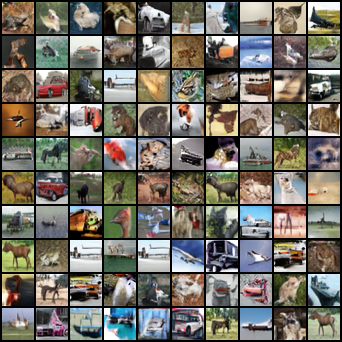
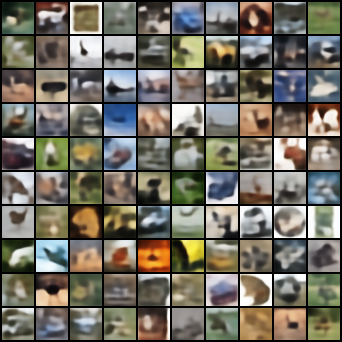

# Frozen-checkpoint diagnosis

The original prior FIDs reproduce within 0.00003. Simple encoder-frequency or Gaussian-offset sampling does not repair the plateau. Reconstruction outputs themselves have very poor perceptual FID despite low pixel MSE. The live discriminator gives a much weaker signal at 100k, while reconstruction becomes a larger and more opposed contribution to the generator update. These are measured symptoms; targeted continuation scouts test their causal relevance.

| Sampling / diagnostic | Samples | 50k checkpoint FID ↓ | 100k checkpoint FID ↓ |
|---|---:|---:|---:|
| prior | 50,000 | 18.9012 | 20.8058 |
| frequency_only | 50,000 | 25.8579 | 27.0336 |
| global_offsets_uniform | 50,000 | 67.4956 | 66.4570 |
| global_offsets_frequency | 50,000 | 166.6429 | 155.9326 |
| conditional_diag_frequency | 50,000 | 179.4649 | 175.2497 |
| train_code_replay | 50,000 | 148.3532 | 136.5001 |
| test_reconstruction | 10,000 | 148.9246 | 137.3551 |

Only `prior` is the original unconditional benchmark. All Gaussian fits use 50k unaugmented training encodings. `global_offsets` uses a full 64×64 covariance, with 1e-5 diagonal jitter. Conditional diagonal fits use 32 global pseudo-observations per component. Frequency and offset interventions jointly change the sample distribution. Gaussian draws are not clipped to the encoder box. The tests do not establish that a better learned latent density could not help.

`train_code_replay` decodes actual training encodings sampled with replacement; it is not novel unconditional generation. `test_reconstruction` uses all 10k held-out test encodings, so its FID sample count differs from the other rows. Both show the same large perceptual gap; this is not a proposed way to claim a better generation score.

## Live training-weight gradient probes

Same 16 fixed batches of 64 train images at each checkpoint; generator, encoder, prior and discriminator use their live saved weights. No optimizer update. Values below are means across batches. The reconstruction gradient includes its configured coefficient.

| Quantity | 50k | 100k |
|---|---:|---:|
| adv_g_norm | 0.16118 | 0.03867 |
| recon_g_norm | 0.06319 | 0.04044 |
| recon_over_adv | 0.39215 | 1.04770 |
| gradient_cosine | -0.05353 | -0.19159 |
| paired_accuracy | 0.56348 | 0.47852 |
| real_input_grad_norm | 0.68403 | 0.05505 |
| fake_input_grad_norm | 0.63392 | 0.05174 |
| real_over_cap_fraction | 0.01660 | 0.00000 |
| fake_over_cap_fraction | 0.00000 | 0.00000 |

Reconstruction/adversarial gradient ratio rises from 0.392 to 1.048; cosine changes from −0.054 to −0.192. Batch standard deviations of the cosine are 0.051 and 0.049. These are two snapshots, not a claim that conflict is constant throughout training. Near-chance critic accuracy alone could reflect GAN equilibrium; combined with poor FID and substantially weaker gradients, it motivates testing critic/optimization changes. Raw critic score offsets are irrelevant to the relativistic objective.

The bcap norm is almost always below its free threshold at the probed points (100k: all probed real/fake gradients below 1). This does not support a claim that the penalty is actively clipping every update, nor does it rule out effects of earlier lazy penalty updates.

## Interpretation and freezing

Pixel MSE rewards the right location/color and tolerates averaging away detail. The decoder receives this objective on encoded latents and adversarial supervision on prior latents. Shared generator weights can therefore receive competing updates. The very poor FID of encoded reconstructions illustrates the mismatch between pixel accuracy and realism; the negative gradient cosine directly measures local opposition in parameter space.

Freezing the encoder alone leaves reconstruction gradients on the generator. Freezing the generator globally prevents generation improvement. A targeted alternative is to route reconstruction gradients only into the encoder, while adversarial gradients update the generator/prior. Lower reconstruction weight tests a softer intervention first. Whether the encoder/prior should be frozen or the updates separated should follow the FID intervention results, not the snapshot diagnosis alone.

Gaussian offset covariance differs markedly from identity, but this difference becomes smaller from 50k to 100k while ordinary prior FID worsens. Aggregate mismatch exists; the observed direction does not establish it as the sole cause.

## Example grids

100k ordinary prior:

100k replayed training encodings (diagnostic reconstructions):

Raw checkpoint hashes, protocol and results: [50k](diagnostics_50k.json), [100k](diagnostics_100k.json). Both checkpoints were verified unchanged. Source and configuration checks passed.
