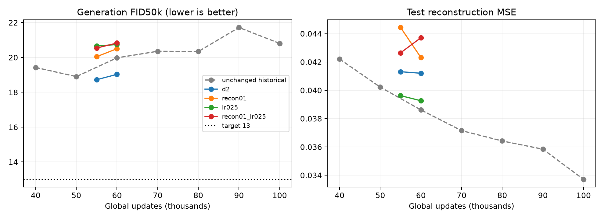

# CIFAR AE-GAN plateau experiments

4/4 certified runs complete.

| Rank | Run | Start → end | Final FID50k ↓ | Test MSE ↓ | Train min |
|---:|---|---:|---:|---:|---:|
| 1 | d2 | 50000 → 60000 | 19.0289 | 0.04120 | 11.59 |
| 2 | recon01 | 50000 → 60000 | 20.5006 | 0.04231 | 9.81 |
| 3 | lr025 | 50000 → 60000 | 20.7400 | 0.03926 | 10.10 |
| 4 | recon01_lr025 | 50000 → 60000 | 20.8273 | 0.04371 | 7.57 |

All generation FIDs use 50,000 independent prior draws and EMA G/prior; CIFAR train50k reference, TF-compatible Inception. No fitted encoder sampling is used in training benchmarks. Reconstructions use the 10k test split. Each run restores its recorded parent checkpoint and preserves the model seed; these are configuration interventions, not seed experiments.

Historical unchanged continuation: 50k **18.9012**, 60k **19.9770**, 100k **20.8058**. The historical 60k result is the matched endpoint control for the 60k scouts. It is not an independent replication.

| Run | Step | FID50k ↓ | Test MSE ↓ |
|---|---:|---:|---:|
| d2 | 55000 | 18.7229 | 0.04131 |
| d2 | 60000 | 19.0289 | 0.04120 |
| recon01 | 55000 | 20.0447 | 0.04443 |
| recon01 | 60000 | 20.5006 | 0.04231 |
| lr025 | 55000 | 20.6605 | 0.03962 |
| lr025 | 60000 | 20.7400 | 0.03926 |
| recon01_lr025 | 55000 | 20.5403 | 0.04264 |
| recon01_lr025 | 60000 | 20.8273 | 0.04371 |

## Recommendation

Lowest final FID: **d2 (19.0289)**. Target below 13 remains unmet.
Best observed intermediate/final measurement: **18.7229 at 55,000**. Checkpoint: `/home/martyn/dev/ParticleGAN/runs/cifar_particle_ae/plateau_scout/d2/checkpoint_055000.pt`. This is selected from the evaluated curve, separate from the final-endpoint ranking.
Compared with unchanged continuation at 60k: -0.9481 FID. Use the final endpoint ranking and the 55k→60k trend to select a continuation; short scouts do not establish its 200k outcome.

