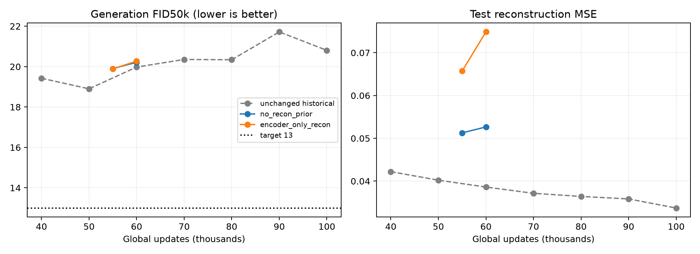

# CIFAR AE-GAN plateau experiments

2/2 certified runs complete.

| Rank | Run | Start → end | Final FID50k ↓ | Test MSE ↓ | Train min |
|---:|---|---:|---:|---:|---:|
| 1 | no_recon_prior | 50000 → 60000 | 20.2151 | 0.05266 | 7.51 |
| 2 | encoder_only_recon | 50000 → 60000 | 20.2712 | 0.07487 | 7.38 |

All generation FIDs use 50,000 independent prior draws and EMA G/prior; CIFAR train50k reference, TF-compatible Inception. No fitted encoder sampling is used in training benchmarks. Reconstructions use the 10k test split. Each run restores its recorded parent checkpoint and preserves the model seed; these are configuration interventions, not seed experiments.

Historical unchanged continuation: 50k **18.9012**, 60k **19.9770**, 100k **20.8058**. The historical 60k result is the matched endpoint control for the 60k scouts. It is not an independent replication.

| Run | Step | FID50k ↓ | Test MSE ↓ |
|---|---:|---:|---:|
| no_recon_prior | 55000 | 19.9008 | 0.05128 |
| no_recon_prior | 60000 | 20.2151 | 0.05266 |
| encoder_only_recon | 55000 | 19.8892 | 0.06573 |
| encoder_only_recon | 60000 | 20.2712 | 0.07487 |

## Recommendation

Lowest final FID: **no_recon_prior (20.2151)**. Target below 13 remains unmet.
Best observed intermediate/final measurement: **19.8892 at 55,000**. Checkpoint: `/home/martyn/dev/ParticleGAN/runs/cifar_particle_ae/routing_scout/encoder_only_recon/checkpoint_055000.pt`. This is selected from the evaluated curve, separate from the final-endpoint ranking.
Compared with unchanged continuation at 60k: +0.2381 FID. Use the final endpoint ranking and the 55k→60k trend to select a continuation; short scouts do not establish its 200k outcome.

