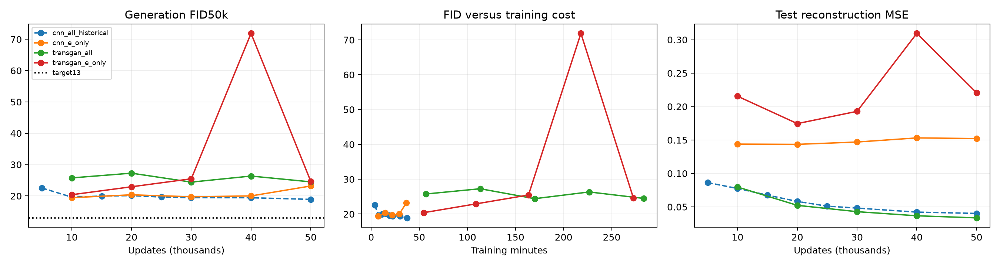

# CIFAR AE-GAN: scratch transformer and reconstruction routing

3/3 certified scouts complete.

All new runs start from scratch for 50k updates. Same frozen pretrained ResNet18 D, scratch E, particle prior, optimizer rates, one D update, EMA and lazy bcap every8 with coefficient×8. E-only reconstruction detaches particle centers and freezes G parameters for the reconstruction forward while preserving the gradient through G into E. Adversarial gradients still train G and the prior.

| Rank | New run | G parameters | Final FID50k ↓ | Test MSE ↓ | Train min | Wall min | Updates/s |
|---:|---|---:|---:|---:|---:|---:|---:|
| 1 | cnn_e_only | 645,123 | 23.1749 | 0.15222 | 36.46 | 42.22 | 22.86 |
| 2 | transgan_all | 18,851,023 | 24.4911 | 0.03357 | 283.25 | 295.46 | 2.94 |
| 3 | transgan_e_only | 18,851,023 | 24.6440 | 0.22069 | 272.53 | 284.90 | 3.06 |

Historical CNN with full reconstruction at50k: **FID 18.9012**, test MSE 0.04022; 645,123 G parameters. Its original scratch trajectory resumed at30k with full optimizer/RNG state and unchanged recipe. It is reused at user request and is not a new concurrent control.

FID uses 50k prior samples, EMA G/prior and the existing TF-compatible Inception CIFAR train50k reference. Reconstruction uses test10k. All arms use the same seed; no seed sweeps. Transformer size differs from CNN size, so this tests architecture plus capacity. It is a TransGAN-style generator inside AE-GAN, with a normalized low-gain tanh RGB head to prevent preflight saturation, not a reproduction of the full TransGAN recipe.

| Run | Step | FID50k ↓ | Test MSE ↓ | Training min |
|---|---:|---:|---:|---:|
| cnn_all_historical | 5,000 | 22.5396 | 0.08629 | 3.77 |
| cnn_all_historical | 10,000 | 19.6110 | 0.07755 | 7.51 |
| cnn_all_historical | 15,000 | 19.9602 | 0.06760 | 11.24 |
| cnn_all_historical | 20,000 | 20.1046 | 0.05816 | 14.96 |
| cnn_all_historical | 25,000 | 19.6419 | 0.05111 | 18.69 |
| cnn_all_historical | 30,000 | 19.4391 | 0.04819 | 22.41 |
| cnn_all_historical | 40,000 | 19.4241 | 0.04220 | 29.89 |
| cnn_all_historical | 50,000 | 18.9012 | 0.04022 | 37.33 |
| cnn_e_only | 10,000 | 19.4482 | 0.14391 | 7.41 |
| cnn_e_only | 20,000 | 20.3610 | 0.14355 | 14.70 |
| cnn_e_only | 30,000 | 19.7293 | 0.14704 | 21.95 |
| cnn_e_only | 40,000 | 20.0023 | 0.15318 | 29.20 |
| cnn_e_only | 50,000 | 23.1749 | 0.15222 | 36.46 |
| transgan_all | 10,000 | 25.7557 | 0.07970 | 56.71 |
| transgan_all | 20,000 | 27.2631 | 0.05231 | 113.35 |
| transgan_all | 30,000 | 24.4107 | 0.04286 | 169.98 |
| transgan_all | 40,000 | 26.3416 | 0.03670 | 226.60 |
| transgan_all | 50,000 | 24.4911 | 0.03357 | 283.25 |
| transgan_e_only | 10,000 | 20.3919 | 0.21554 | 54.59 |
| transgan_e_only | 20,000 | 22.9247 | 0.17459 | 109.05 |
| transgan_e_only | 30,000 | 25.4700 | 0.19294 | 163.52 |
| transgan_e_only | 40,000 | 71.8706 | 0.30954 | 218.02 |
| transgan_e_only | 50,000 | 24.6440 | 0.22069 | 272.53 |

## Interpretation and recommendation

Transformer − CNN under E-only reconstruction: +1.4691 FID. E-only − full reconstruction within transformer: +0.1530 FID. These compare new scratch runs; negative favors the first named intervention.
Relative to historical full-reconstruction CNN, CNN E-only changes FID by +4.2737, and transformer full reconstruction by +5.5899. These historical contrasts are less controlled; small differences should not be overinterpreted.
Lowest new final endpoint: **cnn_e_only (23.1749)**; last evaluation change +3.1726. Endpoint ranking is separate from intermediate minima and does not prove a unique cause of the plateau.
Recommendation: these endpoints do not improve on the historical CNN baseline. Inspect critic/gradient diagnostics and samples before committing to longer training.
Best observed new measurement: 19.4482, cnn_e_only at10,000. Checkpoint `/home/martyn/dev/ParticleGAN/runs/cifar_particle_ae/transgan_scout/cnn_e_only/checkpoint_010000.pt`. This minimum is selected across evaluations.
Target below13 remains unmet at final endpoints.

