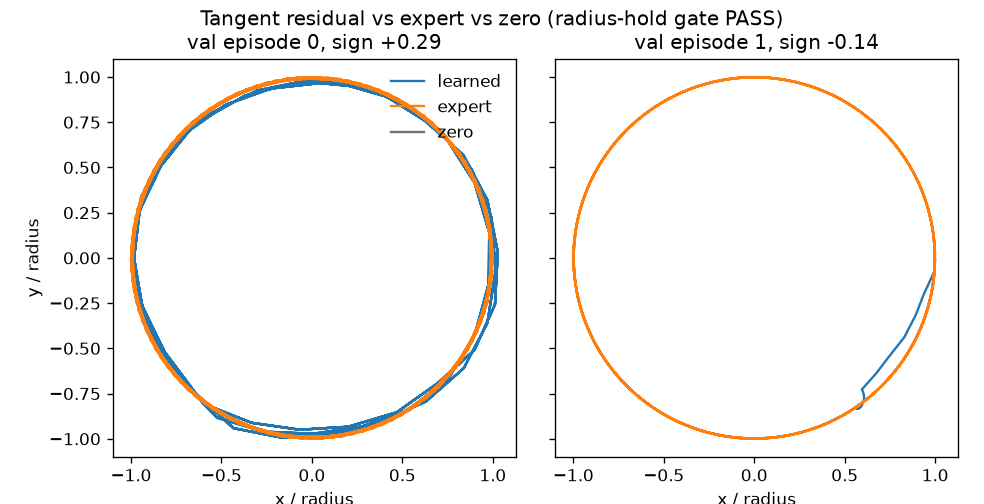

# Circle transition leaderboard

Passing run is `tangent_residual` (`configs/circle/radial_hold.yaml`). The
cartesian baseline `paired_error` at `f8a5a4a` remains the radius-hold miss.
This benchmark is the [circle transition-encoder toy](../../docs/circle-toy.md).
There are no inherited memory runs or Lunar Lander scores in this leaderboard.

## Evaluation protocol v1

Frozen before the first learned comparison. Thresholds are the handoff values.
The cell split, recovery window, and panel seeds are the concrete v1 choices
recorded in `lib/circle_transition.py` (`protocol()`).

- Geometry cells: 5×5 centers in [-0.75, 0.75]², 4 radii in [0.6, 1.4], 4 speed magnitudes in [0.12, 0.40]. Bucket `cell % 20`: train 0–13, validation 14–16, test 17–19.
- 128 episodes, both directions, horizons 256 and 1,024. Panel seeds: val/test main 51001/51002, recovery 51011/51012.
- Main panel starts on the circle. Recovery starts at normalized radii 0.8 and 1.2. Recovery-window radial metrics use the suffix after 64 steps and are not a substitute for full-trace success.
- Full-trace success: radial RMSE < 0.1, mean absolute signed-step error < 0.03 rad/step, direction agreement > 95%, at least one requested turn, finite trace.
- Rank by worst-direction 1,024-step full-trace success, then radial RMSE and signed-speed error. Local action / G3 error is reported and does not rank the policy.
- Analytic expert, zero action, and reversed expert are controls, not learned rows.

Freeze and record these settings with the first evaluator before comparing models:

- Start each episode from an independently sampled observed position and explicit
  circle geometry/signed speed. No observed trajectory prefix or recurrent state.
- Evaluate 128 held-out episodes, balanced across directions, at horizons 256 and
  1,024. Reuse the same panel for mechanism comparisons. Split by circle parameters
  to keep training/calibration, validation and final test panels separate.
- Main panel starts on the target circle. A separate recovery panel starts at
  normalized radii 0.8 and 1.2; report it separately, with a declared recovery window.
- Apply G2 actions through the displacement environment. No expert corrections,
  projection onto the circle, online optimization or replacement of observations
  by G3 predictions. Full rollouts are evaluation-only.
- Count full-trace success only when radial RMSE relative to the requested radius
  is below 0.1, mean absolute signed angular-step error is below 0.03 rad/step,
  direction agreement exceeds 95%, and accumulated progress in the requested
  direction completes at least one turn. Reject nonfinite trajectories. Also
  report maximum radial error and late-window errors so the average cannot hide
  long excursions or eventual failure.
- Report success by direction, signed-speed error, completed turns, radial RMSE,
  drift and stopping separately. Include held-out action error and G3 next-state
  error versus persistence, but do not rank the policy by prediction error alone.
- Rank first by worst-direction 1,024-step full-trace success, then by radial RMSE
  and signed-speed error. Report sample counts, update budget, parameter counts,
  examples seen and wall time. Compare learned arms at matched budgets.

The analytic expert, zero action and reversed expert are evaluator controls,
not learned entries. Protocol v1 above is the frozen comparison contract.

## Results

Rank key is worst-direction full-trace success at 1,024 steps on the main panel.
`radius_hold_gate` is the acceptance check: radial RMSE < 0.1, signed-step error
< 0.03, direction > 95%, worst-direction success > 0.203 + 0.15, success ≥ 0.5,
and a finite trace. Legacy closed-loop fidelity can still clear zero and reversed
motion when the radius walks; that score does not pass the gate. The published
cartesian row fails it. Metrics: [paired_error.json](paired_error.json),
[tangent_residual.json](tangent_residual.json).

Every learned arm is seed 24002, width 128, `adv_weight=1`, 300 pretrain + 2000
finetune steps, batch 128, CPU. The tangent residual adds 1,000 detached head
updates in the second half (256,000 extra on-circle rows). It does not replace
the base updates.

| Run | Mechanism | Val success / worst / radial / speed | Test success / worst / radial / speed | Gate |
|---|---|---:|---:|---|
| paired_error | Cartesian paired-error | 0.312 / 0.203 / 0.227 / 0.043 | 0.328 / 0.203 / 0.248 / 0.043 | FAIL |
| radial_hold | Radial-tangent edit, radial scale = expert radial std, protocol rho | 0.445 / 0.250 / 0.123 / 0.027 | 0.281 / 0.156 / 0.151 / 0.030 | FAIL |
| radial_hold_tol | Same, radial scale noise-capped | 0 / 0 / 0.098 / 0.075 | 0 / 0 / 0.097 / 0.070 | FAIL |
| radial_hold_split | Separate tangent and radial scores, shared G2 | 0 / 0 / 0.197 / 0.207 | 0 / 0 / 0.219 / 0.221 | FAIL |
| radial_hold_wide | Signal cap, finetune rho 0.5–1.5 | 0.234 / 0.125 / 0.056 / 0.044 | 0.180 / 0.031 / 0.065 / 0.047 | FAIL |
| radial_hold_on75 | Wide rho, 75% of rows on the circle | 0.172 / 0.156 / 0.056 / 0.043 | 0.148 / 0.141 / 0.062 / 0.043 | FAIL |
| radial_hold_curriculum | 1000 wide steps, then 1000 protocol steps | 0.391 / 0.359 / 0.054 / 0.037 | 0.297 / 0.281 / 0.076 / 0.039 | FAIL |
| tangent_refine | Freeze base at step 1500, 500 tangent-head steps | 0.547 / 0.188 / 0.050 / 0.041 | 0.586 / 0.219 / 0.050 / 0.030 | FAIL |
| tangent_residual | Wide-rho base for all 2000 steps, tangent head on the second 1000 | 0.773 / 0.641 / 0.036 / 0.029 | 0.812 / 0.656 / 0.034 / 0.022 | PASS |

`tangent_residual` is `configs/circle/radial_hold.yaml`. Checkpoint and log:
`results/circle_transition/tangent_residual/`. Test main 1024 also has direction
agreement 1.000, 48.1 turns (expert 47.7), late radial RMSE 0.032, counterclockwise
success 0.969, clockwise success 0.656. Validation direction agreement is 0.956.
No episode was nonfinite. Recovery-panel test worst-direction success at 1,024
steps is 0.734; validation recovery signed-step error is 0.0301, just over the
0.03 bar, and is not part of the gate.

Controls on the test main panel, 1,024 steps: analytic expert success 1.000;
zero action success 0; reversed expert direction agreement 0. Local test action
L2 is 0.027. Control-time G3 next L2 is 1.085 against persistence 0.289. Paired
G3, which sees the expert action, is 0.190. Wall time 67 s. Base controller
parameters 54,418; the tangent head adds 4,161. `b_cap` applications 750
(500 on the base critic, 250 on the tangent critic). Diagnostic MSE stays outside
both losses.

Two validation episodes, 256 steps, radius-normalized. The learned trace sits on
the unit circle with the expert. Zero action stays at the start.

## Interpretation

The cartesian policy learns the on-circle inward chord and ignores rho, so the
closed-loop radius walks. Expert radial spread on the protocol range is about
0.03, under the paired-noise hold, which is why a longer run of the same loss
flattened. Widening the training radius to 0.5–1.5 makes the restore visible:
radial RMSE falls to about 0.06, and about 95% of episodes clear the radial bar.
The leftover error is tangential. One-step tangent L1 near 0.04 is below the
tangent noise, so the joint critic stops correcting speed, and signed-step error
stays near 0.044.

Capping the radial divisor harder, or splitting the score while G2 is shared,
lets the radial channel swamp the tangent and destroys direction. A curriculum
that returns to the protocol radius repairs speed only to 0.037 and drops the
restore correlation. Freezing that base at step 1500 and fitting a tangent head
fixes counterclockwise speed and leaves clockwise worst-direction success at 0.19.

The passing run does not freeze the radius pathway. E_control and G2 take the
same 2,000 wide-radius paired-error updates as `radial_hold_wide`. From step
1,001 a zero-init head reads detached G2 features and adds a physical tangent
correction. Its own paired-error critic whitens that residual and caps the
tangent divisor at half the speed bar on the smallest circle (tolerance 0.009).
The radial residual of that critic is held at zero, and the head gradient does
not enter E_control or G2. On-circle tangent L1 in the log falls from about
0.04 to about 0.02. Closed-loop radial RMSE stays under 0.04 because the base
restore is left in place.

## Next recommendation

Leave this recipe in place. The val signed-step error is 0.029, close to the
0.03 line, and clockwise success (0.66 test, 0.64 val) is the weaker direction.
A follow-up that only retunes the head start step or the tangent tolerance would
be a sweep of this same mechanism. The open measurement is whether the detached
head still holds when the base is trained at a different width or particle count,
not another seed of this config.
