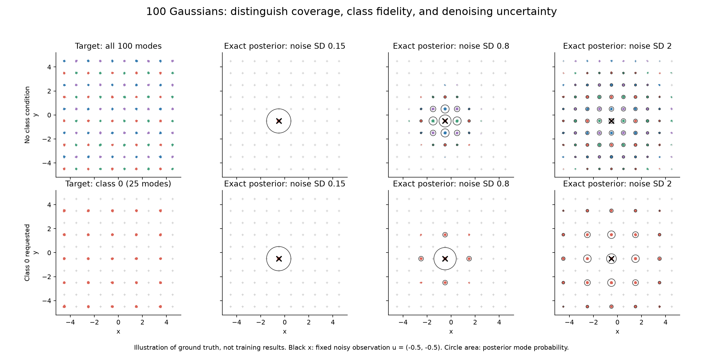

# Benchmark: conditional denoising on 100 Gaussians

Status: two rounds complete, **89 successful training runs on both GPUs**.
The latest 17 runs show that longer training rescues DDGAN: 77.8 ± 1.6% HQ at
28k updates across three seeds, and up to 93.4% in the single-seed 56k screen.
The one-shot GAN remains sharper; DDGAN has better mode proportions. Learned
step-noise particles mostly preserve their inference benefit when replaced by
a Gaussian with matching covariance. The user selected DDGAN + UCD with Gaussian
step noise as the working default; performance still has tradeoffs.

Start with the [latest readout](budget56k/READOUT.md),
[samples](budget56k/samples.png), [full table](budget56k/TABLE.md), and
[three-seed check](confirm28k/TABLE.md). The [first screen](screen_20k/READOUT.md)
and [bcap audit](BCAP_AUDIT.md) remain available. Training source code and the
audited recipe were unchanged during both rounds. See [RUNBOOK.md](RUNBOOK.md)
for the current state and repeatable commands. No experiments are running.

## Run the selected default

**100 Gaussians DDGAN + UCD**, with 20,000 learned latent particles and Gaussian
reverse-step noise, uses the tested 56k-update settings and established bcap recipe.

```bash
.venv/bin/python experiments/train_denoising.py
```

Review/edit [the full default config](../../configs/denoising/default.toml).
The script loads it automatically; pass `--config PATH` for another configuration.
Outputs go to `results/denoising/ddgan_ucd`. No new training was launched when
selecting these defaults. The trainer source fingerprint changes for future runs;
completed experiments retain their original provenance.

## Target and purpose

Keep the existing 10 by 10 grid, spacing 1 and within-mode standard deviation
0.03. Assign mode `(i, j)` class `2 * (i % 2) + j % 2`. Classes are uniform;
each class contains 25 equally weighted modes spread across the grid. A class
cannot identify a unique output or solve the mode-coverage problem by itself.
The class is an input, not an extra generated coordinate.

Run a class-free version as a reference to the existing example. The class
version enables a meaningful test of UCD's treatment of semantic conditions.
Continuous Gaussian components overlap mathematically, even when their overlap
is negligible on the clean grid; noisy conditional distributions overlap much
more. This is an empirical benchmark, not an application of a disjoint-support
equilibrium theorem.



Rows distinguish class-free and class-conditional generation. Columns distinguish
the target distribution and three levels of observation noise. Every posterior
uses the same observed location. A successful stochastic denoiser should recover
the plausible alternatives with their correct probabilities and local spread.
Choosing just the best-looking point is insufficient.

## Generation and discrimination

Compare a one-shot GAN `G(z, c)` with a four-step DDGAN-style model
`x0_hat = G(xt, z, t, c)`. The latter generates a reverse transition via

```
x_prev = A_t * x0_hat + B_t * xt + sqrt(beta_tilde) * eta
```

Here `A_t`, `B_t`, and `beta_tilde` are the usual Gaussian forward-process
posterior coefficients. With Gaussian `eta`, this is DDGAN's posterior sampler.
Substituting noise particles changes the generator's transition family, while
the real transition target remains the Gaussian forward process. Both `z` and
`eta` are resampled independently at every reverse step.

Start with cumulative signal variances `alpha_bar = [1, .9, .5, .05, .0001]`,
interpreted in the existing raw grid coordinates, as an explicit pilot choice.
Keep this schedule fixed across the initial denoising arms. Verify terminal
Gaussian approximation error using the exact oracle before reporting results.
Report sampling from the usual `N(0, I)` terminal state, with exact `q_T` starts
as a diagnostic, not as privileged information for only one learned model.

Use one shared generator and discriminator across times, small MLPs, matched
adversarial kernels and discriminator feature maps, and the same data stream
where comparisons permit it. Sample one time per training example; a four-step
model need not unroll four steps for each discriminator update. Sampling does
require four generator evaluations. Train a strong one-shot baseline rather
than an intentionally unstable vanilla recipe.

The discriminator alternatives are:

| Model | Condition injected into D | UCD-style class head |
| --- | --- | --- |
| One-shot | `D(x, c)` | `d(x)[c]` |
| Denoising | `D(x_prev, xt, t, c)` | `d(x_prev, xt, t)[c]` |

The UCD-style arm outputs four scores, selects the requested class's score,
and adds the paper's real/fake class-supervision loss. **It still observes the
noisy input and time.** This tests removal of class injection; it does not test
removing the information that defines a denoising transition. Dropping `xt`
is a separate marginal-matching ablation.

At high noise, even a real transition may not identify the class. Consequently
the class-supervision loss can conflict with the available information. This is
a reason to test UCD, not assume it wins. Follow up with the identical four-head
architecture at classification weight zero, and an injected-class critic with
matched auxiliary supervision, to separate architecture and supervision effects.
Only after that, test noise-dependent classification weighting. This adaptation
has no inherited guarantee from the UCD paper.

## Distinguish the sources of randomness

| Variable | Role | Initial experiment |
| --- | --- | --- |
| `x_T` | Starting diffusion state | Fresh Gaussian in every denoising arm |
| Forward corruption | Defines real noisy training transitions | Fresh Gaussian in every arm |
| `z` | Auxiliary generator latent, as in ParticleGAN | Fresh Gaussian or learned latent table |
| `eta` | Reverse posterior-sampler noise | Fresh Gaussian, fixed noise table, or learned noise table |

“Particle prior + particle noise” means independent uniform draws from the
learned `z` table and a second fixed/learned `eta` table. It does **not** mean
Gaussian jitter around `z`. Noise tables have data dimension (two here), whereas
the latent table can use the repo's four-dimensional latent. Initially use one
shared noise table across reverse steps, with the known schedule providing the
noise scale. Use separate RNG streams for data, time, latent IDs, noise IDs,
regularization, and evaluation. Do not tie latent and noise IDs together.

Initialize fixed and learned noise tables identically. A starting size such as
1,024 noise particles is a pilot choice, not a claimed optimum. Log noise mean,
covariance, radius distribution, and distinct rows. An unconstrained learned
table can move, shrink, or collapse; those changes must be visible. Compare a
moment-standardized table later to distinguish shape adaptation from learning
a different noise scale. At the last DDGAN step `beta_tilde = 0`, so this noise
table cannot directly supply final-step stochasticity.

With a learned noise table, gradients flow through selected rows from the
transition adversarial loss. A loss judging only `x0_hat` would not train this
table. Keep the noise sampler in both training and inference; a sampling-only
swap is a different intervention.

Replacing forward corruption or `x_T` with particles is another question. In
particular, particle-valued forward noise changes the target process and
invalidates the Gaussian reverse-posterior formula. Do not bundle it into the
initial comparison or silently reuse that formula.

## First comparison, then targeted challenges

Use these initial factors:

- One-shot versus four-step adversarial denoising.
- Injected class versus UCD-style class head and supervision.
- Fresh Gaussian `z` versus learned latent particles.
- For denoising only: Gaussian, fixed-table, or learned-table `eta`.

This is 4 one-shot cells and 12 denoising cells: **16 configurations, 48 runs
at three predeclared seeds**. The eight cells with ordinary Gaussian reverse
noise answer the first three questions. Noise-table cells test noise effects
with and without the learned latent prior, so an interaction can be measured.
One-shot models have no reverse-noise switch; do not count duplicate cells.
Start with a small smoke run and time actual training before choosing a run
budget. A pilot seed used for tuning is separate from reported seeds.

Measure learning curves against both elapsed training time and optimizer steps;
report inference time and generator evaluations separately. Share the initial
recipe, then allow equal small tuning budgets per model family: the current
recipe was selected for particles. Report trainable parameters, including tables.
Use the same regularizer within each comparison; changing its differentiated
inputs or coefficients constitutes another intervention.

Follow up on the largest observed effects rather than crossing every possible
switch immediately:

| Question | Discriminating control |
| --- | --- |
| Is denoising useful, or merely noisy D inputs? | One-shot GAN with matched noise augmentation |
| Does the diffusion GAN need multiple reverse steps? | Two, four, and eight adversarial denoising steps; no pure-diffusion training arm |
| Is UCD helping features or class supervision? | Four heads without CE; injected critic with matched auxiliary CE |
| Does D need the noisy observation? | Drop `xt`, retaining time and class scoring; check conditional distributions as well as final marginals |
| Is learning latent locations useful? | Frozen latent table initialized identically to learned particles |
| Are additional parameters or finite support responsible? | Table-size sweep and a comparable-capacity Gaussian baseline |
| Are learned noise particles improving uncertainty or suppressing it? | Fixed noise table; standardized learned table; posterior covariance and tails |
| Does stochasticity need two sources? | Remove `z` or `eta` separately, including tests at a fixed noisy input |
| Is a trajectory-specific table useful? | Shared versus per-time noise tables with stated parameter budgets |
| Is the result specific to four steps? | Two and eight steps at reported training and inference budgets |

Three seeds are an initial descriptive screen; add seeds for unstable or small
effects rather than declaring a winner from a single run. No model's expected
advantage is an acceptance criterion.

## Evaluation without FID

The primary final-sample measures are class-conditional sliced Wasserstein
distance, mode probability error, correct-class rate, mode coverage, within-mode
covariance, and tail mass. Reuse `lib/toy_metrics.py` where applicable, extending
its grid-specific helpers to class subsets and exact conditional components.
Use a smaller exact transport calculation only at final evaluation. Plot
real-versus-real metric values at matched sample counts as the sampling floor.
Target likelihood alone rewards concentration at centers and is not a score for
distributional correctness.

The additional decisive test is **conditional calibration**. Fix noisy inputs
at mode centers, between compatible modes, near class boundaries, and at typical
random observations for each time. Draw many independent model transitions
from each fixed input. Compare these to the exact `q(x_prev | xt, c)` using
sample-based transport and mixture-component responsibility statistics. Evaluate
predicted clean samples against `q(x0 | xt, c)` as an additional diagnostic;
the actual reverse transition remains the primary learned target. Compare full
ancestral chains as well: correctness on real noisy inputs can hide failures on
the model's own intermediate states.

For the preview's equivalent observation `u = x0 + tau * epsilon`, a component
with mean `mu_k` and covariance `sigma^2 I` has posterior weight proportional to

```
w_k(c) * exp(-||u - mu_k||^2 / (2 * (sigma^2 + tau^2)))
```

Its posterior mean is `mu_k + sigma^2/(sigma^2+tau^2) * (u-mu_k)` and covariance
is `sigma^2*tau^2/(sigma^2+tau^2) * I`. Here `w_k(c)` is uniform on the 25
compatible modes and zero elsewhere. For a diffusion observation, use
`u = xt / sqrt(alpha_bar_t)` and `tau^2 = (1-alpha_bar_t)/alpha_bar_t`.
Combining this mixture with the Gaussian posterior coefficients also yields an
exact oracle for `q(x_prev | xt, c)`. Oracle correctness and terminal-start error
should be checked before interpreting learned-model scores.

Produce four views: class-colored final scatter plots; mode-probability error
heatmaps; model/oracle posterior clouds for fixed observations; and learning
curves against time. Add a mode close-up with covariance ellipses so sharper
dots cannot conceal loss of within-mode variation.

## Transfer beyond the grid

Use the grid for development, then freeze the main protocol before testing:

1. Unequal mode weights, modestly overlapping components, and rotated unequal
   covariances. This tests rare-mode recall, ambiguous classes, and shape rather
   than uniform-grid geometry alone. Full Gaussian-mixture posteriors remain
   analytically available under Gaussian corruption.
2. The same mixtures in a fixed rotated 16-dimensional subspace with Gaussian
   variation in remaining directions. Evaluate in the full space and show the
   known two-dimensional projection. Gaussian-mixture ground truth is retained;
   check variation outside the visible projection too.

This gives interpretable tests of conditional diversity, uncertainty, mode mass,
and continuous shape, which are relevant to other domains. It does not establish
image/text performance; a later domain experiment is needed for that claim.

## Sources and existing implementation

- [DDGAN, sections 3 and 5](https://arxiv.org/html/2112.07804): conditional
  adversarial denoising, Gaussian posterior sampling, and an existing
  25-Gaussian benchmark.
- [UCD, section 3](https://arxiv.org/html/2510.00624v1): class-indexed discriminator
  scores and auxiliary classification supervision.
- [`../../examples/100gaussians.py`](../../examples/100gaussians.py): current
  one-shot training recipe.
- [`../../lib/sparse_models.py`](../../lib/sparse_models.py): existing injected,
  projection, and UCD discriminator patterns.
- [`../../docs/prior-controls.md`](../../docs/prior-controls.md): finite-prior
  controls and evaluation requirements.

The benchmark and its adaptations above are experiment hypotheses, not findings
from these papers or the existing repo experiments. Pure diffusion is explicitly
out of scope; all learned generators are adversarially trained.
