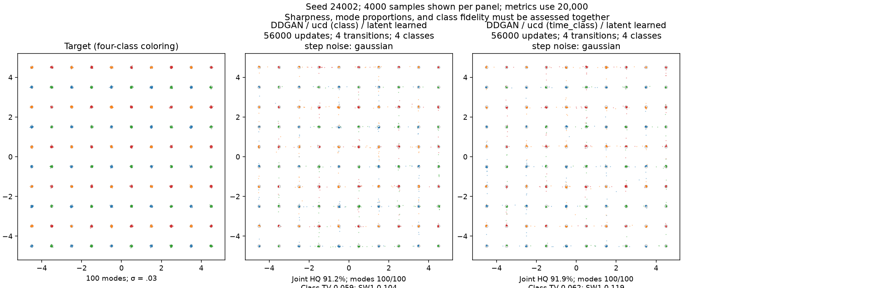
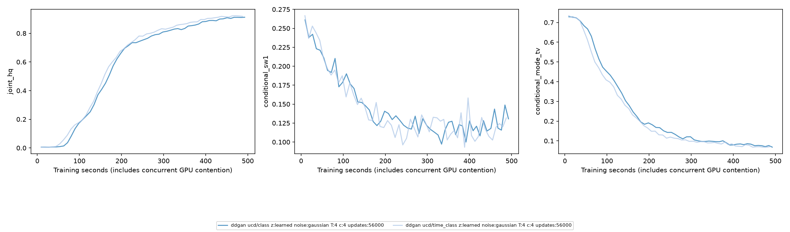

# Joint timestep/class UCD scout on 100 Gaussians

Two certified runs on both A6000 GPUs finished in8.3 minutes. Same seed24002,
56k updates, winning DDGAN/UCD toy recipe, learned20k x4 latent particles,
Gaussian step noise, T4, bcap1/kappa1, Rp logistic, UCD lambda.02, VICReg1,
MLP128x3, Fourier2, batch256, toy optimizer rates and cosine schedule. No seed sweep.

The full configs differ only in `ucd_target` and output directory:
[class_only.yaml](../../../configs/denoising/joint_ucd/class_only.yaml),
[time_class.yaml](../../../configs/denoising/joint_ucd/time_class.yaml).

| Final20k metric | Class-only | Joint(t,c) |
|---|---:|---:|
| Joint HQ ↑ |91.250%|91.905%|
| Covered modes |100|100|
| Class accuracy ↑ |96.185%|96.325%|
| Global SW1 ↓ |.0641|.0555|
| Conditional SW1 ↓ |.1040|.1190|
| Conditional mode TV ↓ |.0590|.0623|
| Posterior SW1 ↓ |.18977|.19028|
| Tails >10 sigma ↓ |3.390%|3.160%|
| Core std / target (ideal1) |.512|.523|
| Covariance eigenvalue ratios (ideal1/1) |2.68/6.00|2.61/5.52|
| D parameters |35,716|36,752|
| Train seconds |492.66|487.53|

**Competitive, not a decisive winner.** Joint UCD has slightly better valid and
correct sample fraction, global distance and tails, but worse class-conditional
distance and mode proportions. Both retain100 modes, near-identical posterior
error and similar class accuracy. Both have overly tight cores with inflated
full covariance from tails. Samples show similar grid fidelity and residual
bridges. One seed and one evaluation draw do not establish equivalence.

Joint UCD removes D's explicit timestep one-hot input and produces16 logits.
The same `(t-1)*classes+c` index selects the adversarial score and the real/fake
classification target. Class-only retains4 heads with explicit t input. Both
retain xt input; G still receives t and c. No posterior, sampler, bcap, particle,
GAN or G-loss change. The head parameter count differs by1036 (2.9% of D).
This is an intentional UCD ablation, not a claim of exact paper reproduction for
noisy transitions. Timestep distributions can overlap; class-label arguments
do not automatically establish the joint objective's practical superiority.

The user prefers joint UCD if competitive because it removes a conditioning
exception. On that basis it was promoted as the next CIFAR candidate, with40
heads and no D timestep embedding. This is a preference-informed selection;
**CIFAR FID for joint UCD is not yet measured**. The toy no-argument default
remains class-only; the ablation is an explicit config option.

Validation:28 focused tests before toy launch, exact old G/D initialization and
output equality in four unchanged baseline modes, two GPU100-update smokes,
then both56k completion certificates. After image port,31 focused tests passed,
including image joint-head invariance/bcap and CUDA checkpoint replay. Saved
source.zip and checkpoints remain under ignored results/denoising/joint_ucd;
source hashes changed after certification for the CIFAR port, so use the
archived source for historical reproduction. Combined log is
`tail -F results/cifar_ddgan/live.log`.
