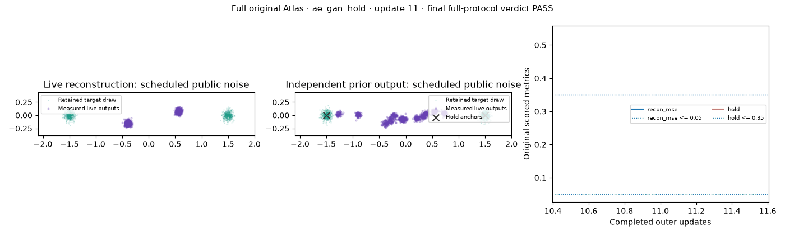
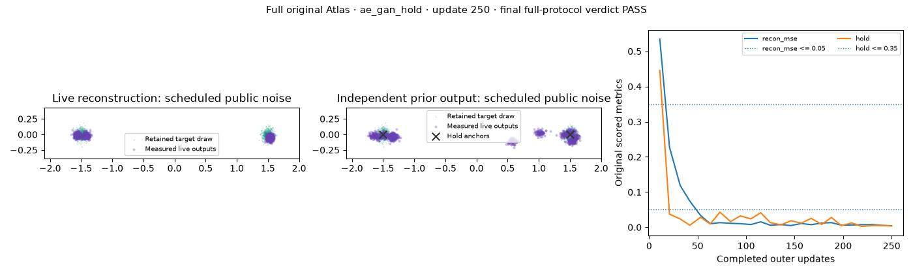

# Atlas AE reconstruction and anchor coverage checkpoint

This separately admitted run is **PASS**. It uses the original `ae_gan_hold` task, seed 0, 250 updates, 24 observations, CPU with one thread, and the full 300-second allowance. Its training settings and numerical gates are unchanged. The source repair validates the original Torch-decorated ParticleGAN initializer; it supplies no numerical credit.

| Test | What it verifies | Required numerical result | Measured result |
|---|---|---|---|
| Reconstruction | The caller's encoder, public `particle_ae` codes, and decoder can reconstruct samples from both anchors while the adversarial prior game runs. | Reconstruction MSE ≤ 0.05 | 0.004397972021251917 |
| Anchor coverage | Unconditional decoder samples reach both target anchors at (−1.5, 0) and (1.5, 0). | Mean distance from each anchor to its nearest generated sample ≤ 0.35 | 0.003759577637538314 |
| Sustained result | Both gates hold together at the end of the fixed run. | All 24 observations present and at least five consecutive passing terminal checks | PASS; see the exact [independent grade](grade.json) and [projection](grade-projection.json). |

The coverage metric checks whether samples reach both anchors. It does not establish balanced mode weights or a correct density within either mode. The test has a distinct purpose from the native 100-mode geometry tests: reconstruction and unconditional coverage must coexist through the public AE and update-policy interfaces.

The goal visualization compares the two target anchors with generated and reconstructed points through training. Any displayed final image comes from the same original child artifact. Media illustrates the task; the independent numerical certificate determines the verdict.

The original failed attempt remains **INVALID**, paid **4.60291067417711 seconds**, with no initialized-model receipt, training result, or numerical credit. This run has a distinct source, candidate, case, and repeat identity. Its paid time is **25.656658787978813 seconds**, reserve **0.0 seconds**. The original failed attempt, prior runs, native cases, and cumulative metadata are each charged once. The cost file states the exact time of its checkpoint; it does not present an in-phase snapshot as the final cumulative total.

New source commit: `36718f9ecbffe6a217914de7a9c22cff1349079e`; source digest: `2f71661f3407a3af3b166493fa0cb1f6730e8ac4689c2b37a8c8a9e424c5c233`.

This is a fixed-seed diagnostic. It supplies no reusable-default, seed-robustness, full-suite qualification, or cross-family speed-winner claim. The [three native Atlas geometry passes](../atlas-native-restoration-checkpoint-20261005/README.md) remain a separate representation result.

Public JSON: [results](results.json), [cost checkpoint](COST.json), [source and archive limits](SOURCE_INDEX.json).
