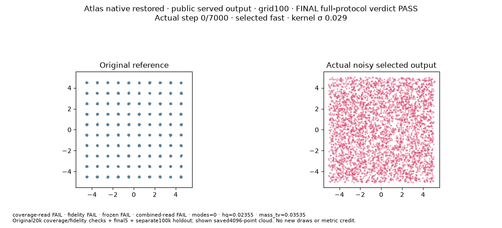
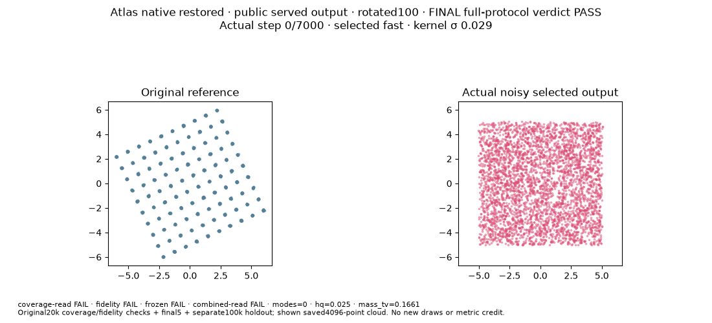
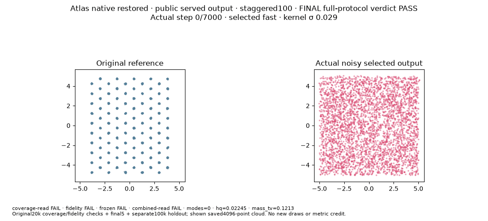

# Atlas native representation and serving restoration

These are fixed fresh-seed-0 diagnostics of the named particle/affine Atlas variant, `atlas-native-original-representation-selected-seed0-v1`. They use the public policy's intrinsic fast/averaged selection and learned noisy serving law. The legacy archive slot `live` holds that selected noisy primary cloud. Clean and EMA displays are diagnostics.

Native Source: 9da0e927a0a4242ee813ceb0340e9fee70ccdc40 / 00c19ef01f68e3222888a9b0edc6fcc5f635a384b982260c4e005832c1ed09ae. Request, protocol, initialization, scorer and terminal provenance are in [verification.json](verification.json); original copied-byte pins are in [input-index.json](input-index.json). Full 78-field Recipe: `152ee607b4a2b18d99e9f440985b920363a481a14236ae12409747e9c283738a`; intrinsic schedule `None`, external 7,000 updates, N=20,000, z=2, batch=2,048. Initialization uses raw particles uniform on [−5,5] and a learnable affine generator initialized to identity, with the native 128-wide, three-layer, Fourier-3 critic.

| Native geometry | Execution / accepted joint gate | Coverage suffix / minimum; confirmed step | Final-five checks; holdout | Paid seconds | Saved goal media |
| --- | --- | --- | --- | --- | --- |
| grid100: 10×10 unit lattice | completed / PASS | 5/5; confirmed 7000 | 5/5 terminal reads; 100,000-sample holdout PASS | 946.207055 | [GIF](receipts/native/grid100/goal.gif) · [extracted final frame](receipts/native/grid100/goal-final.png) |
| rotated100: the same lattice at 25° | completed / PASS | 26/5; confirmed 1750 | 5/5 terminal reads; 100,000-sample holdout PASS | 922.925795 | [GIF](receipts/native/rotated100/goal.gif) · [extracted final frame](receipts/native/rotated100/goal-final.png) |
| staggered100: alternating ±0.25 shifts, row spacing 0.85 | completed / PASS | 24/5; confirmed 2250 | 5/5 terminal reads; 100,000-sample holdout PASS | 913.334815 | [GIF](receipts/native/staggered100/goal.gif) · [extracted final frame](receipts/native/staggered100/goal-final.png) |

All three targets have 100 equally weighted Gaussian modes with standard deviation 0.03. The question is whether the learned served clouds cover all 100 modes with correct per-mode mass, centers and local shape under the same unchanged 13 requirements. Visible mode coverage alone cannot certify PASS. The requirements include precision≥0.97, minimum high-quality mode mass≥0.005, coverage mass TV≤0.10, maximum mass≤0.02, covariance eigenvalue ratios0.40–1.70, radial median ratios0.65–1.40, and stricter accuracy mass TV≤0.06, center RMS≤0.20 target sigmas, absolute covariance-trace bias≤0.10 and radial KS≤0.04. Exact stored scalars and original consumer decisions are linked in [results.json](results.json).

Native certification requires 7,000 completed updates and all 34 scheduled 20,000-sample observations, the final five at 6,000/6,250/6,500/6,750/7,000, and an independent 100,000-sample holdout. An all-green endpoint can still FAIL when its passing suffix is too short or another required read/holdout fails. Raw reported accuracy is preserved separately from the accepted coverage AND accuracy verdict. INVALID or INCOMPLETE has no accepted numerical grade.

Accepted native media: 3 GIFs. All three original GIFs are copied byte for byte. For each present GIF, frames preserve the original fixed axes, target references and clocks 0/1/100/1,000/2,250/3,500/4,750/6,000/7,000. Early-frame read captions do not replace the final case verdict. A native PNG, when linked, is an extraction of existing GIF frame 8 at7,000, with input/output hashes in the index; it is not a child-attested PNG. The plots illustrate learned clouds without providing a visual substitute for the numerical gates.

## Separate original AE attempt

AE is the independently admitted original `ae_gan_hold` case on its separately pinned Source 7f7037a54edc54cfb8f7466f6a98aee56e17b6db / 8693fcf0f2b3ebea741782b414e88099d411e114ccc92928fcc8fd3464dd72bb, with the original MoG/auxiliary-encoder objective and ordinary live scheduled-noise observation law. It is not part of the native3 score or a restored-native representation trial.

| Case | Execution / accepted gate | Complete clocks; terminal suffix / minimum; confirmed step | Original final metrics | Paid seconds | Original media |
| --- | --- | --- | --- | --- | --- |
| ae_gan_hold | completed startup INVALID / unavailable | unavailable; no initialization receipt or verified model start | not measured | 4.60291067417711 | unavailable: startup source check failed |

The original AE contract has 250 updates, 24 scheduled 1,024-sample scored observations and a terminal passing suffix of at least 5; reconstruction MSE ≤0.05 and hold ≤0.35. If accepted original media is present, its GIF has the original 24 frames and its final PNG corresponds to update 250. This attempt produced zero accepted AE media and no accepted numerical result. Endpoint metrics alone do not certify its stable suffix. CPU 1, 300-second admission, fresh initialization and terminal provenance remain separate from native GPU cases.

## Cost and provenance

The checkpoint totals 12306.45668054535 seconds as of the recorded paid publication snapshot, including 263.45436519547366 seconds of cumulative metadata. Later report/Git/message work is excluded. [COST.json](COST.json) is an explicitly scoped checkpoint as of an earlier CLOSED AE/capture snapshot or the recorded in-phase snapshot. It does not claim to include later publication metadata; the final cumulative cost is not yet represented in this public checkpoint. All report and Git writes occur inside paid phases. After the last phase closes, ROOT reports exact final CLOSED cost from retained memory to ROOT/Ember without an unpaid file read or write. The checkpoint retains all predecessor and failed-attempt charges known at its stated boundary, each new physical case once, residual reserves when applicable, and the SAME cumulative parent 300 metadata once under global 41,288. Reference carry fields are not added again. Original halt history and earlier NOT_RUN/INVALID records remain in the linked [prior history](../common26-full-original-diagnostic-20261005/README.md).

This is a method-specific, fixed-seed diagnostic report. It changes no common26 table, qualification, default adoption or speed ranking; it grants no historical19 credit and establishes no seed robustness or general rotation invariance. E22 is not run in these trials. Representation, architecture, serving and fresh seed differ from the earlier MoG/MLP/live-clean diagnostics, so these trials do not isolate a failure cause. Passing siblings do not replace a failed or invalid case.

## Reproduction dependencies

The scientific Source is the pinned isolated branch/closure, not a claim that plain develop alone runs these trials. The native owner requires all 437 declared files, including 389 external archive members, plus its producer/controller/dispatcher and renderer dependencies. [Source provenance](source-index.json) records their relative aliases and hashes, the isolated donor fix 4af5a091 (Draft PR292), runtime and copied-proof pins. All3914 locally copied Source members were rechecked by hash. This compact publication omits389 required external archive bodies and the scored arrays; a plain develop checkout is not a standalone reproducer. AE retains its distinct old 8693/e093 closure and allocator 5ff929e5. Other methods, b_cap and shared defaults are unchanged.

Public files allow byte checks of the compact records and saved media. Original scored arrays, complete states, raw envelopes, logs, tokens and private Source paths remain local. Recomputing scientific grades needs those retained arrays and the complete matching Source; this compact report is not an independent full-data regrade package.

The AE source check failed at the decorated initializer before a fresh-init receipt. A separate source-only harness repair is being reviewed; the failed attempt stays INVALID.

The two questions remain distinct: these trials test whether this representation can fit the target; shipping family defaults still requires a prospectively frozen, comparable suite across problems and seeds. Choose speed among comparable full successes only.

### What these problems verify

The restored-native trials test a fresh Atlas particle/affine model on three two-dimensional mixtures of 100 equally weighted, isotropic Gaussians (target standard deviation 0.03). The training interface supplies unlabelled draws; component centers belong to the evaluator and plots. These are three native diagnostics with the same method and gate set, not three additional common26 slots.

| Native task | Declared target | Separate diagnostic value |
| --- | --- | --- |
| grid100 | A 10×10 lattice with coordinates −4.5 through 4.5 and unit spacing. | Tests complete coverage, equal mode mass, correct centers and within-mode spread on the regular reference geometry. |
| rotated100 | The same lattice rotated by 25°, with the same isotropic width and weights. | Removes alignment with the coordinate axes. It checks this particular orientation; one angle does not establish general rotation invariance. |
| staggered100 | Alternating rows shift by −0.25/+0.25 along the second coordinate; the first-coordinate row spacing is multiplied by 0.85. | Changes the regular Cartesian layout and local neighborhood geometry. A grid or rotation PASS cannot substitute for this separate task. |

The diagnostic interpretations in the last column follow from the declared geometry, rather than an empirical attribution of a failure. Source: frozen native100/problems.py:15–65, SHA 2581374d451ed9147c031dfcdfbe9e2eea83e41ba49c2b8945b6e729ede26c9d.

All three use 7,000 training updates and 34 scheduled observations, each with 20,000 primary generated samples. A PASS requires the final five observations at 6,000, 6,250, 6,500, 6,750 and 7,000 to satisfy the unchanged joint gates, followed by a separate 100,000-sample holdout that also passes both gates. All expected observations, finite samples and source/initialization/durable-terminal evidence must be complete. An early passing endpoint, GIF, raw accuracy-only status or selected best checkpoint cannot replace that evidence.

The 13 numeric requirements are: modes ≥100; precision ≥0.97; minimum high-quality mode mass ≥0.005; mass TV ≤0.10; maximum mode mass ≤0.02; minimum/maximum covariance eigenvalue ratios ≥0.40/≤1.70; minimum/maximum radial median ratios ≥0.65/≤1.40; accuracy mass TV ≤0.06; center RMS in target-sigma units ≤0.20; absolute covariance-trace bias ≤0.10; radial KS ≤0.04. The two mass-TV tests are distinct frozen metric fields. Precision and high-quality mass use the original three-sigma rule. Source: metrics.py:19–105 (a7fbef19…); accuracy.py:31–44 (ee5c6204…); gate.py:306–327 (55f6ef73…); accuracy_gate.py:56–108 (e66ede95…).

The declared restored method uses the unchanged raw Atlas config a3ee5c67… and full 78-field Recipe 152ee607…, intrinsic schedule total_steps=None, 20,000 raw particle rows in two dimensions, batch 2,048, a learnable affine generator initialized to identity, and the native 128-wide/three-layer/Fourier-3 critic with the pinned initializer. Fresh initialization uses seed 0. Each primary observation uses the public serving selector's fast or averaged state and learned output noise; the policy chooses that state independently of test scores. A separate evaluation RNG supplies the draw, and the complete owner-state fingerprint must remain unchanged. The legacy archive key “live” holds this selected noisy primary cloud, not necessarily raw live parameters. Clean and EMA clouds remain diagnostics and cannot choose the grade. Source: native restoration CONTRACT cee8e7bd…; atlas_native_restoration.py:94–120, 540–561, 629–680 (a0e7d88d…).

A fully certified PASS supports the intended particle/affine, intrinsically served noisy Atlas output on that named native task, seed and fixed horizon. It does not establish seed robustness, statistical superiority, success on all common26 problems, E22 success or failure, a default recommendation, qualification credit, or a speed ranking. A failed or invalid case keeps its own status and cost; it must not be hidden by a passing sibling.

The earlier common-host diagnostic used a supplied fixed-width MoG prior (0.025), a learned MLP generator and live clean output. Those representation/serving restrictions differ from the intended particle/affine served-noisy method; the target and quality gates do not inherently require them. Restoring them is a method-identity correction, not proof of a particular failure cause. Representation, network, serving and fresh seed change together, so this trial cannot isolate their separate effects or treat the previous failures as algorithm or family limitations. Adding noise alone is not guaranteed to repair excessive within-component width. Source: prior MoG owner 751f072f…:215–246; captured current-grid100 control projection 960b2d54….

The verified earlier native seed-1234 receipts record all three noisy primary runs as PASS and their same-run clean diagnostics as FAIL after 7,000 updates/34 reads. That directly shows why the scored deployed-output law matters. It does not isolate all combined method changes, justify seed selection, transfer historical grades to this fresh seed-0 source, or establish that the two sources have identical internal control histories. Historical receipt projections are pinned separately in the accompanying review; no old model or samples are reused. The present Source review adds no metric values or new numerical verdicts. ROOT must bind actual fresh receipts, original gates and terminal certification before publishing each current status.

### Original training visualizations

**grid100**

**rotated100**

**staggered100**

