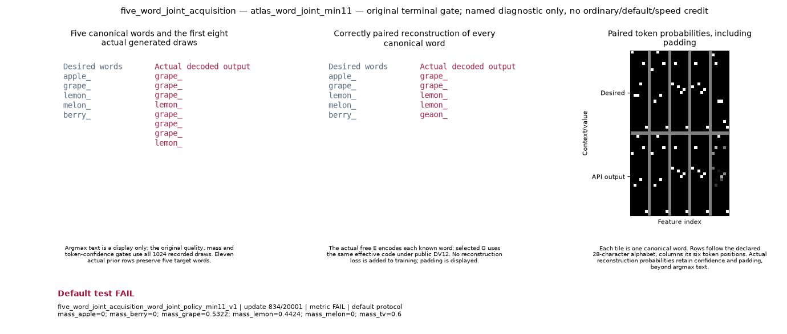

# Retained min11 word context

**Execution: INVALID. Certified numerical gate: UNAVAILABLE.** The producer nevertheless recorded all **20,001 updates**, with generator, free encoder, prior and discriminator clocks each at 20,001, and **24 finite scalar observations with pure typed-state/global-RNG receipts**. These are recorded facts, not a replacement qualification verdict.

Retained illustration only: execution INVALID; certified numerical gate UNAVAILABLE. The producer recorded 20,001 updates and 24 pure reads. The original GIF shows FAIL from a rejected health grade; that badge is not an accepted numerical verdict. No status is changed.

*Retained illustration only: execution INVALID; certified numerical gate UNAVAILABLE. The producer recorded 20,001 updates and 24 pure reads. The original GIF shows FAIL from a rejected health grade; that badge is not an accepted numerical verdict. No status is changed.*

The byte-original GIF retains its raw FAIL badge. That badge came from the rejected health grade `observed public policy state is nonfinite`. The diagnostic wrapper classified the attempt INVALID and withheld numerical credit. This companion preserves that decision and performs no scoring, health relaxation or model inspection.

The supervised producer completed with child return code 0. The parent rejected its health-grade evidence and halted the lane as INVALID. This was not a producer exception or an absent training clock.

The frozen publisher set the clock to UNAVAILABLE for every INVALID attempt and looked for an `error` field in the producer JSON. Here the producer returned complete `public_components` evidence without such a field; the rejection lives in the independent grade and study job reason. This page supplies the missing reporting context while the original portable report remains unchanged.

**This companion supersedes only the frozen cut’s clock, error and GIF-availability wording for this attempt. Execution INVALID and numerical gate UNAVAILABLE are unchanged.**

| Recorded endpoint at update 20,001 | Value |
|---|---:|
| Sample count | 1,024 |
| Recovered modes | 2 of 5 |
| Quality fraction | 0.9248046875 |
| Mass TV | 0.6 |
| Exact reconstruction | 0 |
| Minimum reconstruction token probability | 0 |
| Reconstruction NLL | 11.05240844637142 |

The selected effective-code law has eleven actual prior rows, five original target words and a free encoder. Original N5 remains separately BLOCKED. The original six thresholds are retained as reference metadata in [context.json](context.json); no threshold verdict is recomputed here.

Source `fb7acc775b3a1a6184d36b55e035b9da04531492` / `f380eed990931bacb205e6537beaf387fdbb676ffc97b6f32f19ff903ae1cfed`, physical GPU1 / logical `cuda:0`. Recorded paid cost **558.5739127129782 seconds**, reserve zero, was already charged in the original v4b ledger; this companion introduces no new training charge, default, speed, ordinary-tier or cross-cohort credit.

[Original unchanged v4b report](../atlas-named-gpu-diagnostics-native-v4b-20261004/README.md). [Byte-original retained media receipt](word-retained-media.json), [source-bound context](context.json), [input index](input-index.json). [Separate sentinel diagnosis](../atlas-word-dimension-health-20261004/DIAGNOSIS.md) is pinned separately and does not change the old INVALID status. This companion does not inspect checkpoints or repeat that tensor-health analysis.

Share the illustration with this caption/page. A detached raw GIF badge is not an accepted numerical verdict. The compact files are portable; full hash revalidation requires the local immutable inputs in the index. No raw checkpoint, array, log, internal nonce or lease descriptor is copied.
