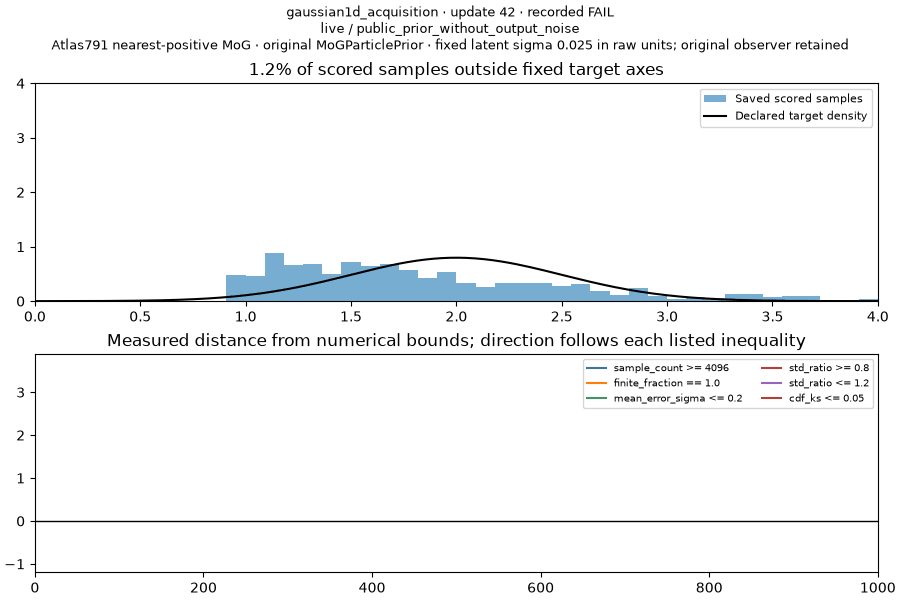
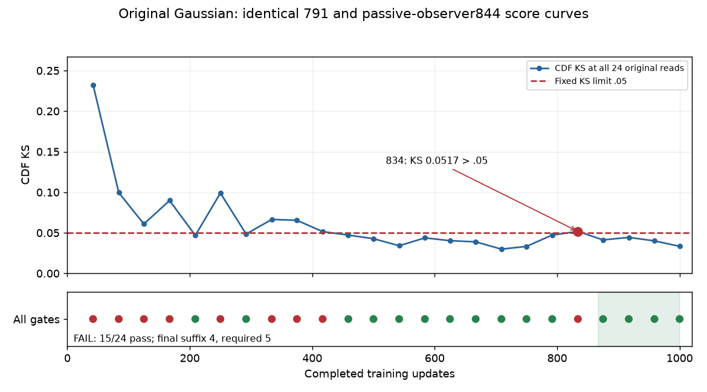

The passive radius diagnostic retains the original Gaussian **FAIL**: all 1000 updates completed, with 15/24 passing observations and only four passing final observations; five are required. At step 834, CDF KS is 0.051700751185499, above the fixed .05 limit. The final KS is 0.033380420682047 and final location/width pass, so the last frame alone does not establish sustained convergence.

This toy verifies that a public ParticleGAN GAN learns N(2, .5²), including its analytic CDF, location and width, and retains that fit at the end. Each original scoring read uses 4096 samples from live weights with clean output noise. The original TaskSpec, effective Atlas Recipe, raw learnable MoG prior (sigma .025), seed0, data, network, initializer, all 24 scoring clocks, final five-check requirement and full120 allowance are unchanged. The observer measures whether the nearest-positive support-radius correction is reached and produces a typed input or same-pair table/EMA difference on those exact runtime inputs.

| Recorded site | Radius calls | Query rows | Old-zero/new-positive | Radius / cap / delta / rounded-input / EMA differences |
| --- | ---: | ---: | ---: | --- |
| Fake pool before generated F | 500 | 128000 | 0 | 0 / 0 / 0 / 0 / 0 |
| Primary move before particle write | 14 | 23 | 0 | 0 / 0 / 0 / 0 / 0 |
| Isolation move | 0 | 0 | 0 | 0 / 0 / 0 / 0 / 0 |

All call-count joins match: 1000 lifecycle entries, 500 ready evaluations, 500 not-ready entries, and 23 same-pair commit joins. The isolation selector returned no rows in its 500 visits. There is no first affected witness because no effective difference was recorded. This is a conditional statement about the logged visits. Complete call-count joins are separate from full event/live-leaf coverage, which remains **UNKNOWN** because callable scope is incomplete. Historical exposure, whole-state identity and downstream legacy decisions also remain UNKNOWN.

The actual 15 CPU noninterference controls pass, including populated fast serving, forbidden getters/model operations, RNG/original-call identity, rounding, clipping, per-site coverage and bounded witnesses/snapshots. All nine added-operation counters are strict zero. The real CUDA observer retained 575 purity comparisons with zero failures. These facts do not turn the CPU fixtures into a proof of arbitrary callbacks or all CUDA state. The ordinary independent evaluator still applies the unchanged numerical verdict.

All 24 original scalar observations and the complete saved sample-bank bytes exactly match the earlier791 run. Thirty-three context files were byte-pin verified: 24 original scored-clock snapshots and nine pre-update/after-generator-backward/post-update records around 833–835. Their partition hashes, relative pins and raw completed-update clocks are in [CONTEXT.json](CONTEXT.json); binary state artifacts remain local. No new diagnostic draws, forwards, optimizer updates, alternate decisions, paired replay or regrade were added to this retained readout.



The animation is the existing791 goal visualization; its saved scored bank is byte-identical to this new diagnostic bank (SHA25655b1a929bb7e85e4a302f1cc0c7436cbdba725a6588a77bfe7ff518a958812ce,401001 bytes). It illustrates fitting the target distribution. The full curve below exposes the late sustained-gate failure omitted by a final-frame impression.



The one physical1 attempt took 55.393541231 seconds under the original120-second wall allowance. Reporting remains inside the finite90-second metadata allocation (software30, other60) and unchanged41288 global ceiling; final closed reporting cost is retained in the separate ledger. The older suite terminals and qualified100 UNKNOWN planning reserve remain preserved once. This diagnostic adds no configuration rank, speed, main/default or winner credit.

Reproduce the reversible CPU controls with the public test module:

```sh
CUDA_VISIBLE_DEVICES='' OMP_NUM_THREADS=1 MKL_NUM_THREADS=1 python -m experiments.forge.atlas844_software_controls --output /tmp/atlas844-controls.json
```

The separate READY Study selects only the unchanged `gaussian1d_acquisition` through the maintained Forge API. [RESULTS.json](RESULTS.json) records the full admitted identity, original observations, actual controls and site readout; [SOURCE.json](SOURCE.json) records the copied Source manifest. Parent [PR308](https://github.com/255BITS/ParticleGAN/pull/308) holds the protected original four-case suite and earlier debugging plan.

The follow-up [retained833-835 diagnosis](NEIGHBORHOOD_DIAGNOSIS.md) distinguishes active particle/network updates, the no-move834 event, live-clean serving and evaluation RNG from unproved distribution/sampling causes. It includes a bounded future replay PLAN; no new evaluation was performed.
