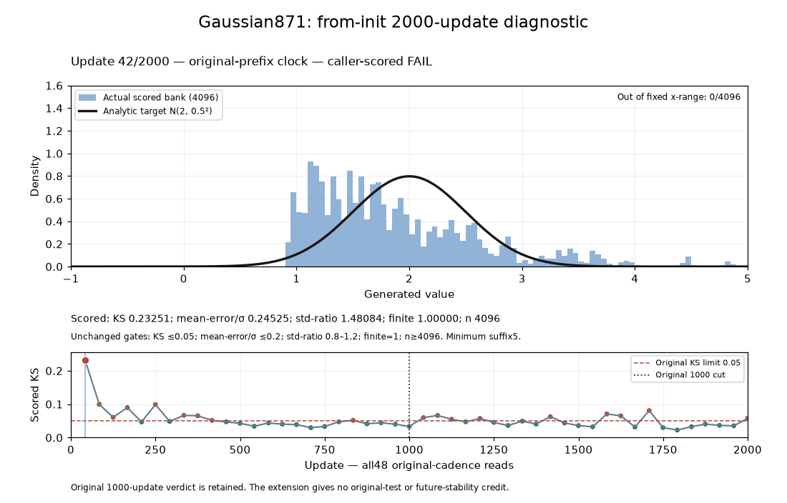

The fixed-seed Atlas Gaussian run did not pass after 2000 updates. It completed the preregistered 48 reads: 30 passed all six gates individually, but the final Kolmogorov–Smirnov (KS) error was 0.0575256077865442, above 0.05, and the terminal passing suffix was zero.



The goal was to match N(2, 0.5²) with the fixed Atlas configuration and sustain that match across the original Gaussian gates. This separate duration diagnostic extended one run from initialization to 2000 updates. It retained the original Recipe, network, seed 0, dataset, compute resources and scoring law. The authorized timeout was 240 seconds. The trainable MoG prior kept its fixed positive latent width σ=0.025 and standardize=False. Clean live scoring retained that prior kernel and the original DV12 latent perturbation, with additional output noise disabled; it did not replace them with a noiseless latent table or score an averaged model.

Each read scored 4096 live outputs. The six unchanged conditions were sample_count≥4096, finite_fraction=1, mean_error_sigma≤0.2, std_ratio≥0.8, std_ratio≤1.2 and KS≤0.05. Sustained success still required at least five consecutive passing reads ending at the terminal observation. The clock was ceil(k×1000/24), k=1…48: the original first 24 reads ended at update 1000, followed by 1042, 1084, 1125, 1167, 1209, 1250, …, 2000. There was no first-pass stop, tuning or repeated run.

| Retained result | Value |
| --- | --- |
| Independently graded verdict | FAIL |
| Individually passing reads | 30/48 |
| First five-pass window | 459, 500, 542, 584, 625 |
| Longest passing sequence | Nine reads, 459 through 792 |
| Failures after the first five-pass window | 10 of the remaining 33 reads |
| Final passing suffix | 0 |
| Final mean / standard deviation | 1.954956169 / 0.473646482; their original gates passed |
| Final KS | 0.0575256077865442; original gate failed |
| Charged physical science | 64.503426 seconds |

All seven scientific metric values at each of the first 24 reads, and every ordered float32 value in each 4096-output bank, matched both protected 791 and 844 references exactly. No compared step differed. This establishes equality for those recorded metrics and sample banks; whole training-state, optimizer, initializer and RNG-state identity remain UNKNOWN. The original 1000-update FAIL remains unchanged. The 2000-update result supplies no original-task, default, winner, family or qualification credit. It answers this fixed-seed duration question with a FAIL; it does not establish a universal limit on longer training or identify the cause of the excursions.

The run used candidate `atlas-existing-mog-longer871-v1`, view `atlas_existing_mog_longer871_v1`, Study `atlas-existing-mog-longer871-study-v1` and Task `gaussian1d_acquisition_longer871_v1`. Its Source commit was `11cc75227dad0c5db6d0b56fd56a2bbb82e345c0`, Source digest `a14f4e628f6f24d9826c4f59c0f57fba76d59149eac3885dee021c3593437c15`, candidate revision `2ed3403a58fc1ef2e46f5063a39a813dcff153bbbba66c750d48ae43b81e50f9`, request `cc43e5c0ee7a679f8d149def` and physical attempt `96f0146087994b5988dc21a1979a7b01`.

The maintained public planning API resolves the exact reviewed Study rather than accepting caller-edited task or budget fields. The Study must already have completed its binding review and reached READY before freezing. These are API call shapes for that procedure, not a request to repeat the completed experiment:

```python
from pathlib import Path
from experiments.forge.planning import resolve_idea

root = Path.cwd().resolve()  # repository containing the reviewed declaration
# queue_root is the caller's explicitly owned Forge queue directory.
request = resolve_idea(
    root,
    "atlas-existing-mog-longer871-v1",
    study="atlas-existing-mog-longer871-study-v1",
    queue_root=queue_root,
    freeze_source=True,
)
```

Submit that full frozen request from a fresh Python process whose working directory and import namespace are the copied `request["source"]["snapshot_path"]`. In that process, `root` is the copied Source root. The authoritative campaign is the Study's existing finite campaign:

```python
from pathlib import Path
from experiments.forge.queue import Queue

root = Path.cwd().resolve()  # copied Source root in the fresh process
assert root == Path(request["source"]["snapshot_path"]).resolve()
entry = Queue(queue_root, report_root=root / "reports" / "forge").submit(
    request, request["study"]["campaign"]
)
request_id = entry["request"]["request_id"]
```

Queue submission is separate from the reviewed one-case controller's full-request software-proof binding, finite 240-second case fit, ordinary worker claim, certified terminal collection and independent grading. Reproduction must retain that workflow, all 48 scored banks and the original gates; this note does not supply a new admission or a longer horizon.

The retained machine-readable [receipt](RESULTS.json) includes all 48 scalar reads, gates, Source bindings and both prefix comparisons. Bulk sample banks and execution logs remain in the owned run store. Accounting preserves qualified predecessor costs; no exact all-inclusive measured-cost claim is made.
