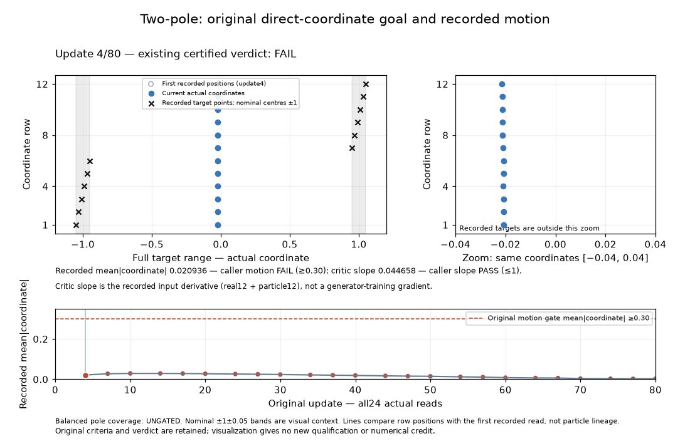

# Original two-pole passive diagnostic: INVALID

The one admitted CPU attempt exited before a scored bank or independent grade was produced. It provides no new convergence result, model-failure diagnosis, q-normalization measurement, or repair-benefit evidence.

| Item | Retained result |
| --- | --- |
| Request | `84aead29da2ee1938a5b981e` |
| Attempt | `5d617c198bb548aa8242e07dc8ca09df` |
| Source | `26a028fa2710660052a445657d9a228c7ce9338d94fb2406bce5a36b60228b5f` |
| Intended run | Original 80 updates, 24 reads, seed 0, CPU threads 1, GPUs 0 |
| Actual terminal | ERROR; no independent grade or scored observations |
| Supervised elapsed | 5.252349246758968 seconds, including startup |
| Conservative science debit | 300 seconds; 294.74765075324103 retained as unmeasured reserve |

The problem verifies escape from the zero-initialized coordinate table (`mean_abs >= 0.30`) while the critic input gradient remains small (`grad_med <= 1`). Both gates must hold at the original final five clocks 67, 70, 74, 77 and 80. Pole coverage is ungated. These gates alone do not establish bimodal representation quality. The original Task, full 79-field Recipe, target, initialization, grading and schedule remain unchanged.

The runtime error is `TypeError: unknown policy state leaf: function`. The observer installs `SettleTest.observe` and `OptimizerSurprise.group_q/decide` as instance callbacks. Their original `state_dict()` methods deep-copy every instance attribute; `UpdatePolicy.state_dict()` includes that state. The copied owner's first checkpoint rejects the callable in its strict typed digest before `measure()`. The first scheduled read is update 4. No scored bank was emitted.

All 11 observer controls, 16 accounting guards and eight metadata controls passed. Two unsupported complete-submission variants were rejected before the real submission. The observer fixture snapshot skipped callable leaves and did not exercise this genuine owner checkpoint boundary. Those passing checks therefore did not establish end-to-end compatibility.

The screening and host-profile corrections forward identity only for the exact supported diagnostic candidate/view; proper prior identities and seed/Recipe/revision/cohort checks remain intact. The original Source, failed controls, pre-claim errors and costs were retained. This error attempt is immutable; no retry or consumer repair was performed. A future correction must handle only known observer callbacks and retain rejection of unrelated callable state, with a genuine populated checkpoint control before another separately authorized attempt.

The original 791 reference GIF illustrates particle motion and the fixed escape goal:



This attempt produced no new animation or winner/default credit. Cost qualifications (`UNKNOWN_NOT_ZERO`, declared reserve neither measured nor certified) remain in the structured result. See [RESULTS.json](RESULTS.json) and retained error/software receipts.

Run the portable metadata checks with:

```sh
PYTHONPATH=. python reports/forge/atlas889/metadata_controls.py --root . --controls-json /tmp/atlas889-metadata-controls.json
```

The observer did alter the state being serialized: it added function-valued controller keys. The failed before-measure digest does not establish that tensor values changed or certify checkpoint purity.

An [uninstalled compatibility proposal](checkpoint-compatibility/README.md) contains the exact patch, Source archive and seven checkpoint controls. It invokes the existing state getter once while suspending only the three verified recorder hooks, then restores their identities. The proposed controls compare OFF/ON full typed hashes and live numeric, alias, version and RNG state through the genuine checkpoint; they also retain rejection of unknown callables and original exceptions. These controls are AUTHORED_NOT_RUN. They do not prove arbitrary ambient callable or returned-copy alias integrity. The proposal has not been installed or admitted, and the consumed attempt remains INVALID.

The [independent Source review](checkpoint-compatibility/independent-review.json) is CLEAR_SOURCE_ONLY against the frozen proposal. It does not certify executed controls or admission.
