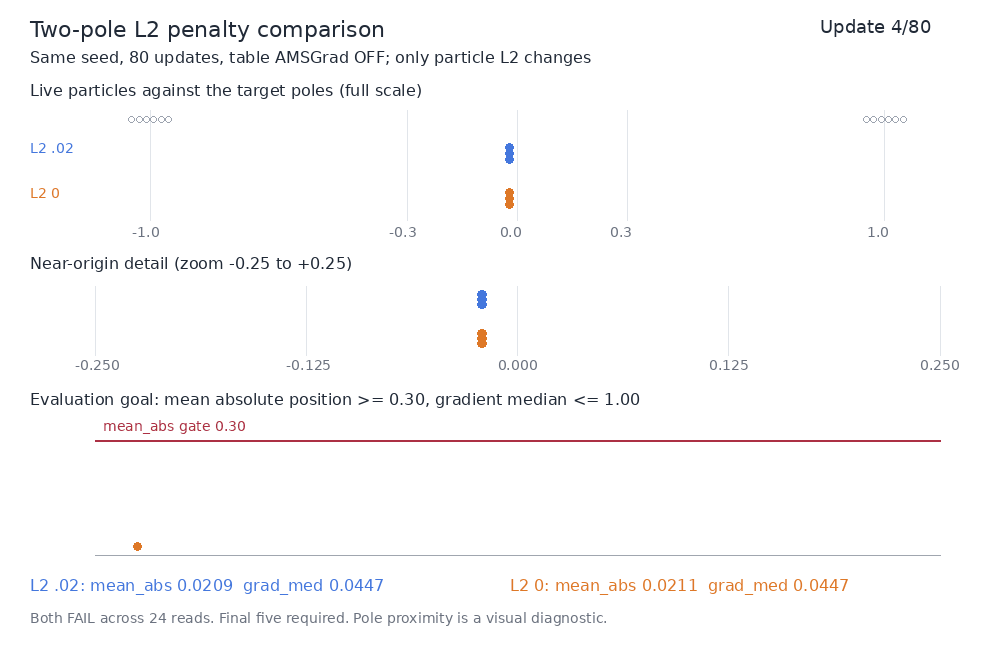

# Particle L2 restoring-force comparison

Removing the particle L2 penalty increased separation and displacement, but the single diagnostic case still **FAILS** after 80 updates. This tests whether the `0.02 * particles.square().mean()` term suppresses outward motion after table AMSGrad has already been disabled.

| Quantity | Saved baseline 927: L2 0.02 | Diagnostic 932: L2 0 |
|---|---:|---:|
| Task | `two_pole` | `two_pole_l2_off932_v1` |
| Final mean_abs, required >= 0.30 | 0.01502315 — FAIL | 0.08783505 — FAIL |
| Final grad_med, required <= 1.00 | 0.00998517 — PASS | 0.02218658 — PASS |
| Passing observations / complete curve | 0 / 24 | 0 / 24 |
| Final table standard deviation | 0.01667638 | 0.10288850 |
| Final table range | 0.05578367 | 0.33750696 |
| Positive/negative row-centroid separation | 0.02616741 | 0.17378767 |
| Rows within 0.1 of either pole, ungated | 0 / 12 | 0 / 12 |

The GIF uses all 24 saved live-particle states from both completed runs. The full-scale panel shows the fixed target poles; a labeled zoom shows the near-origin spread. The curve shows the actual mean_abs gate. No model calls, evaluation draws or training were added to create the visualization.

The graded goal is sustained displacement from the zero collapse, with bounded critic-gradient measurements. Passing requires the original gates at the final five reads, steps 67, 70, 74, 77 and 80. Pole proximity and the spread statistics are descriptive diagnostics; these gates do not certify two-mode coverage or exact target matching.

Only particle L2 changes from 0.02 to 0. Table AMSGrad stays OFF, noise and critic AMSGrad stay ON, and the completed-update LR clock, q/betas/gains, losses, seed 0, initialization, fixed targets, 80-update horizon, 24-read schedule and evaluation gates stay fixed. Because the original Task binds its training objective, the L2-off case has a distinct diagnostic Task and objective identity. Original benchmark files and all prior FAIL/INVALID outcomes are preserved.

Mean_abs rises 5.8466x and the table spreads substantially. Across the common completed Adam prefix, updates 1–70, cumulative mean absolute travel rises 0.18824029 -> 0.23817934; net mean absolute displacement rises 0.01320954 -> 0.06048852. Motion cancellation falls 92.98% -> 74.60%. Common translation still accounts for 89.60% -> 90.70% of travel. The L2 force contributes to contraction in this fixed case, but removing it is insufficient to converge by the tested horizon. The bounded optimizer trace overflows later; its tail remains UNKNOWN. The full 24-read scored curve is complete and each saved measurement passes the declared live-state/RNG purity checks.

Three fresh objective/negative/optimizer-clock/checkpoint controls PASS in 12.1444 seconds. The test fixture required a genuine noise-step entry, a completed update before checkpointing, and one fresh-installed recorder retained through spy removal and checkpointing. All 61 assertions remain (59 self.assert calls plus two torch.testing.assert_close calls). Previous importer failure, short-deadline timeout, failed v3 fixture and its corrected Source review remain recorded in `software-history.json`. Separate retained optimizer-927 eight-control and original recorder eleven-control producers join the fresh 22-field software proof; original checkpoint seven-control provenance is preserved.

This is one full-300-second CPU1/gpus0 diagnostic allocation; actual parent span was 29.4652 seconds. The unused allowance remains a conservative debit. `cost.json` records a closed accounting cut, carries the exhausted 916 envelope and prior 918/921/927 allocations once, and identifies later reporting/Source/persistence/timeout uncertainty. It is not an exact all-inclusive elapsed-time total.

Reproduce through the ParticleGAN Forge API with candidate `atlas-two-pole-l2-off932-v1`, Study `atlas-two-pole-l2-off932-study-v1`, View `atlas_two_pole_l2_off932_v1`, `execution_backend='cpu'` and `through_tier=1`. `resolve_idea(..., freeze_source=True, queue_root=...)` produces the request; the existing Queue submits, claims and runs the single job and independently grades its terminal result. `admitted-request.json`, `source-binding.json`, `software-proof.json`, `raw-result.json.gz`, `graded-result.json` and `comparison.json` preserve the measured configuration and pass/fail evidence. A fresh reproduction is a new allocation, not a replay of this attempt.

Request `a7cfc6f48c5ec2f849476208`; attempt `8f23a5ca2369457e8c96036ff011766d`; Source `313379fed51f2ca0633de36bad4c88536d6ebbc6b2a97b4c24c26c7f9b84c56d`; candidate revision `1957bc63c65671a8a9345373cdc2507f92137dceb50639c054d3ce44963d6dd3`. Base Recipe D5 is provenance; optimizer 950ed and objective 151457 are declared separately. This result supplies no canonical-original PASS, family/default winner, merge or deployment claim.
