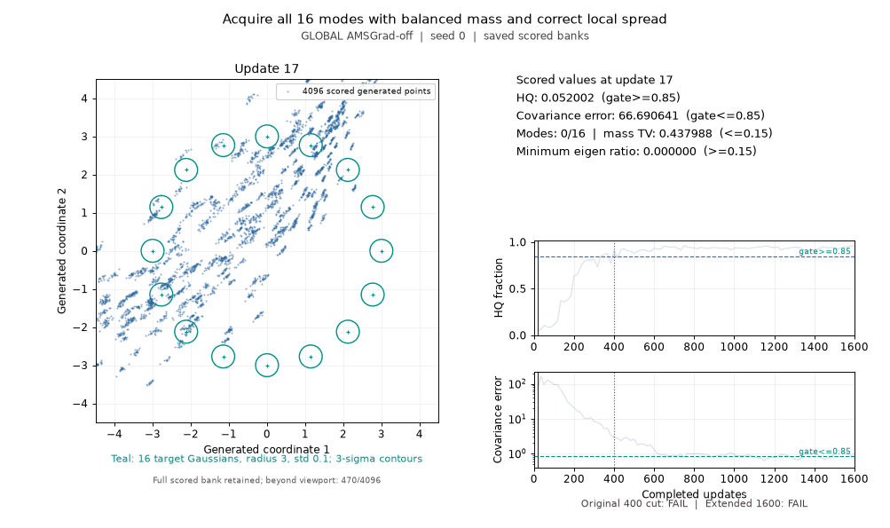

GLOBAL AMSGrad-off does not retain convergence on the original Atlas791 ring after 1,600 updates. Both its 400- and 1,600-update projections fail the unchanged gates. The new original-recipe launch stopped before training because a direct-file invocation shadowed Python's standard queue module; its failed attempt and full allocation remain preserved.

| Recipe and measurement | Updates | Verdict | Modes | HQ fraction | Mass TV | Component covariance error | Min eigen ratio | Confirmed update |
| --- | ---: | --- | ---: | ---: | ---: | ---: | ---: | ---: |
| Original Atlas791, retained historical measurement | 400 | FAIL | 16 | 0.846680 | 0.043213 | 3.761148 | 0.265099 | — |
| Original Atlas791, new launch | 1,600 intended | ERROR before training | — | — | — | — | — | — |
| GLOBAL AMSGrad-off, new single trajectory | 400 | FAIL | 16 | 0.907959 | 0.048584 | 2.992258 | 0.319459 | — |
| GLOBAL AMSGrad-off, same trajectory | 1,600 | FAIL | 16 | 0.955322 | 0.037842 | 1.023748 | 0.219247 | — |

The 1,600-update diagnostic recorded 19 passing observations out of 96, first at update 750. It ended with a passing suffix of zero and has no confirmed convergence update. All final gates except component covariance pass; four of the final five reads fail that covariance limit. This verifies temporary satisfaction of the measured goal, while retained convergence and a reusable family default remain unverified. The historical 400-update result is retained evidence. The missing new original trajectory prevents the intended extended causal comparison.



The GIF shows the AMSGrad-off arm only. Its 400- and 1,600-update annotations both refer to that single trajectory. Frames use already-scored saved samples and original metrics; fixed view bounds include an explicit off-viewport count.

The goal is to acquire 16 equally weighted Gaussian modes on a radius-three ring, with standard deviation 0.1 per mode. The gates verify coverage, balanced mass, precision and local spread together: sample_count >= 4096, modes >= 16, mass_tv <= 0.15, hq >= 0.85, component_covariance_error <= 0.85 and component_min_eigen_ratio >= 0.15. Every gate must pass on the final five scheduled observations.

| Final observation | HQ fraction | Component covariance error | Covariance gate |
| ---: | ---: | ---: | --- |
| 1534 | 0.939697 | 1.099814 | FAIL |
| 1550 | 0.948242 | 1.064794 | FAIL |
| 1567 | 0.951416 | 1.036840 | FAIL |
| 1584 | 0.959717 | 0.833331 | PASS |
| 1600 | 0.955322 | 1.023748 | FAIL |


Both declared variants bind the immutable original791 Source and complete retained 79-field Recipe. The GLOBAL AMSGrad-off arm changes only Recipe.amsgrad=False, affecting generator, prior, critic and noise optimizer groups together. Original Recipe.total_steps=None, data, architecture, positive-MoG factory, controllers and numerical scorer remain fixed. Fresh diagnostic Tasks declare the external 1,600-update horizon and 96 observations at ceil(i*400/24), i=1..96; the original 400-update geometry card and benchmark are preserved. Final clocks are 1534, 1550, 1567, 1584 and 1600. Both projections come from one uninterrupted AMSGrad-off trajectory.

Eight focused interface/negative/source/gate controls passed with two optimizer-group constructor checks and one actual 17-update, one-read fixture. The fixture's original sample bank and all raw metric values exactly match retained791 on physical GPU1/cuda:0. Its equality scope ends at update 17. The required new-original full24 scientific bank/metric equality remains unavailable because that launch failed before model construction. Whole training-state equality is UNKNOWN_PARTIAL.

Software attempts first failed on a recipe metadata label/import dependency, then typed ownership metadata and marshal serialization of interned strings. The final binding uses the exact pinned original791 full Recipe, required immutable imports, canonical typed ownership schema and strict code-content equality. Earlier failures/setup costs are preserved; numerical code and gates remain frozen.

The original launch invoked a file whose directory contained experiments/forge/queue.py, causing a stdlib import to select that sibling module. The remaining authorized trajectory completed through python -m experiments.forge.atlas954_ring_driver from the restored Source root. The original failed attempt was preserved without replay. Both full 1,200-second scientific caps remain charged once. Measured parent spans were about 0.717 seconds for the import error and 194.470 seconds for the completed remaining arm; wall-clock convergence was not measured. The 18,564.401961-second predecessor and both case allocations remain carried without refund. Software/setup/collection stays inside the same separate 180-second allowance. Source author/tool/persistence/unknown tails remain UNKNOWN_NOT_ZERO; declared caps are not exact all-inclusive elapsed cost or certified upper bounds.

Numerical results were sent to Ember before rendering and publication. This single-seed diagnostic has an incomplete original comparison. It supplies no canonical benchmark promotion or family/default winner.

The API call shape is:

```python
from pathlib import Path
from experiments.forge.atlas954_ring_driver import run_arm

# Fresh checked declaration, fresh authorized attempt and new output directory.
result, grades = run_arm(
    source_root,
    current_source_bound_declaration,
    Path(new_output_directory),
    device="cuda:0",
)
passed_at_400 = grades["400"]["status"] == "PASS"
passed_at_1600 = grades["1600"]["status"] == "PASS"
```

The runner uses the original ParticleGAN producer/training/evaluation bodies. Declarations bind all 79 Recipe fields, Task, Source pins, observation clocks, per-arm proof and fresh attempt ID. A new environment needs its own checked binding. Use module invocation for the CLI, CUDA_VISIBLE_DEVICES=1 and PYTHONPATH pointing to the restored Source root. Archived ROOT-only controls/driver Sources remain outside ordinary CI discovery.

[Machine-readable result](comparison.json) · [grades](global-amsgrad-off/grades.json) · [complete terminal](global-amsgrad-off/terminal.json) · [retained error](original-launch-error/ERROR.json) · [actual software controls](software-controls.json) · [Source map](source-map.json) · [original Recipe](retained791-recipe-inputs.json)

The raw result, all 96 already-scored sample banks, original scored goal states, initialization and both declarations are retained alongside the Source leaf bundle. Presentation uses those saved banks and scored rows; no training or metric evaluation is rerun.
