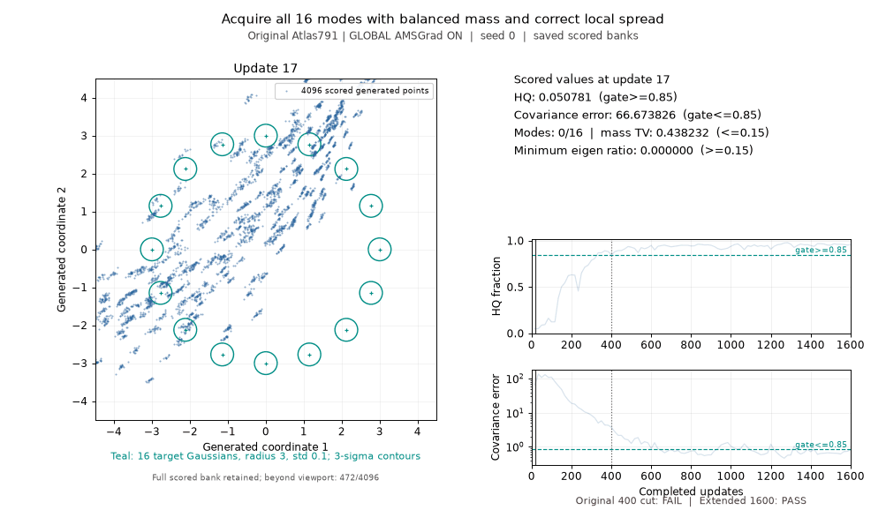

The original Atlas791 recipe passes the unchanged ring gates at 1,600 updates, with retained convergence confirmed at update **1,500**. GLOBAL AMSGrad-off fails at the same horizon. This completes the approved two-trajectory, seed-zero comparison after recovery of the original launch's pre-model import failure.

| Rank at the common 1,600-update horizon | Recipe | Verdict | First passing read | Retained passing suffix starts | Confirmed update | Passing reads / 96 | Final HQ fraction | Final component covariance error |
| ---: | --- | --- | ---: | ---: | ---: | ---: | ---: | ---: |
| 1 | Original Atlas791; GLOBAL AMSGrad ON | PASS | 650 | 1434 | **1500** | 43 | 0.956299 | **0.814855** |
| 2 | GLOBAL AMSGrad OFF | FAIL | 750 | — | — | 19 | 0.955322 | **1.023748** |

Confirmation requires five consecutive passing scheduled reads in the passing suffix retained through the end. The original ends with eleven passing reads; the off variant ends with zero. Update 650 is an early passing read, not the convergence claim. The covariance threshold is 0.85; four of the off variant's final five reads exceed it.



The original GIF shows the 16 target modes, saved generated points and already-scored HQ/covariance traces. Its 400-update label is FAIL and its extended 1,600-update label is PASS. Fixed view bounds include an off-viewport count, so clipped samples are disclosed.


The off GIF shows its separate uninterrupted trajectory; both of that arm's horizon labels are FAIL. Neither animation performs extra training, sampling or metric evaluation.

The problem attempts to verify acquisition of all 16 equally weighted Gaussian modes on a radius-three ring, each with standard deviation 0.1. Coverage alone is insufficient: the gates also check balanced mode mass, sample precision and local spread. All six gates must pass on each of the final five scheduled observations: sample_count >= 4096, modes >= 16, mass_tv <= 0.15, hq >= 0.85, component_covariance_error <= 0.85 and component_min_eigen_ratio >= 0.15. The plotted covariance value preserves the original scorer's component covariance semantics.

| Recipe and projection of the same saved trajectory | Updates | Verdict | Modes | HQ fraction | Mass TV | Component covariance error | Minimum eigen ratio |
| --- | ---: | --- | ---: | ---: | ---: | ---: | ---: |
| Original Atlas791 | 400 | FAIL | 16 | 0.846680 | 0.043213 | 3.761148 | 0.265099 |
| Original Atlas791 | 1600 | PASS | 16 | 0.956299 | 0.052734 | 0.814855 | 0.222365 |
| GLOBAL AMSGrad OFF | 400 | FAIL | 16 | 0.907959 | 0.048584 | 2.992258 | 0.319459 |
| GLOBAL AMSGrad OFF | 1600 | FAIL | 16 | 0.955322 | 0.037842 | 1.023748 | 0.219247 |

Every one of the original trajectory's first 24 saved sample banks and all 24 raw metric rows exactly matches the retained original791 run through update 400. This is measured equality of actual outputs, clocks, dtypes, shapes and metric values. It validates the recovered original prefix and its 400-update FAIL. Historical target banks and the full historical training state are unavailable; whole training-state equality remains UNKNOWN_PARTIAL.

| Final observation | Original HQ | Original covariance error | Original covariance gate | GLOBAL-off HQ | GLOBAL-off covariance error | GLOBAL-off covariance gate |
| ---: | ---: | ---: | --- | ---: | ---: | --- |
| 1534 | 0.961426 | 0.647596 | PASS | 0.939697 | 1.099814 | FAIL |
| 1550 | 0.962158 | 0.620621 | PASS | 0.948242 | 1.064794 | FAIL |
| 1567 | 0.958984 | 0.727964 | PASS | 0.951416 | 1.036840 | FAIL |
| 1584 | 0.953125 | 0.745452 | PASS | 0.959717 | 0.833331 | PASS |
| 1600 | 0.956299 | 0.814855 | PASS | 0.955322 | 1.023748 | FAIL |

Both trajectories bind the immutable original791 Source and its complete 79-field Recipe. GLOBAL AMSGrad-off changes only Recipe.amsgrad=False; the switch applies globally to generator, prior, critic and noise optimizer groups. Original Recipe.total_steps=None, data, positive-MoG factory, architecture, numerical updates, controllers and scorer remain fixed. Fresh diagnostic Tasks declare 1,600 external updates and 96 observations at ceil(i*400/24), i=1..96. The original 400-update benchmark and all gates remain unchanged. Each arm's 400 and 1,600 projections come from that arm's one uninterrupted trajectory on physical GPU1/cuda:0 with one CPU thread.

This result establishes that the original recipe can represent and retain the measured ring goal for this seed at the declared longer horizon. It supplies an extended diagnostic winner, while both canonical 400-update results still fail. It does not establish a reusable family default across seeds or other toy problems. Only one arm converges here, so it ranks first by confirmed update 1,500; time-to-convergence seconds were not recorded. Whole-attempt parent spans of 68.575 seconds for the recovered original and 194.470 seconds for the off arm include setup and collection and are not a wall-clock convergence comparison.

Eight focused interface, negative, Source and gate controls passed, including optimizer-group constructor checks and one 17-update original fixture whose saved bank and raw metrics exactly reproduced retained791. No completed scientific case or successful controls were rerun for publication. The stronger full24 prefix proof above comes from the recovered scientific original itself.

Software setup failures and their costs remain retained. The first original scientific attempt failed before model construction: direct-file invocation put experiments/forge/queue.py ahead of the standard-library queue module. Approved recovery used python -m experiments.forge.atlas954_ring_driver from the frozen Source root. The failed attempt remains in history with its complete 1,200-second allocation. The completed off arm retains another 1,200 seconds, and the explicitly approved original recovery adds another 1,200 seconds. All 3,600 scientific allocation seconds are charged once, without refund or accounting reset. The predecessor of 18,564.401961 seconds is carried once; setup, controls, collection and publication share the same 180-second software allowance inside the 41,288-second global budget. The accounting file is a publication checkpoint, not final all-inclusive measured cost. Author/tool/persistence and other unmeasured tails remain UNKNOWN_NOT_ZERO; allocated caps are neither measured elapsed time nor certified upper bounds.

Numerical results were sent to Ember before original rendering and publication. The earlier incomplete comparison and failed launch are preserved as historical records and superseded by this completed comparison.

The ParticleGAN API call and explicit pass/fail access are:

```python
from pathlib import Path
from experiments.forge.atlas954_ring_driver import run_arm

# Requires a fresh checked declaration and separately authorized attempt.
result, grades = run_arm(
    source_root,
    current_source_bound_declaration,
    Path(new_output_directory),
    device="cuda:0",
)
passed_at_400 = grades["400"]["status"] == "PASS"
passed_at_1600 = grades["1600"]["status"] == "PASS"
```

The runner calls the original ParticleGAN producer, training and evaluator bodies. Declarations bind the full Recipe, Task, frozen Source, observation clocks, per-arm proof and fresh attempt ID. A new environment needs its own checked Source binding. Use module invocation for the CLI with CUDA_VISIBLE_DEVICES=1 and PYTHONPATH pointing to that Source root. Archived controls and driver Sources remain outside ordinary CI discovery.

[Machine-readable paired result](comparison.json) · [original grades](original-replacement976/grades.json) · [off grades](global-amsgrad-off/grades.json) · [full24 equality proof](original-replacement976/full24-prefix.json) · [retained launch error](original-launch-error/ERROR.json) · [actual software controls](software-controls.json) · [Source map](source-map.json) · [original Recipe](retained791-recipe-inputs.json) · [accounting checkpoint](software-accounting.json)

Both raw results, all 96 saved sample banks and scored goal states per trajectory, initializations, declarations and the immutable Source leaf bundle are retained beside the GIFs. The original failed attempt and prior partial comparison remain available for inspection.

[Compact retained per-mode metric export](retained-mode-metrics.json) contains all 96 reads of both arms, plus update 750, the off arm's last passing read at 1584 and next failure at 1600, and both final-five windows. It copies existing full/core covariance vectors, core eigenvalue ratios, spill, mass/count and HQ/count fields exactly from the saved raw results. No model, sampling, scoring or eigenpair arithmetic is added. Mode indices retain the scorer's emitted order. The final-five component_resolved flags are false for all 16 modes in both arms; the guarded resolved_core_* defaults are excluded from this diagnostic export and supply no explanation of convergence.
