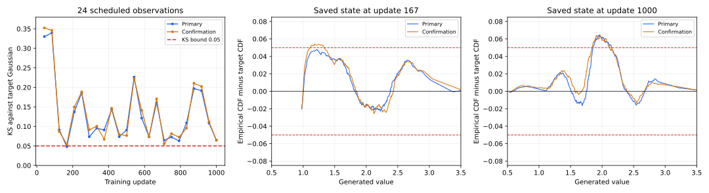

# BCAP Gaussian smoke failure

**BCAP passes five of six required Tier 1 tasks. Its remaining failure is an
unconfirmed Gaussian distribution match.** At update 167, the primary draw passes
with KS **0.047977**, but an independent draw from the unchanged state gives
**0.054185**, exceeding the **0.05** limit. No other primary observation passes.
At update 1,000, the mean and standard deviation are close to their targets,
but both draws still fail the full CDF bound.

This explains the selected BCAP DualNorm row in the
[current leaderboard](../technique-inventory.md), following the
[completed word split campaign](../word-split-inventory/README.md).
The five passing prerequisites are `two_pole`, `unused_token_hold`, `ae_gan_hold`,
`ring16_acquisition` and `five_word_joint_smoke`. Ordinary Tier 2 remains
ineligible; its missing results are unmeasured, rather than additional numerical
failures. The family total of 21/22 Tier 1 requirements counts shared tasks across
views and is not 22 distinct experiments.

## The exact passing requirement

The target is **N(2, 0.5²)**. At least one of 24 scheduled training states must
pass every bound on both a primary draw and an independent confirmation draw.
Each draw contains 4,096 clean samples from the live generator and public MoG
prior. All 1,000 updates finish, regardless of an early pass. This smoke question
requires acquisition; continued quality has its separate
[`gaussian1d_stability` task](../../../configs/forge/tasks/gaussian1d_stability.json).

| Requirement | Passing bound |
| --- | --- |
| Samples and numerical validity | At least 4,096; finite fraction 1 |
| Mean | Absolute error at most 0.1, equivalent to 0.2 target standard deviations |
| Standard deviation | 0.4–0.6, equivalent to a ratio of 0.8–1.2 |
| Full distribution | Maximum empirical CDF difference from the target at most 0.05 |

KS measures the largest discrepancy in cumulative probability at any value.
A distance of 0.054185 means a difference of **5.42 percentage points** somewhere
in the distribution. Mean and width can meet their separate allowances while
the full target CDF still fails. This is an absolute distribution bound, not a
statistical test p-value.

## The near miss and the endpoint

| State and draw | Mean | Standard deviation | KS | Full check |
| --- | ---: | ---: | ---: | --- |
| Update 167 primary | 1.968416 | 0.502161 | 0.047977 | PASS |
| Update 167 confirmation | 1.965074 | 0.505198 | 0.054185 | FAIL |
| Update 1,000 primary | 1.967879 | 0.497889 | 0.064603 | FAIL |
| Update 1,000 confirmation | 1.961604 | 0.502776 | 0.064796 | FAIL |

The confirmation at 167 misses by **0.004185**, or **8.37% above the limit**.
Both state hashes match, and confirmation leaves training unchanged. This is a
valid numerical failure, rather than a timeout, RNG leak, incomplete run or
checkpoint substitution. The receipt records 1,000 updates each for G, D and the
learned prior, costing 17.836473 worker seconds within the 120-second allowance.
[Original compact receipt](../technique-receipts/4a5687bf78db4967aebe1ca068163a07.json).

Across all 24 scheduled observations, only **1 primary draw** passes the full
bounds, **0 confirmation draws** pass, and **0 states** pass both. Mean and width
pass together in 10 primary and 11 confirmation draws. KS fails in **23/24
primary draws and 24/24 confirmation draws**. The close result at 167 therefore
does not describe the whole trajectory: later KS errors repeatedly rise above
0.1 and sometimes above 0.2.



The first panel includes all scheduled states. The other panels show the signed
CDF discrepancy at the near miss and endpoint; red lines mark the unchanged
±0.05 allowance. These plots use retained samples, with no new model sampling.
CDF panels retain every 16th sorted sample and both residual extrema; all metrics
use the full 4,096 samples.

## Where the generated distribution differs

At update 167, the largest confirmation discrepancy occurs near **x = 1.18257**:
the saved draw puts **10.52%** of its probability below this value, while the
target Gaussian assigns **5.10%**. The primary draw also has excess probability
in this lower shoulder, with its largest gap near x = 1.21507. This local mass
imbalance survives otherwise accurate mean and width.

At update 1,000, the largest confirmation discrepancy moves toward the center,
near **x = 1.96527**: the empirical cumulative fraction is **53.71%**, compared
with the target's **47.23%**. The generated median is about **1.920**, versus the
target median 2. Its near-correct mean and standard deviation conceal this
central mismatch.

An additional descriptive calculation fits a Gaussian to each draw's own mean
and width. At 167, confirmation KS against that fitted Gaussian is **0.051646**;
at 1,000, it is **0.034199**. Thus the early miss includes a residual shape
discrepancy, while the endpoint's small location/scale offsets also contribute
to failing the fixed target CDF. Fitting away those offsets changes the question
and grants no qualification. The two finite draws at 167 do not determine
whether the underlying population KS lies above or below 0.05; the declared
independent confirmation nevertheless fails. [Saved sample analysis](analysis.json).

## What the evidence says about the trainer

The selected global recipe uses relativistic BCAP with penalty coefficient and
cap both 1, **DualNorm**, constant G/D/prior rates **0.012 / 0.018 / 0.03**, zero
momentum, zero smoothing, zero prior regularization and no added training noise.
Numerical rank truncation and disabled autograd multithreading are already
enabled. The host has latent dimension 2, two width-32 hidden layers, two critic
Fourier frequencies, 256 learned uniform MoG locations, kernel sigma 0.1 and
batch size 128. Protocol seed is 0 with the public deterministic initializer and
isolated checkpointed streams. Host-card legacy rates are provenance; the
executed recipe supplies these actual rates.

**Persistent normalized motion is a plausible mechanism, not a demonstrated
cause.** With smoothing off, retained matrix singular directions receive unit
polar weights, and sampled prior rows receive approximately
`-0.03 * gradient / (gradient_norm + epsilon)`. Smaller nonzero gradients
therefore need not produce proportionately smaller steps. G, D and the learned
input locations keep moving even near a good fit. Numerical rank truncation
removes unreliable singular directions, but does not soften the retained ones.
The large repeated CDF swings are consistent with difficulty settling this
coupled stochastic game.

Earlier source-bound diagnostics support that hypothesis without qualifying
this cohort. The
[saved-state diagnosis](../gaussian1d-diagnosis/README.md) found intermittent
acquisition, deterioration during continued training and a moving prior; a
target-informed fixed representation in the unchanged architecture passed
24/24 checks. That control demonstrates representational capacity, not learned
convergence. [Larger batches](../tier1-batch-size/README.md),
[removing Fourier features](https://github.com/255BITS/ParticleGAN/blob/37eb6bef4a71fd21660e4c37a781392371f59c5f/reports/forge/gaussian-no-fourier/README.md) and
[reducing depth](../gaussian-shallow/README.md) did not establish continuous
stability under their separate contracts.

The current Gaussian endpoint exactly matches the previous
[post-truncation V6 cohort](../gaussian-smoke-inventory/final-v6/NOTES.md).
The word acquisition/hold split did not introduce this Gaussian failure.
Earlier Gaussian passes retain their original source, update rule and task
identity; they cannot be pooled with the current BCAP Ring16 pass.

## Recommended next comparison

Keep the full Gaussian bounds and independent confirmation. The existing
[opt-in fixed-scale smoothing](../../../docs/dualnorm-smoothing.md) directly
addresses the suspected response: retained matrix singular directions receive
`s / hypot(s, lambda)`, and vector/prior directions receive
`gradient / hypot(gradient_norm, lambda)`. Weak signals then produce smaller
updates without an elapsed-step learning-rate schedule or permanent shutdown.
Smoothing changes all players' relative response, so a Gaussian improvement
must also preserve the other five smoke passes, especially Ring16.

The prepared
[bounded positive-scale comparison](../../../configs/forge/searches/bcap-dualnorm-smoothing-tier1-v1.json)
declares **1e-5, 1e-4 and 1e-3**, with one global scale and the incumbent rates
across all six tasks. Its ceiling is **7,560 reserved seconds**, 2,520 per
candidate including the clock diagnostic. A zero-smoothing control belongs to
the separately declared unsmoothed category; reuse requires exact compatible
evidence, and any new control needs its own checked reservation. These are
prepared choices, not measured winners or authorization to execute a search.

Require a whole six-task pass before ordinary Tier 2, then measure strict
Gaussian stationary retention and target-shift reacquisition from that recipe's
own checkpoint. A smoke pass alone does not establish continuous learning or
public-default adoption; Forge's calibration requirements remain in force.

## Evidence and reproduction

This analysis adds **zero optimizer updates and zero sampling draws**. All
**50 saved sample sets** reproduce their recorded public-scorer metrics exactly:
24 scheduled primary/confirmation pairs plus the separate initialization pair.
All 25 saved observation pairs have matching training-state hashes. Initialization
is excluded from qualification. The original FAIL, recipes and leaderboard
remain unchanged.

The producer is develop commit
`737592c128ef84cf596c7f198b0ce8aad7c65700`, source digest
`cbb19c5e55e93aff93abd4092bbbe79e10c03a8b9f65a3f5db3b97f0f557d1ec`,
attempt `4a5687bf78db4967aebe1ca068163a07`.
The [original readout](../word-split-inventory/readout.json) binds
`artifacts/word-split-inventory-v1.tar.gz`, SHA-256
`a2519b3f68d2cbf8bf96e929242c21876db301df3df48d51cfd3b4e1957410fc`.
[Analysis provenance](analysis.json) retains the receipt, sample, scorer and
analyzer hashes. Bulk tensors and logs stay in that local archive.

The [actual-training Gaussian GIF](../word-split-inventory/media/gaussian1d_smoke.gif)
and its [source receipt](../word-split-inventory/media/gaussian1d_smoke.json)
illustrate this exact failed run. Numerical observations determine its verdict.

To reproduce from a full checkout in the project Python environment, supply the
byte-exact archive and run the saved-data analyzer:

```sh
mkdir -p runs/software/bcap-gaussian-smoke
python -u reports/forge/bcap-gaussian-smoke/analyze.py \
  --archive artifacts/word-split-inventory-v1.tar.gz \
  --output runs/software/bcap-gaussian-smoke \
  > runs/software/bcap-gaussian-smoke/analysis.log 2>&1
tail -F runs/software/bcap-gaussian-smoke/analysis.log
```

The analyzer loads only retained observation tensors for CPU reference scoring;
it constructs no model or trainer. It verifies archive and original receipt
hashes before producing compact metrics and the CDF plot. The single generated
goal leaderboard remains [technique-inventory](../technique-inventory.md).
