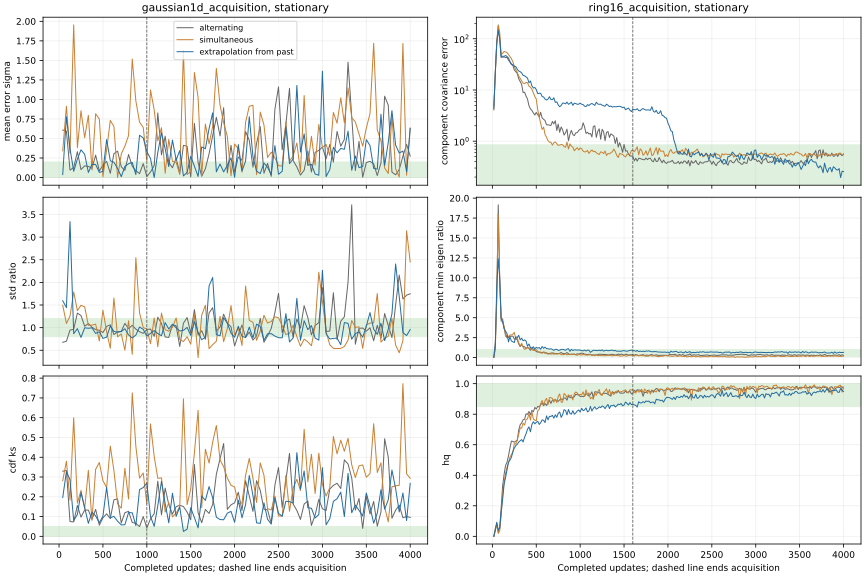
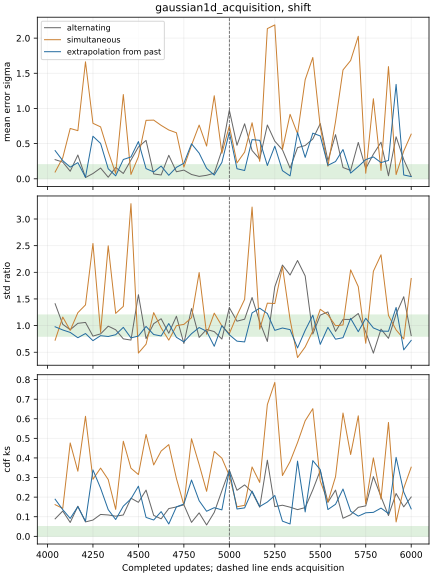

# BCAP extrapolation from the past

**Extrapolation from the past does not fix 1D Gaussian at the selected BCAP
rates.** It fails acquisition, stationary retention and target-shift reacquisition.
The ring reaches a strong late fit but misses its acquisition deadline. Keep
the adopted alternating ring recipe. The new mechanism remains an explicit
research option, with no change to the selected configuration or public defaults.

This is a bounded GPU diagnostic based on [Gidel et al., §3.3](https://arxiv.org/pdf/1802.10551),
with a frozen [protocol](protocol.json), compact [results](results.json),
[saved-sample verification](verification.json) and [provenance](provenance.json).
The [existing technique leaderboard](../technique-inventory.md) remains the single
qualification board. The tables below compare these diagnostic cells; neither
historical reuse nor this study supplies ordinary qualification or promotion.

## What was added

`Recipe.game_update="extrapolation_from_past"` implements equations20–21 on
BCAP's **normalized update field**:

```
lookahead = base - current_role_rate * previous_normalized_direction
fresh_direction = normalized_gradient_at_joint_lookahead
next_base = base - current_role_rate * fresh_direction
```

G, D and the learned prior move to the temporary lookahead together. Both role
gradients are computed there before any correction; the critic does not move
between their backward passes. Each update evaluates one fresh loss gradient per
role, including the usual critic penalty. It adds no second extragradient pass.
The first cache is zero, so the first update equals the simultaneous control.
The served/evaluated model is the corrected live base, without iterate averaging.

The cache stores normalized directions, rather than raw gradients or differences
between rounded parameters. A cached table direction retains its previous
sampled-row mask. Fresh correction updates only the new generator draw's actual
rows; dense prior regularization cannot grant ownership to other rows. Optimizer
histories, previous directions and all named streams are checkpointed. Only the
correction increments optimizer steps. Temporary parameters are restored even
if lookahead evaluation raises.

`game_update="simultaneous"` supplies the necessary timing control: evaluate
both gradients at the base before applying either optimizer step. The default
is `"alternating"`. New recipe packets omit that default field, and an AST/byte
audit verifies the previous alternating update and optimizer remain unchanged.

The supported path is scalar `GANTrainer` with stateless dualnorm or SGD.
Momentum, controller/row restructuring, averaging and BatchNorm combinations
are rejected. Forge treats `game_update` as a structural technique field and
blocks hosts that would ignore it. [Implementation](../../../particlegan/extrapolation.py)
and [trainer](../../../particlegan/training.py) contain the shared mechanism;
the [study driver](../../../benchmarks/toy_audit/bcap_past_extrapolation.py) calls
that public API.

This preserves the winning configuration's normalization, so it is an adaptation
of §3.3 to a different operator—not the paper's raw-gradient SGD or ExtraAdam.
Normalization and sampled-row masks do not establish its smoothness, Lipschitz
or monotonicity assumptions. Its stochastic averaged-iterate results also do not
establish the live retention the user requires. No such guarantee is claimed.

## Matched conditions and gates

All arms use seed0, public deterministic initialization, batch128,256 learned
uniform MoG locations, sigma.1, initialization scale1 and no standardization.
G/D/prior nominal and effective rates remain **.012/.018/.03**, with zero
momentum, both LR floors1, no annealing, EMA, prior regularizer or training noise.
The only candidate delta is `game_update`, identical across both tasks.

Gaussian is N(2,.5²), z2, G/D width32/depth2, Fouriercritic2. Ring is the same
sixteen-cluster law, z4, width64/depth2. Initial models, optimizer histories/rates,
prior, initialization records and named streams match the original step0
checkpoints exactly. Each new stationary trial's actual real-batch digest
matches the archived128-example sequence. Original recipe horizons stay1000
for Gaussian and400 for ring; only the external execution cap is4000.
The diagnostic sigma.1 Gaussian remains separate from the ordinary sigma.025
Tier1 task. Archived verdicts and source identities are retained.

Every observation uses4096 clean live public GPU draws. Gaussian's unchanged
full bounds are finite fraction1, mean error≤.2 target sigma, std ratio[.8,1.2]
and exact-CDF KS≤.05. Ring retains all original covariance, local spread, HQ,
mass and sixteen-mode bounds. Acquisition requires five terminal full passes at
1000 Gaussian /1600 ring. Separately declared strict retention requires **every**
scheduled post-acquisition check through4000 to pass:72 Gaussian /144 ring.
Cadence remains24 observations per original1000/400-update block.

## Stationary results

| Gaussian arm | Acquisition | Hold | Longest full-pass streak | Final mean error / sigma | Final std ratio | Final KS |
| --- | --- | ---: | ---: | ---: | ---: | ---: |
| Alternating baseline, reused | FAIL | 1/72 | 1 | .27536 | 1.74796 | .09594 |
| Simultaneous control | FAIL | 0/72 | 0 | .63305 | 2.45104 | .29329 |
| Extrapolation from the past | FAIL | 3/72 | 2 | .63036 | .95865 | .26799 |

Extrapolation passes only updates1417,1459 and1584. It never reaches five
consecutive full checks. At1000, KS.26950 and mean error.33198 sigma fail.
Its final width passes, but location and CDF fidelity do not. Joint timing alone
is worse: the simultaneous control passes none of96 checks. The baseline's
individually passing1000 endpoint still does not satisfy five terminal passes.

| Ring arm | Acquisition | Hold | First five-pass window | Final covariance error | Final minimum eigen ratio | Final HQ | Final mass TV |
| --- | --- | ---: | ---: | ---: | ---: | ---: | ---: |
| Alternating baseline, reused | PASS | 144/144 | 1584 | .56385 | .27828 | .97070 | .05737 |
| Simultaneous control | PASS | 75/144 | 967 | .54616 | .18197 | .97754 | .06079 |
| Extrapolation from the past | FAIL | 115/144 | 2167 | .25533 | .65523 | .94824 | .07056 |

Extrapolation's final ring fit passes all full bounds, with115 consecutive checks
through4000. Its initial acquisition and29 earlier hold checks fail, so this
is **not** a passing replacement for the adopted1600-update smoke. Simultaneous
acquires sooner but subsequently loses local spread. The baseline remains the
only combined acquisition/strict-retention pass.



## Target-shift response

Every Gaussian arm restores its exact4000-update checkpoint and continues2000
updates after the mean shifts2→3; sigma.5, prior, architecture, rates and cadence
stay fixed. Cache and optimizer history are not reset. Reacquisition requires
five terminal full passes at5000 and every remaining24 checks through6000.
Independent frozen copies receive the same component-index/kernel evaluation
draws, with zero training updates. Their models, optimizers and cache stay exact.

| Gaussian arm | Reacquisition | Hold | Final active KS | Final frozen KS | Final active mean error / sigma | Final active std ratio |
| --- | --- | ---: | ---: | ---: | ---: | ---: |
| Alternating | FAIL | 0/24 | .20058 | .66987 | .03452 | .81245 |
| Simultaneous | FAIL | 0/24 | .35284 | .54666 | .63471 | 1.88360 |
| Extrapolation from the past | FAIL | 0/24 | .13998 | .50831 | .03190 | .72226 |

All active and frozen arms pass0/48 full shift checks. Extrapolation moves close
to the new mean and improves endpoint KS relative to its frozen copy, but ends
under-dispersed and fails distribution fidelity. Response to a changed target
is measurable; stable reacquisition is absent. Stationary failures also preclude
a combined continuous-learner pass, independent of this later response.



## What this tells us

A secondary saved-state audit, explicitly outside the preregistered gates,
finds improved scalar shape after fitting away mean and width: fitted-normal KS
.17296 baseline→.06033 extrapolation, skewness1.61317→−.39295. That useful shape
change cannot substitute for the required target mean, width and CDF.

The final scalar cache has97 nonzero prior rows, direction norms
.999924–.999997. At the fixed.03 prior rate, the corresponding average step is
.0299996 latent units. Lookahead changes direction but preserves almost full
normalized row motion. This directly documents the update field; it does not
isolate the prior as the cause of failure or prove a different field would pass.

**Recommendation:** stop this exact revision as a Gaussian repair; keep the
implementation opt-in and retain the adopted ring recipe. Before tuning more
extrapolation settings, investigate response magnitude near fit under constant
nominal rates, especially the prior's nearly unit row steps. A separately frozen
magnitude-sensitive prior comparison or frozen-prior role control would address
that remaining hypothesis. It must keep one whole trainer across tasks and
measure acquisition, live retention and shift response. No such trial, rate grid,
seed study, continuation or promotion follows automatically from this readout.

## Cost, verification and reproduction

Seven new CUDA trials complete **22,000 updates** and2,816,000 real examples
for **279.351 new training-loop seconds**, against3300 reserved seconds; zero
scientific retries. Four stationary trials contribute16000 updates and three
shift continuations6000. Both existing4000-update stationary baselines are
reused with zero new training cost. Loop timing includes scheduled evaluation,
but excludes construction, restoration, source capture, serialization, numerical
publication and rendering. Original baseline costs remain in their own receipts.

**58 software checks pass:**14 CUDA mechanism/protocol checks and44 metadata
ownership/signature checks. The CUDA bilinear fixture verifies equations20–21;
other checks cover sampled-row masks, no additional training draws, joint timing,
exact checkpoint continuation and atomic malformed-cache rejection. Ten independent
GPU scorer fixtures pass their declared oracle/destructive expectations.
Nine final contexts restore exactly on CUDA; all effective rates and optimizer
counts match. All **1308 saved live/frozen sample sets** reproduce their exact
metrics, and every live/frozen grade is recomputed. Publication launches no
training or model draws. CPU target/reference draws, numerical scoring, metadata
checks and rendering preserve their original laws; all neural training, sampling
and model fixtures use CUDA. These finite tests do not establish unbounded
retention, clock-free eligibility, calibration or default adoption.

Executed scientific commit: `f987656a49c7477322c058d98e6e1c180518fa36`, based on
merged develop `d91c8d867b06435e79c25f65cf46754e8eabbe69` (PR316).
Raw logs, all curves, model/sample tensors, source manifests, named streams and
checks remain in ignored `runs/api/bcap-past-extrapolation-v1/` and the local
archive identified by [provenance](provenance.json). Original prior/duration/batch
archives retain their exact hashes. Software preflight and publication errors
were repaired without rerunning any scientific trial; their logs are archived.

```sh
CUBLAS_WORKSPACE_CONFIG=:4096:8 OMP_NUM_THREADS=1 MKL_NUM_THREADS=1 OPENBLAS_NUM_THREADS=1 \
  /usr/bin/python -u -m benchmarks.toy_audit.bcap_past_extrapolation run \
  --device cuda:0 --output runs/api/bcap-past-extrapolation-v1 \
  > runs/api/bcap-past-extrapolation.run.log 2>&1
tail -F runs/api/bcap-past-extrapolation.run.log

# Saved-evidence verification; hydrate the exact local parent archives first.
CUBLAS_WORKSPACE_CONFIG=:4096:8 OMP_NUM_THREADS=1 \
  /usr/bin/python reports/forge/bcap-past-extrapolation/verify.py \
  --raw runs/api/bcap-past-extrapolation-v1 --device cuda:0
/home/martyn/dev/ParticleGAN/.venv/bin/python \
  reports/forge/bcap-past-extrapolation/publish.py \
  --raw runs/api/bcap-past-extrapolation-v1
```

Actual-training GIFs show saved clean GPU outputs against the target, with
update labels and numerical gate status. Frame selection does not change scoring:

- Gaussian stationary: [baseline](alternating-gaussian1d_acquisition-stationary.gif), [simultaneous](simultaneous-gaussian1d_acquisition-stationary.gif), [extrapolation](extrapolation_from_past-gaussian1d_acquisition-stationary.gif).
- Ring stationary: [baseline](alternating-ring16_acquisition-stationary.gif), [simultaneous](simultaneous-ring16_acquisition-stationary.gif), [extrapolation](extrapolation_from_past-ring16_acquisition-stationary.gif).
- Gaussian target shift: [baseline](alternating-gaussian1d_acquisition-shift.gif), [simultaneous](simultaneous-gaussian1d_acquisition-shift.gif), [extrapolation](extrapolation_from_past-gaussian1d_acquisition-shift.gif).
