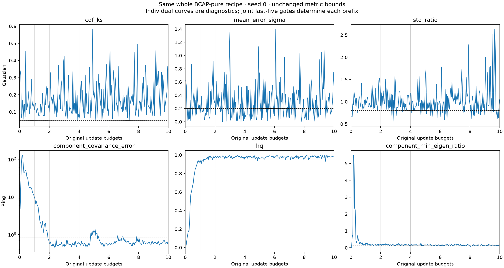
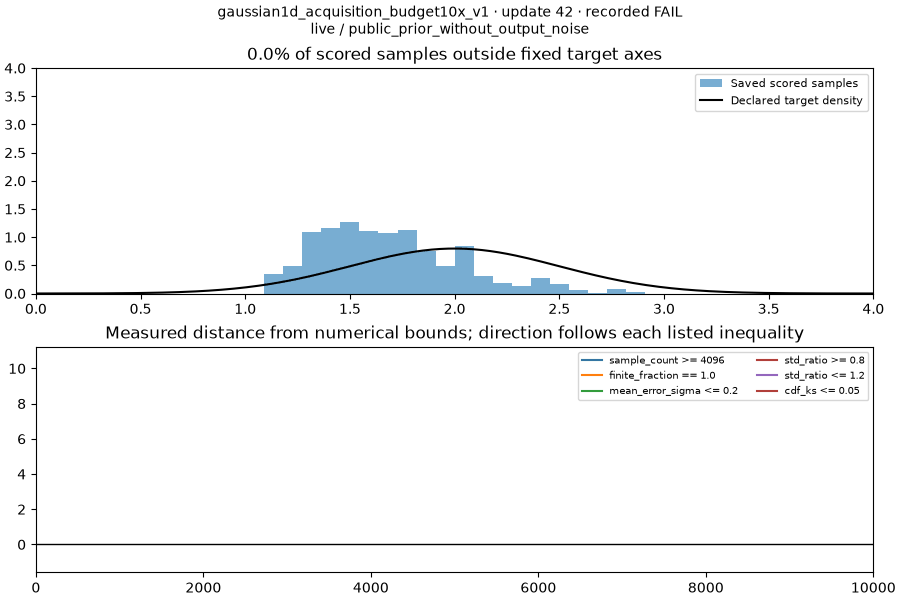
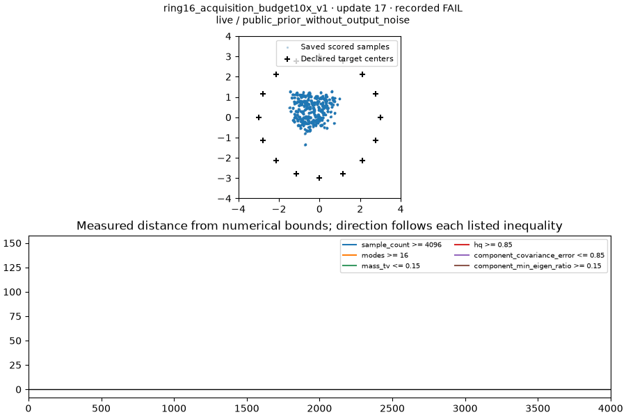

# BCAP-pure: 10× training did not resolve sustained Tier 1 failures

Both requested runs completed on separate GPUs with the winning optimizer and
**constant step sizes**. Gaussian still fails distribution accuracy. Ring16
removes most of its original tail error and passes every endpoint metric, but
fails the existing requirement for five terminal observations passing together.
**Result: 0/2 sustained diagnostic passes.** No thresholds, defaults or original
qualification results changed; the single ordinary leaderboard remains 4/6.

[Certified readout](results.json) · [Frozen declaration](freeze.json) ·
[Archive receipt](archive.json) · [Previous gate audit](../bcap-pure-tier1-gap-audit/README.md) ·
[Single current leaderboard](../technique-inventory.md)

## Same-trajectory budget comparison

These are prefixes of two uninterrupted seed-0 runs, not independent attempts.
A passing endpoint alone is insufficient: the terminal passing suffix must be
at least five original-spaced observations, with every required metric passing.

| Task | Allowance | Updates | KS / full component covariance error | Mean error σ / HQ | Std ratio / minimum component eigen ratio | Passing suffix | Verdict |
| --- | --- | ---: | ---: | ---: | ---: | ---: | --- |
| Gaussian | 1× | 1,000 | KS .11428 | Mean .12788 | Std 1.05499 | 0 | FAIL |
| Gaussian | 2× | 2,000 | KS .16066 | Mean .33521 | Std .91585 | 0 | FAIL |
| Gaussian | 4× | 4,000 | KS .06083 | Mean .04037 | Std 1.19184 | 0 | FAIL |
| Gaussian | 10× | 10,000 | KS .20696 | Mean .52346 | Std 1.05128 | 0 | FAIL |
| Ring16 | 1× | 400 | Covariance 9.61552 | HQ .94385 | Eigen .29107 | 0 | FAIL |
| Ring16 | 2× | 800 | Covariance .60852 | HQ .97852 | Eigen .20328 | 3 | FAIL |
| Ring16 | 4× | 1,600 | Covariance .56998 | HQ .97534 | Eigen .12135 | 0 | FAIL |
| Ring16 | 10× | 4,000 | Covariance .57043 | HQ .99121 | Eigen .17298 | 2 | FAIL |

Ring16 has 16 modes at each listed endpoint. Its mass TV falls from .09302 at
1× to .04663 at 10×, below the unchanged .15 bound. All evaluations use 4,096
clean samples from live weights, without added serving noise.



## What fails exactly

Gaussian requires finite fraction=1, sample count≥4,096, mean error≤.2 target σ,
std ratio in [.8,1.2], and CDF KS≤.05. Only two of 240 observations pass jointly
(updates 3,917 and 5,542); there is no five-pass window. In the last 60 checks,
KS fails 60/60, mean error fails 37/60, and std ratio fails 32/60, spanning
.616–2.630. Extra allowance leaves location, width and shape oscillating.

| Gaussian update | KS ≤ .05 | Mean error σ ≤ .2 | Std ratio [.8,1.2] | Failed metrics |
| ---: | ---: | ---: | ---: | --- |
| 9,834 | .16554 | .14377 | .61627 | KS, std |
| 9,875 | .18990 | .24478 | .76319 | KS, mean, std |
| 9,917 | .22489 | .35962 | .64375 | KS, mean, std |
| 9,959 | .36468 | .74901 | .94697 | KS, mean |
| 10,000 | .20696 | .52346 | 1.05128 | KS, mean |

Ring16 requires sample count≥4,096, modes≥16, mass TV≤.15, HQ≥.85,
full assigned-component covariance error≤.85, and minimum component eigenvalue
ratio≥.15. Its first joint pass is at 767 updates, and its first five-pass
window is 934–1,000. That success is transient: there are 83 failed checks
after that confirmation and 41 pass-to-fail transitions over the full run.

| Ring16 update | Covariance ≤ .85 | Minimum eigen ratio ≥ .15 | Joint pass |
| ---: | ---: | ---: | --- |
| 3,934 | .57680 | .12569 | No |
| 3,950 | .60236 | .14561 | No |
| 3,967 | .65230 | .11783 | No |
| 3,984 | .56272 | .15058 | Yes |
| 4,000 | .57043 | .17298 | Yes |

Only the eigenvalue floor fails in those first three terminal checks. Over the
last 60 observations it fails 36 times; full covariance fails once, while mode
coverage, HQ and mass balance never fail. The limiting components at these
three checks contain 238–274 assigned samples, essentially all HQ, and their
full and 4σ-core minimum eigen ratios agree. This is a narrow within-mode
direction, not missing occupancy or the original distant-tail inflation.
The ratio compares variance to target variance; .15 already permits a standard
deviation as small as √.15≈.387 of target along the narrowest direction.

Full component covariance includes tails and averages all 16 assigned
components without mass weighting. HQ uses 3σ; the separate core diagnostic
uses 4σ. Neither core-only covariance nor an overall ring covariance can
replace these gates. Passing the ring endpoint does not establish a stable
local shape over the required terminal interval.

## Recommended next step

Stop this allowance-only experiment. Neither result supports another automatic
10× extension. Longer training substantially helped ring acquisition, but
Gaussian never sustained accuracy and ring repeatedly lost local spread.
Do not select the favourable 1,000-update ring window as a stable 4,000-update
result, or promote a mixed set of old and new source/budget cohorts.

The next training study should be a small, declared **global optimizer pace
refinement**, retaining constant steps, BCAP coefficient/cap=1 and all six
original Tier 1 requirements. Smaller constant network steps and changes in
D/G or prior/G pace are hypotheses to test for smaller cycles, not proven fixes.
The previous D/prior grid was crossed at G=.01, whereas this winner uses .012;
local combinations at .012 remain possible. Preserve the four existing passes
when ranking any new recipe. The .01 starter lost two-pole terminal stability,
so simply lowering all rates is not guaranteed to help. Positive shared momentum
already lost passes; repeating that sweep is a lower priority. A matrix/vector
pace variant would require its own explicit implementation and control.

A threshold review can proceed separately if the intended test question has
changed. Decide whether ring is meant to test *acquisition by a deadline* or
*continued stable shape*, and consider explicit acquisition and hold criteria
rather than hiding one behind the other. Audit the worst-of-16 eigenvalue
estimator using the existing target and destructive controls at the public
sampling count. Keep the observed training failures distinct from this
methodological calibration. The present measurements do not justify relaxing
KS or the eigen floor just to accept the winner. Any revised task, allowance or
stability policy needs a new version and validation against those controls;
retain the old results and provenance.

## Execution and evidence

The [preregistered source](https://github.com/255BITS/ParticleGAN/blob/6939fde43d5df47ed77ce3e9bbc289fe729fbf2f/reports/forge/bcap-pure-budget10x-v1/README.md)
committed exactly these two runs before freezing. It predicted possible ring
recovery and continued Gaussian fluctuation. Gaussian fluctuation is observed;
sustained ring recovery is not. No additional seed, optimizer arm, retry or
training extension ran.

Forge's narrower registered numerical prediction, ring endpoint covariance
error≤.85, is observed. That prediction does not assert the whole stability
conjunction; both certified task verdicts remain FAIL.

| Binding | Value |
| --- | --- |
| Study | `bcap-pure-budget10x-v1` |
| Executed commit | `6939fde43d5df47ed77ce3e9bbc289fe729fbf2f` |
| Frozen source digest | `46c1aa862c1da363dc8938c834327ea9702d5db57c8cfcaae488d3e5b5545a4d` |
| Candidate | `bcap-dualnorm--7beb7378d81dc3be2c648438661e0376fe2805298232f5c2398be835ddaad6f9` |
| Gaussian attempt / GPU | `b97fa2481fa8452f8f1cfd44ab6568d8` / 0 |
| Ring attempt / GPU | `e60c4e50de8c4733af1024de4c92394f` / 1 |
| Charged worker time | Gaussian 96.846 s + ring 61.234 s = 158.080 s |
| Full reserved ceiling | 1,200 + 3,000 = 4,200 worker-seconds; released after completion |

Both use full dualnorm, momentum zero, epsilon 1e-8: G/E=.012, D=.018,
sampled prior rows=.03. Architecture, target/data law, batch128, 256 learned MoG
locations at σ=.025, public deterministic initializer and named seed-0 streams
match each original task. The external update caps are 10,000/4,000; the
recipe schedule horizons remain 1,000/400. Both schedule floors are 1, so the
stored `cosine` label produces **no annealing**. The reader checks multiplier
(1,1) at every step and the actual final optimizer group rates. Per-step rates
were not logged. There is no added controller, noise warmup, loss/BCAP change,
or EMA scoring.

The opt-in diagnostic adapter/evaluator retains the original spacing,
`ceil(i × original_budget / 24)`, for i=1…240. Each run completes exactly the
requested G/D/prior update counts with finite-state and named-RNG guards.
All first 24 saved metric records and sample tensors reproduce the corresponding
original attempt **exactly, including tensor bytes**. Initialization hashes and
named stream starts agree after ignoring the physical CUDA index. The original
runs retained no resumable final state, so unavailable optimizer/model/end-stream
comparisons cannot be claimed. New final states retain all 14 consumed named
streams, model/optimizer state and actual optimizer group rates.

The ordinary 24-check grader and existing task declarations are unchanged.
The new view is `research_diagnostic`; its compact
[Forge record](../records/readout-26e6cf0b4f24d0c63408bb91.json) supplies no
qualification credit. Original 4/6 evidence retains executed source
`a0f7e70e50427e0d3221d1d7f4cb4aac6e18b1be` and digest `f1755b1b…`.
No ordinary qualification or leaderboard regeneration was warranted.

## Reproduce the readout

[run.py](run.py) freezes/submits the two declared tasks and logs progress every
30 seconds. [analyze.py](analyze.py) is a saved-output reader: it verifies both
certificates, the frozen source, whole recipes, task laws, complete curves,
old-prefix parity and final states before writing compact results and media.
The tuple/list normalization in its final-state recipe comparison reflects
Torch versus JSON storage; it changes no trained recipe or scientific source.

```sh
PYTHON=/home/martyn/dev/ParticleGAN/.venv/bin/python
BUDGET_QUEUE=/home/martyn/dev/ParticleGAN/runs/forge/bcap-pure-budget10x-v1-queue
$PYTHON reports/forge/bcap-pure-budget10x-v1/analyze.py \
  --queue-root "$BUDGET_QUEUE" \
  --original-queue-root /home/martyn/dev/ParticleGAN/runs/forge/bcap-dualnorm-pacing-v2-queue \
  --original-root /home/martyn/dev/ParticleGAN-dualnorm-pacing-v2
tail -F "$BUDGET_QUEUE/driver.log"
```

Raw stdout, scored tensors, checkpoints and event streams stay outside Git in
the [local archive](archive.json). The original archive is unchanged. Restore
both cohorts to their certified original paths for this strict reader; compact
results and plots remain reviewable without local bulk artifacts. These are two
seed-0 trajectories, without cross-seed robustness or scale-transfer evidence.

Actual-training illustrations render nine retained scored checkpoints each,
adding zero training updates or sampling draws. Metrics determine the verdict.





Validation: 196 focused Forge tests passed; declaration validation and whitespace
checks passed. The strict completed-run reader verifies both FAIL verdicts and
bitwise original-prefix parity. Readout JSON, PNG, GIFs and media receipts
reproduce byte-for-byte. Both publication coverage/freshness tests pass without
raw-log hydration; memory refresh preserves published qualifications and costs.
The new archive's 1,232 member files were checked byte-for-byte, and the original
archive retains its exact SHA-256 identity.
