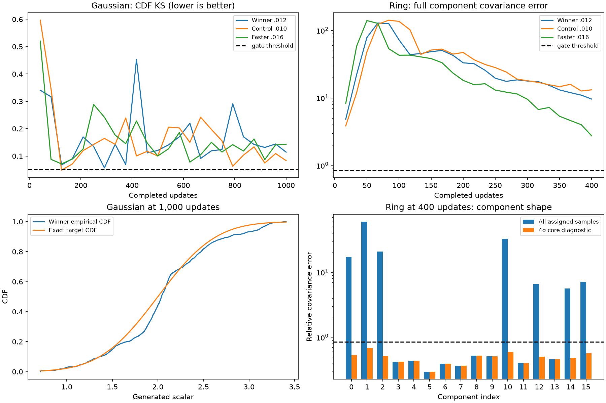

# BCAP-pure: remaining Tier 1 criteria and next experiments

**Completed follow-up:** the owner requested 10× training for both failures.
The [two-run readout](../bcap-pure-budget10x-v1/README.md) records both sustained
gates as FAIL: Gaussian continues oscillating; ring improves tails but repeatedly
loses component spread. The original audit and qualification below are retained.

The new BCAP-pure default is a useful **4/6 Tier 1 starting point**, with constant
dualnorm steps. It still fails Gaussian CDF shape and ring component covariance.
The strongest next experiment is a bounded training-budget diagnostic with the
same recipe: the ring is still improving at 400 updates, whereas the Gaussian
already shows substantial fluctuation. Use those results to choose between a
small optimizer search and a longer acquisition allowance. There is no evidence
yet that extra updates make this recipe pass all six original gates.

This report audits `origin/develop` at
`9cdfd70a49ef4e81143d304c550dfaea72ae51ff`, after [PR #310](https://github.com/255BITS/ParticleGAN/pull/310).
It reads preserved training outputs; **it launches no training, changes no
optimizer, loss, task, threshold or default, and rewrites no qualification**.
The single [current leaderboard](../technique-inventory.md) remains the ranking
for this goal. The tables below explain gate failures rather than create another
leaderboard.

## Which criteria are missing?

The selected whole configuration is
`bcap-dualnorm--7beb7378d81dc3be2c648438661e0376fe2805298232f5c2398be835ddaad6f9`.
Its executed source is `a0f7e70e50427e0d3221d1d7f4cb4aac6e18b1be`, digest
`f1755b1b5538901ffd4882f196bfd475030b06df16fd940c9b839eff86dc8226`.
The later API default decision preserves those original source identities.
See the [default decision](../dualnorm-pacing-v2/DEFAULT_SELECTION.md),
[complete study](../dualnorm-pacing-v2/README.md) and [verified audit](audit.json).

The [current stability view](../../../configs/forge/views/discriminator_stability.json)
is revision 5: six required Tier 1 tasks, 19 Tier 2 tasks and two Tier 3 tasks.
All six Tier 1 cells are measured, complete, finite runs. The two unmet criteria
are **FAIL**, not missing executions. The separately scoped clock audit passes
but does not increase the required denominator. Later-tier cells remain
unknown/unrun because Tier 1 blocks ordinary advancement; they are not 21
additional measured failures. The family headline sums overlapping views and
must not be read as this six-task qualification count.

Every required task needs its complete **24 observations** and at least **five
consecutive passing observations at the end**, with all conditions true together.
An early best checkpoint, a good endpoint alone or a task-specific recipe cannot
fill a missing sustained pass. This rule is implemented by
[test_verdict](../../../benchmarks/transfer_suite/protocol.py) and the
[sustained reducer](../../../benchmarks/locked_shared/observation.py).

| Required task / updates | Declared conditions | Winner endpoint | Result / terminal passing checks |
| --- | --- | --- | --- |
| [Gaussian / 1,000](../../../configs/forge/tasks/gaussian1d_acquisition.json) | Samples ≥4,096; finite fraction =1; mean error ≤0.2 target σ; std ratio in [0.8,1.2]; CDF KS ≤0.05 | 4,096; 1; 0.12788; 1.05499; **KS 0.11428** | **FAIL / 0** |
| [Two-pole / 80](../../../configs/forge/tasks/two_pole.json) | Mean absolute active coordinate ≥0.3; median absolute input gradient ≤1 | 0.94355; 0.28846 | PASS / 17 |
| [Unused-token hold / 200](../../../configs/forge/tasks/unused_token_hold.json) | Concept movement ≥0.85; unused-token hold score ≥0.85 | 0.99681; 0.98366 | PASS / 18 |
| [AE hold / 250](../../../configs/forge/tasks/ae_gan_hold.json) | Reconstruction MSE ≤0.05; hold error ≤0.35 | 0.003065; 0.001007 | PASS / 22 |
| [Ring / 400](../../../configs/forge/tasks/ring16_acquisition.json) | Samples ≥4,096; modes ≥16; mass TV ≤0.15; HQ ≥0.85; full component covariance error ≤0.85; minimum component eigenvalue ratio ≥0.15 | 4,096; 16; 0.09302; 0.94385; **covariance 9.61552**; 0.29107 | **FAIL / 0** |
| [Joint words / 20,001](../../../configs/forge/tasks/five_word_joint_acquisition.json) | Samples ≥1,024; quality ≥0.95; modes =5; mass TV ≤0.1; exact reconstruction =1; minimum reconstruction token probability ≥0.9 | 1,024; 1; 5; 0.01895; 1; 1 | PASS / 6 |

In the complete 25-configuration pacing study, **no configuration passed either
Gaussian or ring acquisition**. Nine had at least one jointly passing Gaussian
observation, but none sustained the terminal window; the selected winner had
none. No ring configuration had even one jointly passing observation. This is
not merely an unlucky choice of terminal checkpoint.

## Constant steps and the actual BCAP-pure training law

| Setting | Audited value / effect |
| --- | --- |
| Optimizer | Full `dualnorm`; no Adam update or adaptive second moment |
| Network steps | G/E =0.012; D =0.018 (D/G =1.5) |
| Learned sampled prior rows | Step =0.03; unsampled rows stay fixed |
| Momentum / epsilon | Network momentum 0; prior momentum always 0; epsilon 1e-8 |
| LR schedule | `lr_floor=1`, `network_lr_floor=1`; both multipliers are exactly 1 |
| Retained schedule metadata | `lr_schedule="cosine"`, `lr_anneal_start=0.6`; **inactive with floor 1** |
| Other schedules | `beta2_end=None`, `reg_coeff_end=None`; no beta2 or penalty annealing |
| Loss / penalty | Existing relativistic logistic loss and fixed `b_cap`, coefficient 1, cap κ=1, every D update |
| Controllers / interventions | No continuous policy, guard, anchor, latent damping, direct-response gain, birth/death or row-evidence gate |
| Added noise / serving | Input/output training noise 0, output-noise warmup 0; EMA decay 0, served averaging 0; clean live scoring |
| Optimizer decay / clipping | No optimizer weight decay or gradient clipping |

There is **no effective LR annealing, late warmup or delayed optimizer change**.
[learning_rate_scale](../../../particlegan/recipes.py) returns 1 immediately when
the floor is 1. The reader checks the public default and all seven selected
host recipes at the start, endpoint, 2×/4× horizons and 100,000 updates.
[Schedule hooks](../../../particlegan/recipe_schedules.py) are inactive for these
settings. `lr_control="mobility"` and `critic_payoff_damping=True` are retained
fields, but do not activate a controller in this recipe. Stored Adam betas are
inactive for full dualnorm. The cap is a soft loss penalty, not a projection
enforcing a global Lipschitz bound.

Dualnorm uses the polar factor of each matrix gradient, L2-normalizes vectors,
and separately normalizes each sampled prior row. Thus a nonzero update generally
does **not** shrink just because its gradient becomes small. Constant nominal
steps can keep parameters moving near equilibrium. More training can improve
acquisition or continue cycling; neither outcome follows from the endpoint alone.
Likewise, decreasing relative update size as weights grow is not LR annealing.
The recorded word matrix growth flag (15.51× its first logged norm) is finite-run
evidence, not proof of unbounded growth. See the
[optimizer implementation](../../../particlegan/optim/dualnorm.py).

Task-owned behavior remains explicit:

| Host | Existing condition that must survive a follow-up |
| --- | --- |
| Gaussian / ring | Learned MoG with 256 locations, kernel σ=0.025 and `standardize=false`. Kernel noise remains part of the prior despite zero additive training noise. Gaussian is N(2,0.5²), hidden width 32, depth 2, z_dim 2; ring has 16 equal modes, radius 3, σ=0.1, width 64, depth 2, z_dim 4. Both use Fourier-2 D and batch 128. |
| Two-pole | Explicit fixed fixture and direct N×1 coordinates updated as a G-player **matrix at 0.012**, including shape scaling. There is no sampled table at the prior rate; the existing particle-L2 objective remains. |
| Unused-token hold | No separate learned prior; the task's hold objective remains. |
| AE hold | Reconstruction, coverage weight 1.5 and particle-L2 coefficient 0.02 remain task objectives even though recipe `prior_reg=0`; learned MoG σ=0.025 remains. |
| Joint words | Five learned 2D cloud rows, σ=0, explicit finite-vocabulary exception; G/E share network pace. D and BCap operate on the joint `(word,z)` input. The 20,001 updates versus 20,000 schedule horizon have no rate effect with floor 1. |

Those auxiliary terms are existing test conditions, not optimizer weight decay
or newly added stabilizers. Sources:
[behavior adapter](../../../experiments/forge/behavior_adapters.py),
[two-pole](../../../benchmarks/locked_shared/two_pole.py),
[AE hold](../../../benchmarks/locked_shared/hosts/ae_gan_hold.py),
[word fixture](../../../benchmarks/toy_audit/api_images.py).
The bare public preset is not a complete reproduction of a Forge host: its prior
defaults differ from these explicit task bindings. Also, `forge-api-v1` preserves
bare `recipe_preset="bcap"` as the historical Adam control; new Forge work must
select the full winning configuration/settings explicitly through
[the shared resolver](../../../experiments/forge/api.py).

## Gaussian: shape error and fluctuation, not just centering

The [Gaussian scorer](../../../benchmarks/toy_audit/gaussian1d_quality.py) compares
the generated empirical CDF with the exact analytic target. It has no histogram
bins or independently sampled target noise. Finite generated-sample uncertainty
still exists; these are deterministic seed-0 observations, not variance estimates.
The winner's best logged KS is **0.05680 at update 292**, already above 0.05;
its final KS is 0.11428. Early near-success does not persist.

| Update | KS (≤0.05) | Mean error in σ (≤0.2) | Std ratio ([0.8,1.2]) |
| ---: | ---: | ---: | ---: |
| 834 | 0.17022 | 0.32094 | 0.87378 |
| 875 | 0.14236 | 0.18907 | 0.84224 |
| 917 | 0.13143 | 0.26054 | 1.03580 |
| 959 | 0.14408 | 0.24770 | 0.92529 |
| 1,000 | 0.11428 | 0.12788 | 1.05499 |

The saved final sample reveals where the shape fails: at x=1.85385, target CDF
is 0.38503 while the generated left CDF is 0.27075, a deficit of 0.11428.
Its 25th percentile is 1.81375 versus target 1.66276, and its 95th percentile
is 3.11298 versus 2.82243. The error is not confined to extreme tails.
After correcting this saved sample's mean and standard deviation to the target
**as an offline diagnostic only**, KS remains **0.08936**, still above 0.05.
Mean/width correction alone cannot repair this sample's CDF. This transformation
is not a serving change or substitute gate result.

Interpretation: the data support investigating non-Gaussian shape and ongoing
game motion. They do not establish a specific cause such as insufficient critic
capacity or prior width. A longer run is a useful diagnostic, but the earlier
better KS makes "just keep training" less persuasive here than for the ring.

## Ring: rare distant samples dominate component shape

The failing metric is the **unweighted mean over all 16 components of relative
Frobenius covariance error**, using *all* nearest-assigned samples and population
covariance denominator n. The minimum eigenvalue ratio is separately bounded
across every component. [The scorer](../../../benchmarks/transfer_suite/vector_tasks.py)
also publishes core-only and overall covariance diagnostics, which cannot replace
the declared full-component gate. HQ and component spill use **3σ**; core
covariance uses **4σ**.
The ring's mode count requires at least one quarter of each mode's target mass
within 3σ: at 4,096 samples, each mode needs at least 64 HQ samples. Merely
assigning one sample to each nearest centre would not pass coverage.

| Update | Full covariance (≤0.85) | Minimum eigenvalue ratio (≥0.15) | HQ (≥0.85) |
| ---: | ---: | ---: | ---: |
| 334 | 15.33818 | 0.19606 | 0.92773 |
| 350 | 13.13764 | 0.22556 | 0.93970 |
| 367 | 11.96634 | 0.16999 | 0.92163 |
| 384 | 10.97897 | **0.14131** | 0.92212 |
| 400 | 9.61552 | 0.29107 | 0.94385 |

Full covariance improves by approximately 37% over the last five observations,
but ends **11.31× the bound**. All 16 modes and mass TV pass at these five
observations. The temporary eigenvalue failure warns that driving covariance
down can introduce contraction; all metrics must pass together.

At update 400, 230/4,096 samples lie beyond 3σ, 192 beyond 4σ, and **180 beyond
10σ** of their nearest target mode. The maximum distance is 23.21σ. Seven
components individually exceed covariance error 0.85. Component 1 has full
error 60.0491 versus core-only 0.68394; component 10 has full error 32.7079
versus core-only 0.59589. Points outside 4σ contribute approximately 67.3% and
88.1% of their respective groups' total squared distance from their own means.
The aggregate core-only error 0.48050 and overall covariance error 0.09988 hide
this full-component failure.

Interpretation: longer training has a plausible target—remove distant assigned
mass while retaining local spread and occupancy. The saved outputs establish
the tail problem, but do not identify whether particular prior rows, transitions
between modes or local generator sensitivity cause it. A future diagnostic can
bind generated outliers to sampled row IDs and measured generator sensitivity;
do not change the prior width or sampling law to improve a score in this cohort.



The plotted .010 control and .016 comparison are complete recipes from the same
executed source. They supply context, not independent repetitions. The .016
recipe improves ring covariance to 2.74482 but fails word confidence
(0.87848 <0.9), scoring only 3/6; its Gaussian KS also worsens to 0.14263 and
mean error fails at 0.22361σ. Shared momentum 0.5 also improves ring covariance
to 2.53849 but loses the eigenvalue floor and scores 2/6; momentum 0.9 loses ring
coverage and quality. Repeating that momentum sweep is not the first priority.
Word input-gradient labels in the old observer are unreliable and are excluded
from causal interpretation. Scalar/ring labels are usable; the matrix spectral
product still excludes Fourier maps and nonlinearities.

## Recommended next study and decision rules

1. **Run two bounded training-budget diagnostics using the frozen winner.**
   From the public initializer at seed 0, run Gaussian to at most **4,000** updates
   and ring to **1,600**. Predeclare summaries at original, 2× and 4× budgets
   (Gaussian 1,000/2,000/4,000; ring 400/800/1,600). Two longer trajectories answer
   the question without paying for duplicate 2× prefixes. Keep the same global
   recipe, constant steps, loss/caps, architecture, batch law, prior and clean
   live scoring. Proposed conservative timeouts are 480 and 1,200 seconds:
   **1,680 maximum reserved worker-seconds**, subject to resource preflight.
   This is a proposal, not an extension of the concluded search.

   Preserve the original cadence with 96 observations at
   `ceil(i * N_base / 24)`, i=1..96. Every original observation step then remains
   present, and five-check stability spans the same number of updates. The
   shipped adapter/evaluator currently hardcode 24 observations and reject
   48/96; this requires a **new explicit diagnostic cadence/evaluator contract
   and adapter support**, without altering old tasks or graders. Simply increasing
   `steps` with today's 24-check helper also changes cadence and the stability
   window, so it is not this comparison. Gaussian/ring saved no final model,
   optimizer and consumed-stream state (`produces_state=false`); saved samples
   cannot support certified continuation. New runs must begin from scratch,
   save resumable named states, and verify emitted initialization/stream bindings
   and saved samples/metrics through the original budget before drawing a
   budget-only conclusion. The old archive cannot verify final model, optimizer
   or consumed-stream tensor equality because it did not retain those states.

   Freeze new diagnostic task/study IDs, source, full reservations and stop
   rules before execution. Use an explicitly authorized diagnostic lane where
   the failed Tier 1 screen blocks ordinary advancement. Retain public-API
   execution and actual-training GIFs. Prefix summaries are slices of two runs,
   not extra independent attempts or replacements for historical grades.

2. **Use sustained quality, not the last best metric, to decide.**
   A budget explanation becomes credible when *all* original metric thresholds
   hold for five terminal observations at 2× or 4×, with ring tails decreasing
   and the eigenvalue floor intact. If ring only improves partially, report it
   as slower progress rather than a pass. If Gaussian repeatedly crosses and
   leaves the threshold, or worsens while parameters grow, prioritize optimizer
   pace/direction diagnostics. Stop at the declared maximum even if a trajectory
   appears promising; no indefinite continuation or automatic budget expansion.
   Any longer-budget success remains a new diagnostic result: it does **not**
   pass the original "within 400/1,000 updates" requirement. Revising acquisition
   allowances would need explicit task/version and calibration decisions.

3. **Then choose one small search, conditioned on the diagnosis.**
   If the main constraint is ring acquisition speed and Gaussian is stable,
   the untested interpolation G/E={0.013,0.014,0.015}, D/G=1.5, absolute
   prior=0.03 and momentum=0 is a focused three-recipe option. Each recipe must
   complete all six original Tier 1 tasks, including words; required-only
   reservation is **3×2,220=6,660 seconds**, or **7,560** including one 300-second
   clock diagnostic per recipe. The .016 word failure is the explicit risk.
   If Gaussian cycles, prioritize smaller *constant* steps or a declared
   matrix/vector pace variant instead; reducing only a task's rate or adding
   annealing would not produce one global solution. Such a variant requires
   its own implementation/control and finite declaration. Keep BCap coefficient
   and cap at 1 and keep the loss unchanged. The D/prior grid was crossed at
   G=.01, not at every intermediate G rate; positive momentum was shared across
   players. These are real remaining axes, not evidence that a broad Cartesian
   search will solve the shape failures.

4. **Require all six original passes before ordinary Tier 2 work.**
   Preserve the four existing successes from one global recipe. Calibration is
   still provisional; even six passes alone would not complete scientific default
   promotion. Native 7k benchmarks, width/depth transfer and a current-source
   Adam/graft magnitude-versus-direction comparison remain untested in this
   follow-up. They should not be inferred from the public default choice or
   this report. No seed-only study is proposed.

## Audit reproduction and provenance

The reader verifies the immutable archive SHA/size, the original analysis SHA,
35 consumed original artifact hashes, and 11 original result/certificate/source/
seed/candidate/task bindings: all seven winner attempts plus Gaussian/ring for
the matched .010 control and .016 comparison. It checks saved-sample cadence,
recomputes the winner's Gaussian KS on exactly those recorded draws, and derives
new CDF/quantile and ring-distance diagnostics. It does not resample a model or
regrade a qualification row. The original analysis already contains the full
175-attempt audit; these overlapping checks add no new scientific cost or runs.
The compact [audit.json](audit.json) records the applied host recipes, thresholds,
terminal windows, archive identities and input hashes. Raw samples/logs remain
in the original local-only archive; the report commits no tensor states or
per-update streams.

```sh
# From this report's checkout, with the existing project environment:
PYTHON=/home/martyn/dev/ParticleGAN/.venv/bin/python
ARCHIVE=/home/martyn/dev/ParticleGAN-dualnorm-pacing-v2/artifacts/forge/bcap-dualnorm-pacing-v2.tar.gz
AUDIT_LOG=/home/martyn/dev/ParticleGAN/runs/forge/bcap-pure-tier1-gap-audit
mkdir -p "$AUDIT_LOG"
$PYTHON -u reports/forge/bcap-pure-tier1-gap-audit/audit.py \
  --archive "$ARCHIVE" --output-dir "$AUDIT_LOG/reproduced" \
  > "$AUDIT_LOG/audit.log" 2>&1
tail -F "$AUDIT_LOG/audit.log"
```

The archive is `231319616` bytes, SHA-256
`136c907e4a46cdcfffc7b2a904d2f1b684d06cdd44eabbba537ec64a0a680741`.
It has not been remotely replicated; a fresh checkout needs its original bytes
to reproduce saved-sample analysis. No training is authorized by invoking this
reader. Read [EXPERIMENTATION](../../../EXPERIMENTATION.md) and the
[compiled experiment memory](../EXPERIMENT_MEMORY.md) before declaring follow-up
work, retaining the original source/protocol rather than rerunning old studies
for a reporting merge.
